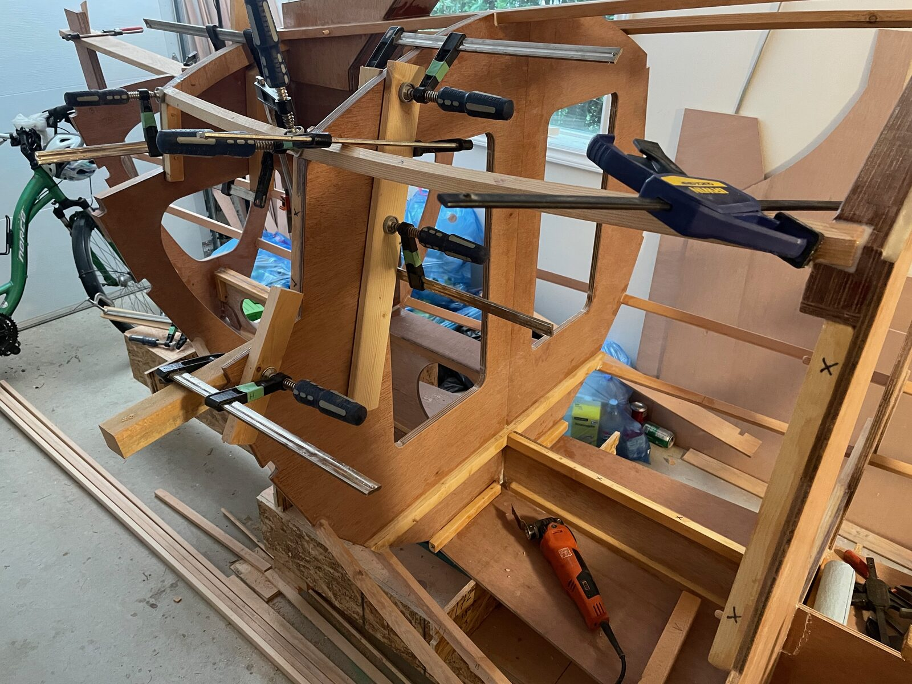
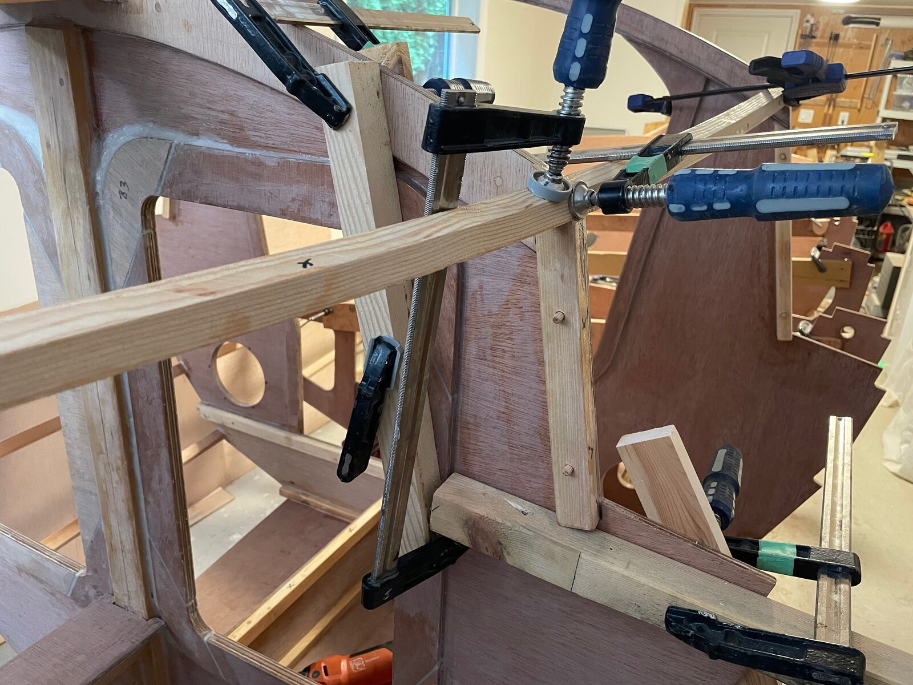
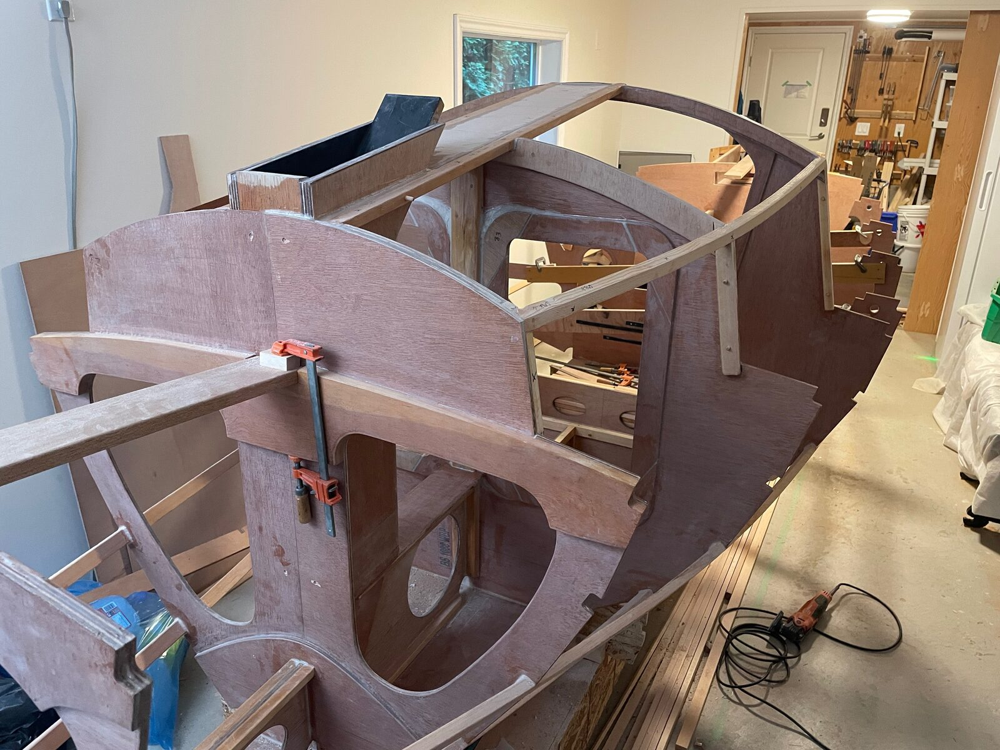
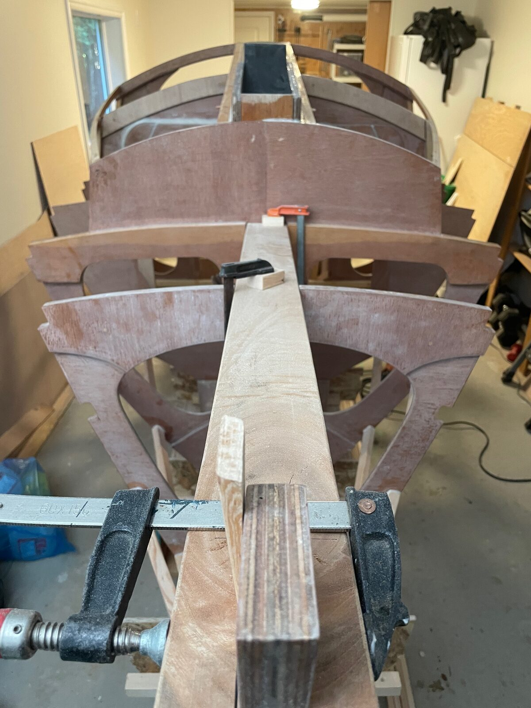

# 013 · Install cabin roof edges

[← Previous: Prepare and install doublers](012-prepare-and-install-doublers.md) · [(up arrow) Build log index](README.md) · [Next: Build and install the mizzen mast box →](014-build-and-install-the-mizzen-mast-box.md)

## Goal

Glue and clamp the edge pieces that run along both sides of the cabin roof, giving the roof panel
something to land on and the coachroof its finished edge.

A short paragraph like this is worth more than a one-line goal: it tells the next builder what the
step is *for*, not just what it's called.

## 1. Dry-fit the edge pieces

Offer both pieces up and check the fit along the full length before any epoxy comes out. The edge
has to follow the camber of the roof, so it will not sit down cold — expect to clamp it into the
curve and expect that to take more clamps than you think.

*Dry-fit with every clamp I own. The piece pulls down into the camber gradually — work from the
middle outwards.*

Some regular paragraph text Lorem ipsum dolor sit amet, consectetur adipisicing elit, sed do eiusmod
tempor incididunt ut labore et dolore magna aliqua. Ut enim ad minim veniam,
quis nostrud exercitation ullamco laboris nisi ut aliquip ex ea commodo
consequat. Duis aute irure dolor in reprehenderit in voluptate velit esse
cillum dolore eu fugiat nulla pariatur. Excepteur sint occaecat cupidatat non
proident, sunt in culpa qui officia deserunt mollit anim id est laborum.

- Clamp spacing ended up at roughly *TODO* mm. Any wider and the edge lifted between clamps.
- Mark the clamp positions on masking tape while dry-fitting, so you are not deciding where they
  go once the glue is on.

> [!TIP]
> Dry-fit twice: once to check the fit, once to rehearse the clamping order. The second one is the
> one that saves you.

## 2. Bevel the landing face

The roof panel meets the edge at an angle that changes along the length, so the landing face needs
a rolling bevel. See [Bevels & rolling bevels](../reference/techniques.md#bevels--rolling-bevels)
for how I found and cut it.

*Detail at the forward end, where the bevel is steepest. The pencil line is the landing face after
planing; the tape is protecting the coaming below.*

> [!WARNING]
> Take the bevel down in stages and keep checking with a straightedge across to the far side. Plane
> it in one pass to the line and you will go through — there is no material to give back, and the
> only fix is a scarfed patch on a visible edge.

## 3. Glue and clamp

Epoxy thickened to a mayonnaise consistency with silica: thin enough to wet both faces, thick
enough to stay in a joint that is under clamping pressure on a curve.

*Both edges glued and clamped, looking forward. Squeeze-out cleaned up wet with a scraper and a
rag — far less work than sanding it off cured.*

- Working time was about *TODO* minutes at *TODO*°C. Mix in two batches rather than one.
- Packing tape on the clamp pads, so the pads don't become part of the boat.

> [!NOTE]
> I left the doublers out where the stringers meet the bulkheads here — see
> [Plan modifications](../reference/plan-modifications.md). If you are building to the plans as
> drawn, your clamping will differ at those points.

## 4. Clean up and check the aft end

*The aft end after cure. This is where the edge meets TODO, and where a gap would show most.*

## Notes

- Things the plans don't tell you, or errors in the plans. Also add to [Plans errata](../reference/plans-errata.md).
- Deviations from the plans. Also add to [Plan modifications](../reference/plan-modifications.md).
- Gotchas and things I'd do differently next time. Also add to [Mistakes](../reference/mistakes.md).
- Research and reasoning behind the choices made here.

Tools used in this step are listed under [Tools](../reference/tools.md); the epoxy and filler are
in the [Bill of materials](../reference/bill-of-materials.md). Unfamiliar words are in the
[Glossary](../reference/glossary.md) — *camber*, *coachroof* and *rolling bevel* all appear above.

---

[← Previous: Prepare and install doublers](012-prepare-and-install-doublers.md) · [(up arrow) Build log index](README.md) · [Next: Build and install the mizzen mast box →](014-build-and-install-the-mizzen-mast-box.md)
