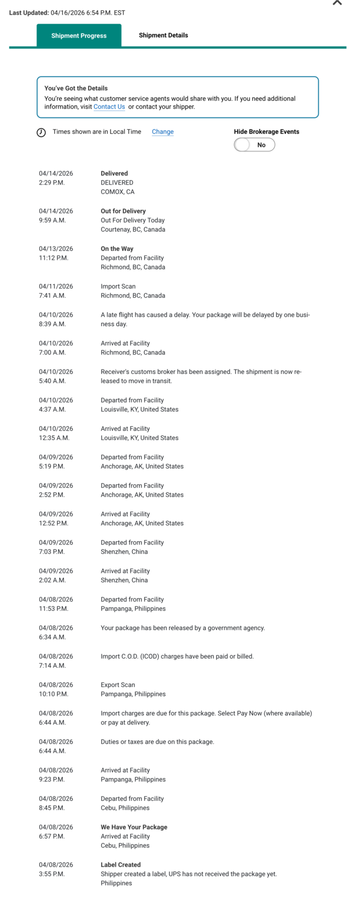
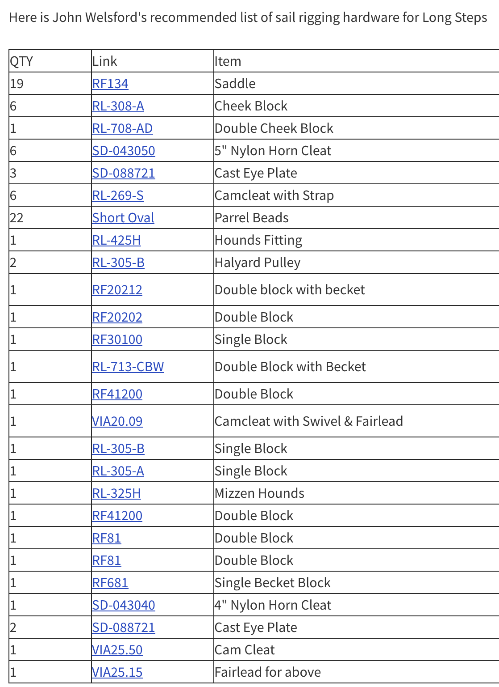
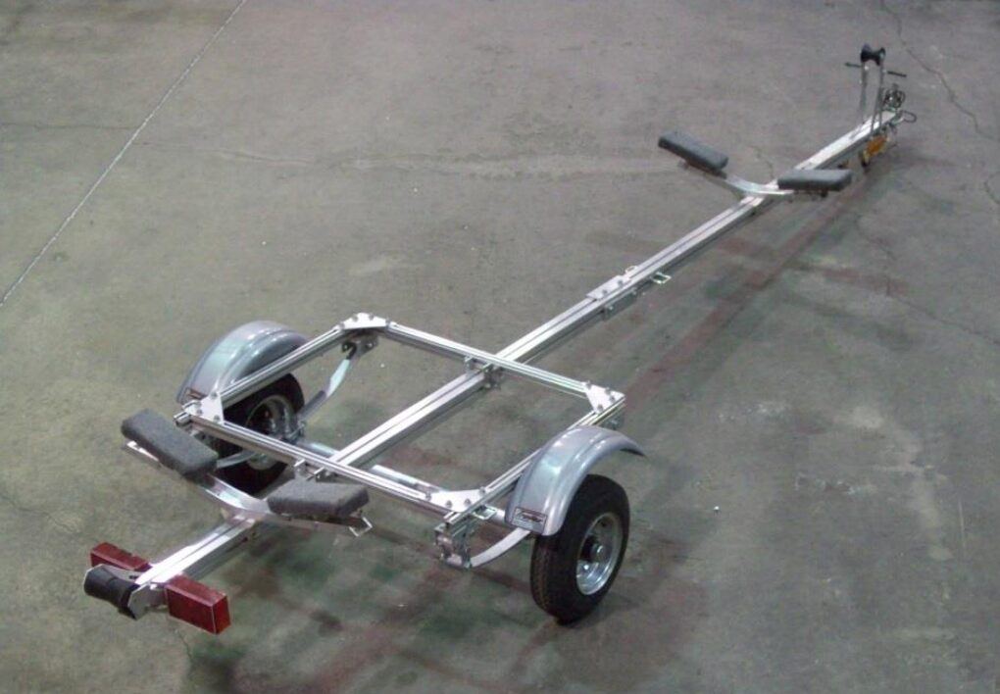
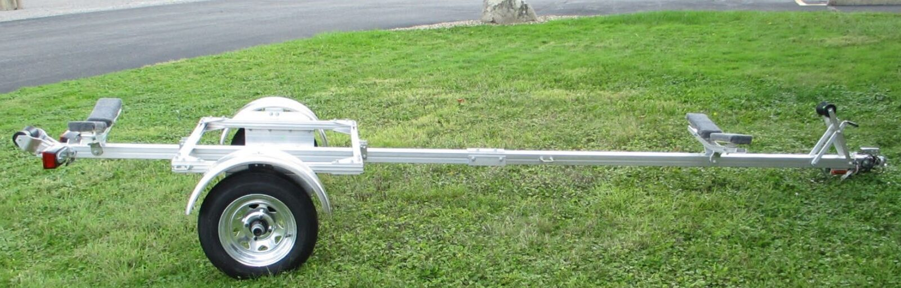
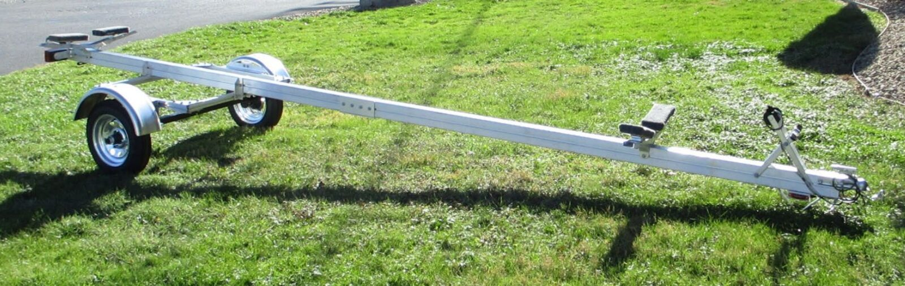

# Materials

[← Home](../README.md) · [Tools](tools.md) · [Techniques](techniques.md) · [Costs](costs.md)

Quantities are what I used for *TODO: design name* — check your own plans before ordering.
Links marked *(aff)* are Amazon affiliate links.

## Plywood

| Where | Thickness | Grade | Sheets | Notes |
|---|---|---|---|---|
| Bottom | TODO | TODO okoume / meranti BS1088 | TODO | TODO |
| Sides / planking | TODO | TODO | TODO | TODO |
| Bulkheads | TODO | TODO | TODO | TODO |
| Deck | TODO | TODO | TODO | TODO |
| **Total** | | | **TODO** | |

Marine ply is best bought from a specialist yard, not Amazon. See [Suppliers](#suppliers).

## Epoxy & fillers

| Item | Quantity | Notes | Link |
|---|---|---|---|
| Epoxy resin | TODO L | TODO brand, slow hardener for warm weather | *(aff)* |
| Hardener | TODO L | Match ratio to your pumps | *(aff)* |
| Colloidal silica | TODO | Thickening, structural glue joints | *(aff)* |
| Microballoons / microlight | TODO | Fairing compound — sands easily, not structural | *(aff)* |
| Wood flour | TODO | Fillets | *(aff)* |
| Denatured alcohol / vinegar | TODO | Clean-up (never solvent on skin) | *(aff)* |

Total epoxy used to date: **TODO L**. Plans estimate was TODO L.

## Fibreglass

| Item | Weight | Quantity | Where used | Link |
|---|---|---|---|---|
| Glass cloth | TODO g/m² | TODO m | Hull sheathing | *(aff)* |
| Glass tape | TODO g/m² | TODO m | Chines, seams, bulkhead joints | *(aff)* |
| Biaxial tape | TODO | TODO m | High-load joints | *(aff)* |

## Fasteners & hardware

| Item | Size | Quantity | Notes | Link |
|---|---|---|---|---|
| Silicon bronze ring nails | TODO | TODO | TODO | *(aff)* |
| Stainless screws | TODO | TODO | Temporary, mostly removed | *(aff)* |
| Copper wire / cable ties | TODO | TODO | Stitching panels | *(aff)* |
| Deck hardware | TODO | TODO | TODO | *(aff)* |

## Paint & varnish

| Item | Quantity | Where | Coats | Link |
|---|---|---|---|---|
| Epoxy primer | TODO | TODO | TODO | *(aff)* |
| Topside enamel | TODO | TODO | TODO | *(aff)* |
| Bottom paint | TODO | TODO | TODO | *(aff)* |
| Spar varnish | TODO | Brightwork | TODO — don't skimp on coats | *(aff)* |

## Consumables

Nobody budgets for these and they add up to real money. See [Costs](costs.md).

| Item | Notes | Link |
|---|---|---|
| Gloves | Buy by the box, change often | *(aff)* |
| Mixing pots, sticks, spreaders | TODO | *(aff)* |
| Sandpaper — 80/120/220 | By the roll, not the sheet | *(aff)* |
| Packing tape & plastic sheet | Release surfaces, epoxy control | *(aff)* |
| Rags & paper towel | TODO | *(aff)* |

## Suppliers

| Supplier | What for | Notes |
|---|---|---|
| TODO | Marine plywood | TODO |
| TODO | Epoxy & glass | TODO |
| TODO | Bronze fasteners | TODO |

- ## Supplies
  - [Budget spreadsheet](https://docs.google.com/spreadsheets/d/1PfBkrPYtFxa2MLt738tvZ5lOhYBLA7aj8WzWo56SE3Q/edit?gid=0#gid=0)
  - ### Adhesives
    - Summary: Just use Epoxy for everything. The savings of using another glue are small compared to the risk of having the boat pieces fall apart later!
    - [General Notes on Glues and Goos](https://forum.woodenboat.com/forum/building-repair/99337-titebond-iii-for-frames?p=2748263#post2748263)
      - **Resorcinol**: The marine standard. If you can get 70 degrees F or higher for an overnight cure and consistent and high clamping pressure with no gaps, you won’t go wrong using it. (Throw an electric blanket over it to be sure.) Likes wood at 10-15% MC, according to Navy tests. Long open time. Repairable with epoxy. Ugly red glue line.
      - **Marine Epoxy**: The repair and restoration standard. Bonds well to a wide variety of materials, and usable in almost all flexibility and temperature conditions. Needs no clamping pressure, only contact. Fills gaps well....but easy to overclamp, starving the glue joint when pulling in thick stock. Likes wood below 12% MC. Repairable with itself; joints can sometimes be broken apart for repair using heat. Clear, relatively thick glue line and can be dyed to match the wood. Controllable open time with different hardeners. Slightly permeable to water vapor and there are many reports of failures in fully saturated wood and with White Oak. Very sensitive to UV, requiring protection.
      - **3M 5200**: A rubbery, polyurethane sealant in various colors with adhesive properties sometimes used as a glue. Fails as a glue under water saturation without high clamping pressure, and without the proper strength testing I couldn’t do here, it’s not recommended as a stand-alone marine glue. Repairable with epoxy.
      - **Liquid Polyurethane**: Gorilla Glue, Elmer’s Probond, Elmer’s Ultimate, and others. Versatile in temperature and bonding wet wood with moderate open time, these glues aren’t rated for below waterline use but initial use shows potential as a marine glue. Likes high clamping pressure and fits similar to resorcinol…it won’t fill gaps. Will successfully glue green wood at 30% MC, but the wetter the wood, the weaker the bond. Repairable with epoxy. Noticeable, yellow-brown glue lines.
      - **PL Premium Construction Adhesive**: This polyurethane goo shows promise as a marine glue with further testing and use. Works like 3M 5200 but cures and behaves like liquid poly. Appears to bond well to everything epoxy does, and more where epoxy and liquid poly won’t, perhaps because of a higher isocyanate content…it bonds to difficult surfaces only cyanoacrylate super glues will bond to. The only general-use glue I’ve found that will bond difficult aliphatic-contaminated surfaces. Appears flexible to temperature and moisture content with gap-filling ability, but as a construction adhesive, its open time is shorter than liquid poly. Appeared to like high clamping pressure, and unlike other glues, wouldn’t bond at all without at least some. Repairable with itself and epoxy. Glue line as in liquid poly.
      - **Urea Formaldehyde Plastic Resin Glue**: Weldwood, DAP and others. The old interior furniture standard, and in older marine applications that required well-blended glue lines. Still preferred by many, as it is a no-creep glue easily repaired using epoxy. Long open time, it needs tight fits and 65 degrees F or higher for an overnight cure…it doesn’t fill gaps. Best glue line among them all and moderate water resistance still make it useful for interior marine brightwork applications. A relatively brittle glue and UV sensitive, it requires protection….but its brittleness is an aid to repairability, as joints can often be broken apart for repair. An inexpensive powder with a short, one-year shelf life.
      - **The Titebond Family of Aliphatics**: Convenient. No mixing, just squeeze. Short open times, fast tack, and short clamping times. Fast, and an acceptable long-grain layup glue…in heated, commercial shops, I’ve had rough-cut Titebond panel layups in and out of the clamps and thru the planer inside of an hour. Flexible in temperature and to a lesser extent in moisture content, but the bottled glue can freeze in unheated shops, and glueups require 55 degrees or warmer to cure. A flexible glue, it has been reported to creep under load, sometimes several years after the joint was made. Franklin doesn't recommend Titebond for either structural (think Gluelam beams) or marine use. The latest “Titebond III” appears to be a stronger glue than its two predecessors. Difficult glues to repair, as they won’t stick to themselves and no other glues will except cyanoacrylates, which are too brittle for general use. Epoxy and fabric aren’t bonding to aliphatic glue lines in marine strip construction, compounding repair difficulties. While not definitive, the new PL Premium appears to bond well to Titebond III residue and is worth pursuing by those repairing old white and yellow aliphatic joints.
  - ### Canvas, sail, fabric, hardware
    - Sailrite has lots of supplies and tools available, as well as good instructions for anything related to sewing on boats: [Sailrite: Fabric and Sewing Supply Store](https://www.sailrite.com/)
  - ### CNC Plywood cutting
    - https://www.islandlaser.ca/
      - I spoke with Thomas on Aug. 1 about his services.
      - He does this kind of CNC work
      - He can source marine plywood (from Windsor, just like myself, however, he gets a lot of stock from them)
      - He will work with DXF files
      - He charges $80/hour machine time
      - I told him that I'm in the early planning stages and will get back to him in the next month or two
      - He's north of Courtenay
      - Sounded like a nice guy on the phone
      - I went with Thomas and had a great experience
    - https://www.grantsigns.ca/3d-2d-routing.html
  - ### Epoxy
    - West System seems popular
      - Get pumps for measuring
    - [Chip brushes](https://www.amazon.ca/s?k=chip+brush+epoxy&crid=26KNKDDH2HJ3N&sprefix=chip+brush+epoxy%2Caps%2C175&ref=nb_sb_noss)
  - ### Fiberglass
    - Industrial plastics and paint has fibreglass cloth 6 ounce 50 inch width in stock and they can order 60 inch wide
  - ### G10 fiberglass parts
    - Amazon
    - Industrial Plastics and Paints
    - McMaster Carr
  - ### Lumber
    - For stringers, mast, spars, etc.
    - Thompson Brothers in Courtenay?
    - Windsor Plywood in Courtenay
    - Sawmill Direct in Ladysmith
      - https://www.sawmillsales.ca
      - They sell Red and Yellow Cedar and Douglas Fir in different dimensions at reasonable prices. They advertise clear lumber for Yellow Cedar. I could probably inquire for Doug Fir, too.
  - ### Marine Plywood
    - Windsor Plywood in Courtenay
      - 6mm Okume certified marine plywood: $96 CAD per 4x8' sheet. May take 1-2 weeks to order from HQ in Vancouver.
      - 9mm Okume certified marine plywood: $130 CAD per 4x8' sheet. May take 1-2 weeks to order from HQ in Vancouver.
    - https://www.westwindhardwood.com/product-category/plywood-veneers/marine-grade-plywood/
  - ### Mast
    - Aluminum T6 6061 (T6 is important!)
      - https://www.metalsupermarkets.com/product/aluminum-round-tube-6061/
      - https://www.alustock.ca/Aluminum-Tubes-Pipes/Aluminum-Round-Tubes-Schedule-Pipes#min_price=0&max_price=200&category_id=31&page=0&path=26_31&sort=p.sort_order&order=ASC&limit=15&old_route=product%2Fcategory&attribute_value%5B19%5D%5B%5D=2.375&attribute_value%5B19%5D%5B%5D=2.5&attribute_value%5B19%5D%5B%5D=2.875&attribute_value%5B19%5D%5B%5D=2.877&attribute_value%5B19%5D%5B%5D=3&attribute_value%5B21%5D%5B%5D=0.065
    - Carbon Mast
      - https://chinooksailing.com/collections/masts-carbon/products/100-superlite-rdm-xtra-durable?variant=12724025098295
        - Dealer in Vancouver: https://shop.northshoreskiandboard.com/collections/windsurf-masts
  - ### Metal fabrication
    - https://sendcutsend.com/
    - https://oceanmetal.ca/project/marine/
  - ### Navigation
    - Depth sounding
      - Fish finder
      - Handheld Depth Sounder
  - ### Rudder
    - Pintle and Gudgeon for mounting
      - I went with JW recommendation: Racelite
      - 3/8" pins, good price: https://www.glen-l.com/Gudgeons-Pintles-Medium_Heavy-Duty/productinfo/13-043/
      - The 5/16" ones here look good and reasonable priced: https://www.rigrite.com/Hardware/Rudder_Hardware/Pintles&Gudgeons.php
  - ### Sail
    - [Really Simple Sails](https://reallysimplesails.com/)
      - They offer sails for Welsford Walkabout
        - Go to home page, scroll down until you find Welsford boats, expand accordion.
        - You will find an entry for John Welsford Walkabout Balance Lug Yawl
      - I bought my sails from them:
        - 1x WELS LONGSTEPS 16 2025 Oz2B Lug Main Main and Mizzen 6oz White ($1,299.67CAD)
        - 1x Sailbag B900267B/C ($80.36CAD)
        - Import feeds, duty, tarrifs (thanks big D) ($104CAD)
        - **Total: $1484CAD**
      - I ordered them on Feb 11, 2026 and received them on Apr 14, 2026 (2 months later)
        - 
      - They also have good resources for fine tuning lug sails on their site
    - McBride and Leich in Victoria
    - Michael Storer has good videos with lots of details on how to rig a balance lug said (for the Oz Goose, but applies to any balance lug): [Part 1 Detailed step by step rigging for a lug sail on the OzGoose or other boat - YouTube](https://www.youtube.com/watch?v=93FjgWWKC1Y)
  - ### Sail hardware
    - Duckworks lists a hardware package (out of stock, see attached image):
      - 
  - ### Trailer
    - Requirements:
      - Storable in my boat shed (door width: 69.5")
      - Towable by our Ford Escape (towing capacity: 1,500 lbs) and Ford Transit (towing capacity: ?)
    - Roller bar
    - Trailex (may be more expensive if I have to buy directly from US)
      -
        | **Model** | **Capacity** | **Price** | **Length** | **Width** | **Description** |
        |---|---|---|---|---|---|
        | SUT-220-S | 220 lbs, 17' | $1,598 USD | 15' 2" | 53" | Single Light Duty Carrier, Spring Suspension, 8" wheels, weighs 125 lbs |
        | ~~SUT-250-S~~ | 250 lbs, ? | $1,846 USD | 12' 8" | 68" | Single Light Duty Carrier, spring suspension, 8" wheels |
        | SUT-350-S | 350 lbs, 22' | $1,835 USD | 18' 6" | 52" | Single Boat Carrier for Boats over 17', Spring suspension, 8" wheels, LED lights, weighs 155 lbs |
        | SUT-350-ST | 350 lbs, 22' | $2,363 USD | 18' 6" | 52" | Single Boat Carrier for Boats over 17', torsion suspension, 12" wheels, LED lights, weighs 155 lbs |
        | SUT-500-S | 500 lbs, | $2,008 USD | 15' 2" | 69" | Single Medium Duty Carrier, Spring Suspension, 8" wheels, weighs 180 lbs |
      - SUT-220-S
        - 
      - SUT-220-ST
        - 
      - SUT-350-ST
        - 
    - Marlon
      - Alberni Power & Marine has a 1250 for $1,899 CAD
        - [1250 Boat Trailer with Bunks For Sale | Alberni Power & Marine - RPM Group](https://www.albernipowermarine.com/product/trailers/marlon-trailers/1250-boat-trailer-with-bunks)
        - This trailer is good for 1,250 lbs and boat length up to 16.5'
        - It is 61" wide (fits into my boat shed), weighs 250 lbs (a bit heavy) and comes with 12" wheels (good!)
        - It is below the Ford Escape's max towing capacity of 1,500 lbs
        - I'll have to add a jack to it
        - They are a BC company
    - Stirling
      - Canadian Tire sells a boat trailer for $1,699
        - [Stirling Galvanized Steel Boat Trailer, 14-ft | Canadian Tire](https://www.canadiantire.ca/en/pdp/stirling-galvanized-steel-boat-trailer-14-ft-0408610p.html?rq=boat+trailer)
        - Not as good as the Marlon! It's shorter, has smaller wheels, and is wider (tight fit in my boat shed), and has lower weight rating (970 lbs)
