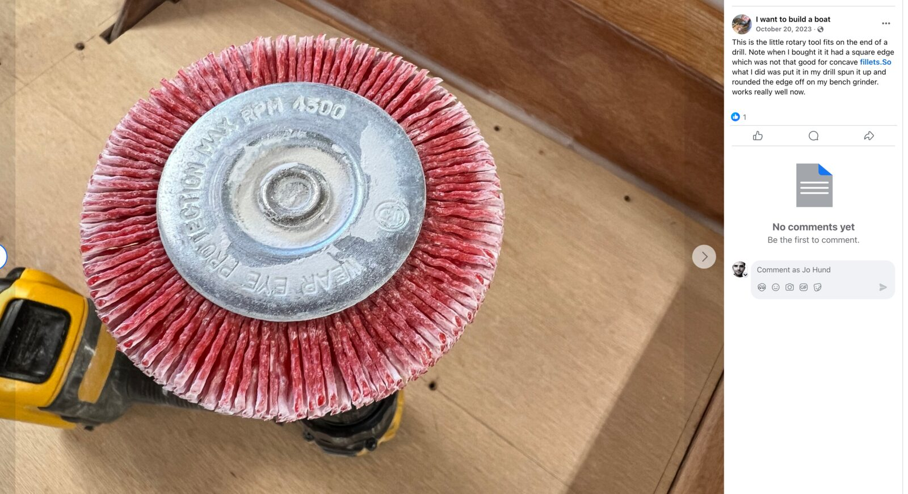

# Techniques & tips

[← Home](../README.md) · [Tools](tools.md) · [Materials](materials.md) · [Glossary](glossary.md)

General technique, not tied to any one build step. Entries in the [log](../build_log/README.md) link
here rather than re-explaining the basics each time.

## Epoxy safety

Read this once, properly. Epoxy sensitisation is cumulative and permanent.

- Gloves always, changed the moment they're contaminated. Never wipe a gloved hand on your skin.
- Never clean epoxy off skin with solvent — it carries the resin *into* you. Waterless hand
  cleaner or vinegar, then soap and water.
- Sanding cured epoxy makes fine dust. Respirator and extraction, every time.
- Ventilate. Warm shop, moving air.
- *TODO: add anything specific to your resin's datasheet.*

## Working with epoxy

- **Ratio discipline.** Off-ratio epoxy doesn't cure soft — it stays permanently weak. Use pumps
  or a scale, and count strokes out loud.
- **Temperature drives everything.** Pot life roughly halves for every 10°C rise. Mix smaller
  batches when it's warm.
- **Wide, shallow pots** exotherm less than deep ones. A cup of fast hardener can smoke.
- **Amine blush** — the waxy film on cured epoxy. Wash with water and a scotchpad before sanding
  or coating, or nothing sticks.
- **Coat wet-on-tacky** where you can: no sanding needed between coats if the previous one is
  still fingerprint-tacky.
- *TODO*

  - ### Epoxy + fiberglass work
    - Use peel ply for nice surfaces?
    - Russell Brown: "Epoxy Basics"
      - Not reproduced here — it's his to sell. *TODO: link to where you bought it.*
    - [Mastering Epoxy with Russell Brown, Part 1 - Introduction to Filleting - YouTube](https://www.youtube.com/watch?v=yDoauHaOfBQ&t=12s)
    - Fillet tips
      - Use special silicone spatulas for nice fillets: https://forum.woodenboat.com/forum/building-repair/9018924-building-a-welsford-long-steps?p=9260120#post9260120
        - Ordered here: https://www.amazon.com/-/es/dp/B0752XQZ2J?language=en_US&psc=1&ref=ppx_pop_dt_b_product_details
      - The Art of Boat Building puts peel ply on his fillets for a nice finish that requires less sanding. Could I use 2" strips of baking paper instead? Should work on thickened epoxy
    - Good youtube channel with epoxy tips: https://www.youtube.com/@WessexResinsAndAdhesives/featured
    - Use a grout removal nib on the Fein tool for removing hardened epoxy (steel tongue with industrial diamonds for abrasives)
    - Jeffrey Bursic uses a rotary grinding attachment to smooth out expoxy fillets
      - 
    - Derek Desaunois coats and sands every piece before it goes into the boat:
      -
        > I’ve resin coated and either peel-plied or sanded back every part (including the stringers) before they go in. Tedious work, but it should save me a lot of work down the line.
      -
        > I also put a layer of plain weave on [the plank] to give it more strength. Much easier to do it now than once it’s in place.
      -
        > everything, including frames and stringers, were coated and sanded before going on the boat.
    - I noticed that the West System epoxy cures quite flexibly, so I will also coat all parts before they go in, including planks.
    - A few places recommend to apply the first resin coat while the hull is cooling. If it is warming up, like from a cool night, bubbles can form. So one strategy is to put a heater on the boat to warm up the piece. Then turn off the heater so that the boats starts cooling down, and apply the first coat of resin.
    - [Howard Rice about fiberglassing the scamp](https://www.facebook.com/share/p/1AmR3P64vB/):
      - A few questions I have received more than once:-), hoping to clarify these as a help for builders.
      - 1. "Do I have glass tape all the inside plank seams?"
      - 2. "Do I have to fiberglass the full bow and full transom outside faces?"
      - 3. "Do I have to fiberglass the inside of the ballast tank and footwell?"
      - The answer to all is no as in no need to do so.
      - 1. The garboard seam (bottom edge of the first plank and the edge of the bottom) should be glass taped between bulkheads after a nice wide fillet is applied. I cut each strip of the 2" tape 2" too long so it adheres an inch up each bulkhead.
      - 2. The bow and transom do not call for being covered in fiberglass, there is no reason or need to do this. Its just extra work. The only exterior surfaces of the boat that need to be covered in fiberglass cloth are the bottom, the garboard plank, and the cabin top. Nothing else.
      - The bottom of the boat is fiberglassed and my advice is to mask off and bring the bottom fiberglass 1" to 2" up the bottom of the transom. Razor off the glass edge where it overlaps the masking tape and remove the tape before the epoxy has fully cured for a clean finish. The edge of the glass can be sanded smooth for a nice finish of the transom and in the case of the photo below you can see that the edge of the glass has been faired in with WEST System 410 fairing compound but any fairing additive will do.
      - 3. As to the ballast tank and footwell. No need to fiberglass either one. The ballast tank should be filleted and thoroughly coated with three coats of epoxy with the last in graphite as the darkness will tend to inhibit marine growth. Be sure to coat the bottom of the cockpit sole that comprises the top of the ballast tank so the inside of the tank is fully black. The footwell should get three coats of epoxy and then paint.
    - [Good expoxy tips from RC Group](https://www.rcgroups.com/forums/showpost.php?p=48551069&postcount=19):
      - 1.  It's not uncommon for epoxies to cure with a waxy blush that comes
        to the surface, WEST included.  It's removable with warm soapy water.
        Gougeon Brothers recommends to not sand until washing away the blush.
        BTW- epoxy doesn't "dry;" it cures and retains its full weight.
      - 2.  I haven't used GFlex so no opinion.   The 105 resin and 205 hardener
        have enough flexibility after curing to not crack under normal use but I
        cannot compare it to GFlex.
      - Epoxy in expensive, no doubt.  The WEST 105 with a seasonally
        appropriate hardener is a good material.   It has a reasonable pot life
        which can be extended by getting it spread in a thin film as soon as
        it's mixed so the heat of reaction doesn't compound itself, causing it
        to kick even faster.  Spreading it on an uncoated paper plate works very
        well.  Avoid putting it on anything that might have wax on it like some
        paper plates and cups because the wax can affect the ability of the
        epoxy to cure.  Gougeon Brothers lists the shelf life of 105 and its
        hardeners as indefinite.
      - WEST has a multi-stage cure.  The first stage is when it gels.  When it
        becomes firm and solid it can be recoated with additional resin/cloth
        without sanding because it will still chemically bond to the previous
        layer.
      - The second is when it feels firm to the touch.  This is what the
        manufacturer refers to as the "green stage."  At 70°-75° F the green
        stage can last up to three days. This is the time to sand because the
        epoxy is still soft.
      - Past the green stage the epoxy develops its full strength and becomes much harder.
      - The cure time of WEST to its maximum strength potential is around 30
        days at 70°-75°F but it can be force cured or "post cured" at 140° F for
        one hour.  A closed up car on a sunny day (when it's not cold) makes a
        great oven for post curing.  Do this after the sanding is finished.
      - WEST 105  will easily join wings, glass the center section, glue in
        firewalls and landing gear mounts.  It was developed to build laminated
        boat hulls using multiple layers of cedar planking.  I've used it to
        splice new wing spar root sections onto the existing spars of an Aeronca
        Champ, repair nonstructural fiberglass and wood parts on airplanes,
        fill in unneeded through hull fitting holes on boats, repair collision
        damage on a sailboat and for model building for decades.  It will
        deteriorate with direct exposure to sunlight so it should be covered
        with paint that blocks sunlight.
      - I've had WEST in my inventory of supplies since the early '90s but I
        also keep 15 minute Z-Poxy and 30 Minute Z-Poxy laminating resin.  I
        don't keep 5 minute on hand.  For most epoxy needs I use the Z-Poxy 15
        minute.  For glassing a wing center, the 30 minute is nice because it's
        very thin.  I use 6 ounce glass cloth tape and blot the extra epoxy out
        of the cloth with toilet paper or paper towels.  Extra epoxy does not
        add any strength; only extra weight and it increases the chances of
        cracking.  The glass/WEST layup can be sanded smooth and iron-on
        covering will stick to the sanded fiberglass.  If you need to hide the
        texture of the glass cloth, use their 410 Micro-Light filler in the
        epoxy to reduce weight and make sanding easier.

## Consistencies

| Consistency | Looks like | Filler | Used for |
|---|---|---|---|
| Unthickened | syrup | none | Wetting out wood and glass |
| Ketchup | just runs off a stick | silica | Bonding tight joints |
| Mayonnaise | holds a soft peak | silica / wood flour | Gluing gappy joints |
| Peanut butter | stands up in ridges | wood flour + silica | Fillets |
| Fairing | light, spreads easily | microballoons | Fairing only — never structural |

## Tick stick

Transferring an irregular shape — a bulkhead into a hull, a panel into a corner — onto stock
without measuring anything.

*TODO: your stick, how you mark it, how you set out the pattern. Photograph the stick in place;
this is the technique nobody understands from words alone.*

## Surveying

Getting and holding the reference geometry: centreline, waterline, station positions, levels,
diagonals.

*TODO: what you used — string line, laser, water level, plumb bob — and how often you re-checked.*

## Scarf joints

Joining plywood sheets end to end. *TODO: 8:1 for most ply; how you cut yours, jig used, clamping
and how you kept the joint flat.*

## Fillets

*TODO: mixing, radius, how you tool them, cleaning up before cure vs. sanding after.*

## Taping seams

*TODO: order of operations, wetting out the tape, feathering edges.*

## Fairing

*TODO: batten and long-board technique, guide-coat trick, when to stop.*

## Bevels & rolling bevels

*TODO: how you found and cut the bevels on stringers and chine logs.*

## Shop practice

- Sweep before every epoxy session. Dust in a wet coat is a day of sanding.
- Label every offcut with its station and side the moment you cut it.
- Mix, don't guess: write the batch size on the pot.
- Photograph before you cover something up. You'll want it for the log, and for the next builder.
- *TODO*

## Things I learned the hard way

Short version here; the full story lives in [Mistakes](mistakes.md).

- *TODO*
