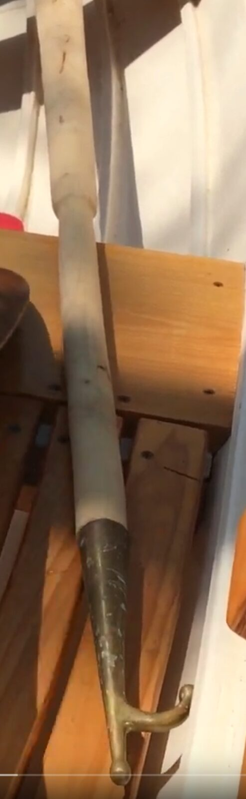
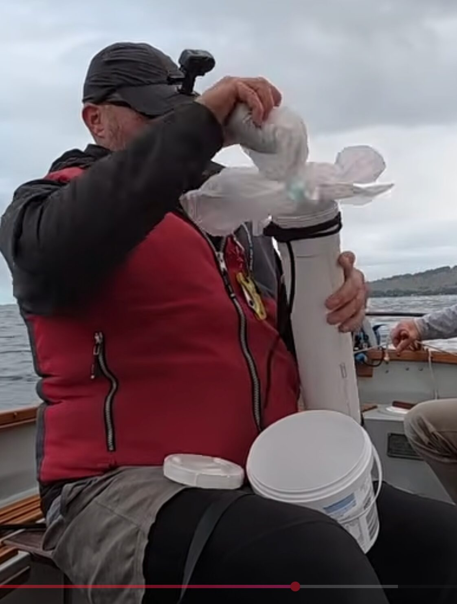

# Accessories

[← Research index](README.md)

  - Bailer
    - Hand bailer with straight lip to scoop water off bilge
    - Bilge pump
      - JW uses a Whale Gusher Titan Bilge Pump Models: BP4402, BP4410 and BP4429
  - Bucket
    - With lid to contain what's inside
    - Collapsible buckets
      - [Collapsible Water Bucket with Locking Lid](https://www.amazon.ca/Collapsible-Multifunction-Foldable-Container-Activities/dp/B0952LRHSS?crid=29Q51TLFM2AOX&dib=eyJ2IjoiMSJ9.DgZn2pFedU6TqxVfp21uCvBRPRE9V2uOBMjeI_OE9-ZdQfBhgxEbeDAwu6CelqjhbVLCF64jfhhVe7S5nhwRKzXiC_omF6UzI1A_t6tYCD3kBiZg_WgM5IrxVfVi5bMgJ2SWfBGRdFu6n7w_uQo3vJuMZPdw1UIlRUrFx8vWplmSWyIVNrG_PBhAYplcgU0oscEPK8GsQ28ny1zrjq9mOyrajMIMC3Wg8VsbcMrvSqz9xR77EMRWqJl4uzZUMb1naXCvj8QgCvJJwss8PTmkJQ_GjuWORHn8PB8QTQg5Vig.maaqAdy02ZxlNFQuqRjBZr0eDSIriLGJ0UBCcDAa55Y&dib_tag=se&keywords=collapsible+bucket+with+lid&qid=1772297007&sprefix=collapsible+bucket+with+lid%2Caps%2C157&sr=8-8)
      - [SAMMART 10L (2.64Gallon) Collapsible Fishing Bucket with Locking Lid](https://www.amazon.ca/SAMMART-2-64Gallon-Collapsible-Fishing-Locking/dp/B0BRXWC9ZR?crid=29Q51TLFM2AOX&dib=eyJ2IjoiMSJ9.DgZn2pFedU6TqxVfp21uCvBRPRE9V2uOBMjeI_OE9-ZdQfBhgxEbeDAwu6CelqjhbVLCF64jfhhVe7S5nhwRKzXiC_omF6UzI1A_t6tYCD3kBiZg_WgM5IrxVfVi5bMgJ2SWfBGRdFu6n7w_uQo3vJuMZPdw1UIlRUrFx8vWplmSWyIVNrG_PBhAYplcgU0oscEPK8GsQ28ny1zrjq9mOyrajMIMC3Wg8VsbcMrvSqz9xR77EMRWqJl4uzZUMb1naXCvj8QgCvJJwss8PTmkJQ_GjuWORHn8PB8QTQg5Vig.maaqAdy02ZxlNFQuqRjBZr0eDSIriLGJ0UBCcDAa55Y&dib_tag=se&keywords=collapsible+bucket+with+lid&qid=1772297007&sprefix=collapsible+bucket+with+lid%2Caps%2C157&sr=8-17)
  - Depth Sounding
    - Fish finder
    - Handheld Depth Sounder
    - Lead line for depth sounding
      - [Sounding Lead Weight](https://shipcanvas.com/collections/sounding-leads/products/sounding-lead)
      - [VDL26-Lead_Lines_Article.pdf](https://ryct.org.au/wp-content/uploads/2025/07/VDL26-Lead_Lines_Article.pdf)
  - Dry bags
    - [YETI SideKick Dry 3 Liter Waterproof Gear Case](https://www.yeti.ca/bags/accessories/70000006060.html)
      - Recommended by Mat Conboy as completely waterproof for high value items
      - Has velcro straps to attach securely
  - Inclinometer (heeling angle)
    - [Sun Company Lev-o-gage Heel-Angle Sailing Clinometer](https://www.amazon.ca/Company-Lev-Heel-Angle-Clinometer-Bulkhead/dp/B0000AY6VK?ie=UTF8)
  - Navigation
    - [DIY chart plotter](https://www.facebook.com/groups/JWDesigns/permalink/3175853089260219/)
      - RasPi with Bare Boat Necessities OS, 10" touch screen, GPS dongle. Less than $200
  - Padook: Combination paddle and boat hook for maneuvering around the dock
    - [Padook - Small Boats Magazine](https://smallboatsmonthly.com/article/padook/)
      - 
    - Modify a standup paddle board paddle:
      - They come in two pieces for easy storage.
      - They are adjustable so they cover a wide range of lengths
      - Add a hook to the handle and you have a very versatile adjustable stick and paddle for maneuvering in narrow spaces where the oars don't work well
  - PooTube
    - 2' x 5" PVC pipe sealed one end and screw lid on the other. Labelled "PooTube". Optional carry strap.
    - You do your business on the bucket with a liner. You tie up the liner and store it in the PooTube until you can empty it.
    - 
  - Radio
    - I should get a VHF radio.
    - The facebook group has a nice comparison sheet (from 2019, so somewhat old): [John Welsford Small Craft Design | Facebook](https://www.facebook.com/groups/JWDesigns/permalink/1015832788595604)
  - Squeegee to dry back rests, seats, and floor
