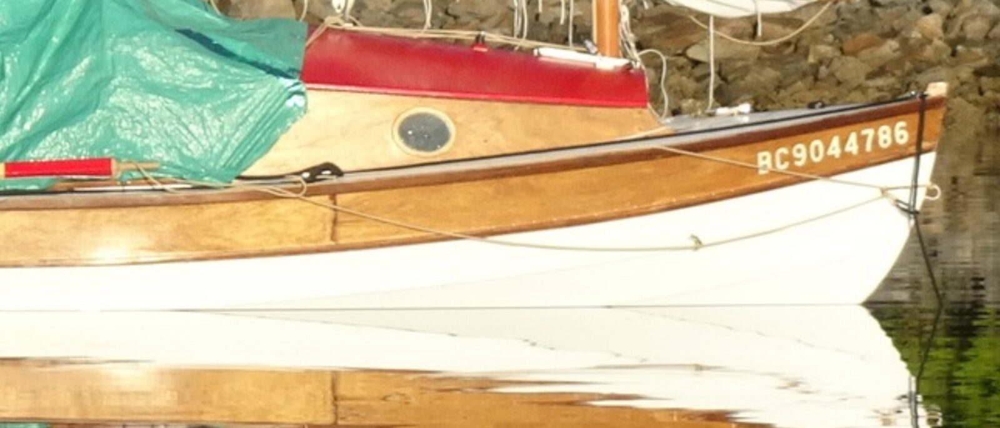
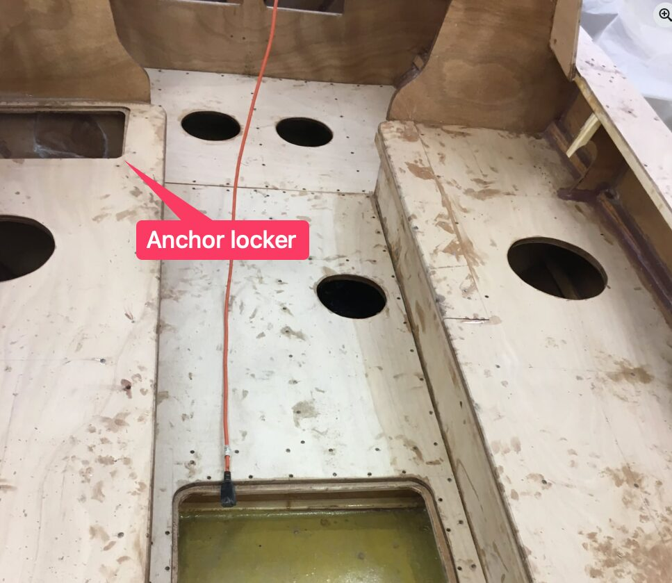
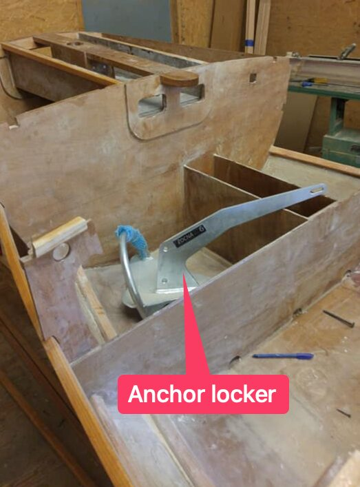

# Anchors and Drogue

[← Research index](README.md)

  - JW uses this on his Long Steps: a 5 kg Rocna on 6m of chain and 40m of 8mm nylon
  - Because the anchor is stowed in the stern of the boat, but needs to be dropped from the bow, there needs to be a mechanism to handle this.
    - This video shows how it's done on SCAMP Luna: [Scamp Sailboat Anchor System and Capsize Recovery Straps - YouTube](https://www.youtube.com/watch?v=Gu9vtlADQ1U)
      - Howard Rice commented: Jo, with great respect to my very good friend Mike Antis I suggest the bag stowage for anchor and rode should be a temporary solution to be used when getting underway under sail. Once going best to feed the rode down through a pipe into a dedicated space. Difficult for Mike due to his boat being fiberglass with no dedicated spot, although he could create one. I am on invitation to spend time with Mike in Florida and if we can pull that off I want to assist him with the next step in his anchoring system and perhaps installing a footwell. The best solution is stowage down a hawse pipe into an enclosed space. Rode in a bag with an anchor, unless carefully put away, will likely tangle up. Rode down a pipe separate from the anchor will never tangle up. Mike has it right, anchor stowed on the ready on deck. Good on him for his seaman-like approach!
      - My takeaway:
        - Don't keep anchor and rode together, they will tangle
        - Feed rode through a pipe into dedicated compartment
        - Keep anchor on deck for good seamanship. What does that mean? Easy access? Should be stowed low for low COG.
        - I can implement this in my aft bench wet locker: a hole and pipe for rode and a separate compartment for anchor and chain.
        - Because my rode storage is on port side, I will mirror what Luna has where the anchor line runs forward on the stbd side. Because the anchor line will be in place most of the time, it needs to run from cockpit to bow, and it would be nice to not have it cross the cockpit.
        - Maybe have the hole into the rode storage on the side deck? So the anchor rode never goes into the cockpit? I could then pull it below the deck into the storage for faster retrieval. Rather than pushing it through a hole into storage.
    - This youtube video shows a good system: https://youtu.be/xd0Pm-0t0Tw?si=iG6yrw5xTUvHLccg&t=220
  - [Anchor Buddy — Slide Anchor](https://www.slideanchor.com/all-products/anchor-buddy)
    - Stretches to get the boat to shore to get off, then pulls the boat out into deep water for tides. Pull the boat back to shore with a bow line.
    - Alternatives:
      - [Making a running line for anchoring a boat - YouTube](https://www.youtube.com/watch?v=63ShKwldmUg) (sinking line, away from other boats' props)
      - There is also one with a floating line
    - Mark Baker's setup
      - 
  - Anchor locker
    - Phil McG has an anchor locker in the port side bench
      - {:height 449, :width 505}
    - Ian Devenney has an anchor locker in the cockpit aft
      - 
    - I will put mine at the aft of the cockpit, stbd side.
      - Idea: Drain it into cockpit, but put a removable barrier or strainer in their to prevent muck and sand from flowing into the cockpit. Make it removable so that when I clean the boat, I can easily pick it up and get it out of the locker/cockpit. Alternatively, I could just put old towels into the bottom of the anchor locker. They should let the water go through but hold back any muck or sand until the towels are removed and cleaned. They would also protect the bottom of the locker from scratching.
  - Mark Barker asked about anchor handling in this FB discussion: https://www.facebook.com/share/p/19DsNme1oU/
  - Mat Conboy and this article use and recommend the Cooper Nylon anchor
    - [My Anchoring System](https://buildingantarctica.wordpress.com/2025/03/07/my-anchoring-system/)
    - It is lightweight and uses only 4' of chain. The difference is that there is a 10' line between the chain and the anchor.
    - [COOPER ANCHOR 1Kg/2.2lb Nylon Review – Salty Boating](https://saltyboating.com/cooper-anchor-1kg-2-2lb-nylon-review/)
    - Mat Conboy shows it in this video
      - [Ep. 47 - FULL TOUR & REVIEW: SWALLOW YACHTS BAYRAIDER 17 - YouTube](https://youtu.be/219RfJDENoU?si=fRhKDQeCaWSKvH85&t=1546)
      - He ties his boat up (and lives?) here:
        - 42 Sunset Dr, Garden Island Creek TAS 7112, Australia
        - It was last sold 5 Sep 2024 for $550,000 AUS
        - And before that on 13 Aug 2018 for $305,000 AUS
  - The Mantus 2.5 lbs dinghy anchor collapses with not tools
    - [2.5 lbs Stainless Steel Mantus Dinghy Anchor - Mantus Marine](https://www.mantusmarine.com/product/2-5-bs-stainless-steel-mantus-dinghy-anchor/?v=28886f13f578)
    - [Dinghy Anchor | Collapsible Boat Anchor | Mantus Marine](https://www.mantusmarine.com/mantus-quick-connect-anchor/?v=28886f13f578)
  - Drogue
    - Osbert: I mainly use it when returning to the beach through breakers. I put the drogue over the bow, to keep the bow to the waves and then row ashore backwards. I also use it to keep the head to wind for reefing etc. Keeps the boat steadier than heaving to. I’ve never had to use it in an emergency but it should keep the boat head to wind and slow her drift if the wind is too strong to sail.
    - [BLUEWING Drift Sock Sea Anchor 32", 42", 53", 62", 72", 6ft 6 ft Parachute Drift Anchor Drift Sock 840D Nylon Sea Anchor Drogue for Marine Boat, Anchors - Amazon Canada](https://www.amazon.ca/BLUEWING-62-Sea-Anchor-Parachute/dp/B0BLC5SS1C?crid=2FJK9W7TT89JI&dib=eyJ2IjoiMSJ9.xP3i_kD2bFW60hKAfGNctp7_9a-ZZV9nokOfHevG7T1J7h95e0FNnhGM_UQomA_in1SZiDzjh7MMYCeBaU0Jydp1miO3PXFLN4YlgYE2QLtaDhHH7JAusHVrjLLLg_mJU2yMjQGO54RwIDjq6UB6IVu_gAyK9dqUJgQOH16XZ8vks7hn065A-eUd2DqTmaouTuy-BpVd7iCSvs_G8Jjw-9WvYtoVPHM94F3dQ0Oejw4XbScpSCT2-KNjvURLeOOJ7uelBshmWi66zL9Y08V-47TgN6HwVvKQNiFZ7ru9c_kEoSwnpvMi4e49kAZoz-zXpU0kCOIksRtzemFLMm3gheHA3RyV53vM5JabBJT66z27Q-LyMzZBYgYqVgkObMqNN8KVSxxZEDy69erNxmcDgknp4Dl9rH8SC4QZ4AwDFgRaLEM8B22W8-VolHcNQ9mh.XHPciWnZdLFkXygIOxiXEvnGG_PNFQAKkfkh067766I&dib_tag=se&keywords=drogue&qid=1739315375&sprefix=drogue%2Caps%2C165&sr=8-26&th=1)
    - Mat Conboy shows how to use sea anchor: [Ep. 58 - FIVE Dinghy Cruising / Small Craft Tips & Tricks - YouTube](https://www.youtube.com/watch?v=9_5MtKZCHDk)
  - Bungee anchor system
    - This video [Bungee anchor system for dinghy - YouTube](https://www.youtube.com/watch?v=LXOVUkiZwyc) shows how to use a bungee anchor system where the anchor is off shore, you pull the boat to shore using a shore line, and then let it get pulled back out. That keeps that boat in deep water on a dropping tide. The bungee is 14' at rest and can be stretched to 50'
