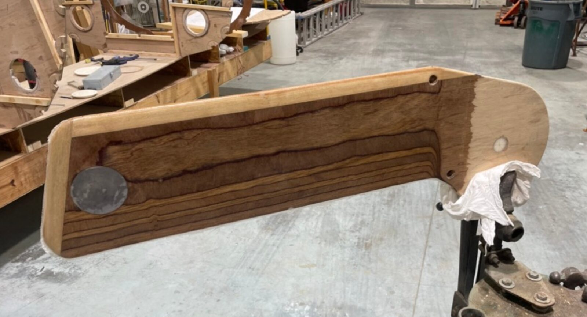
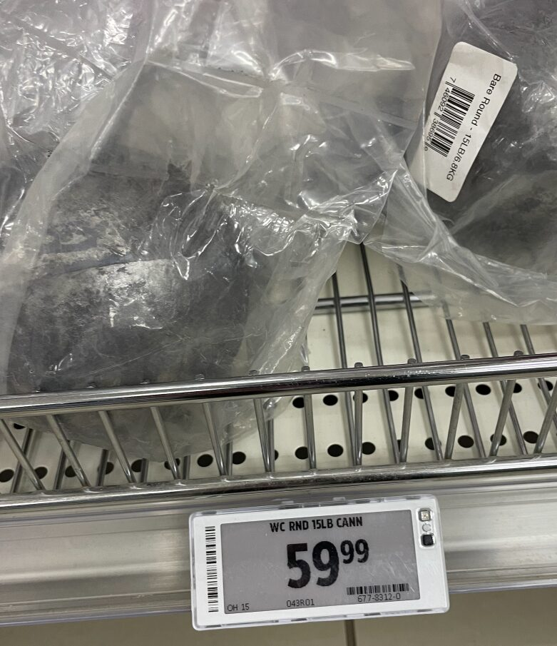
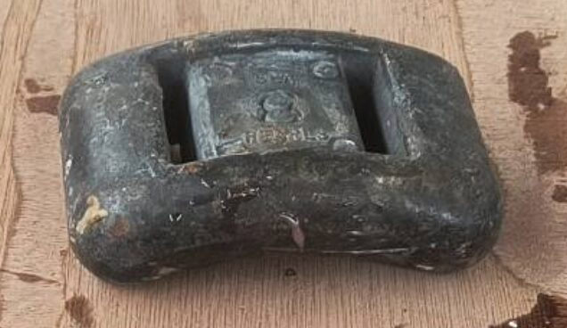
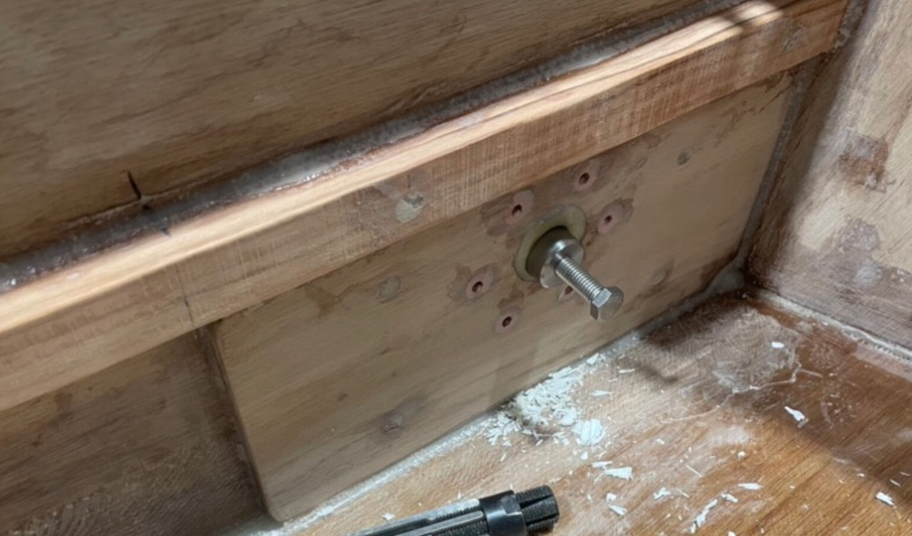
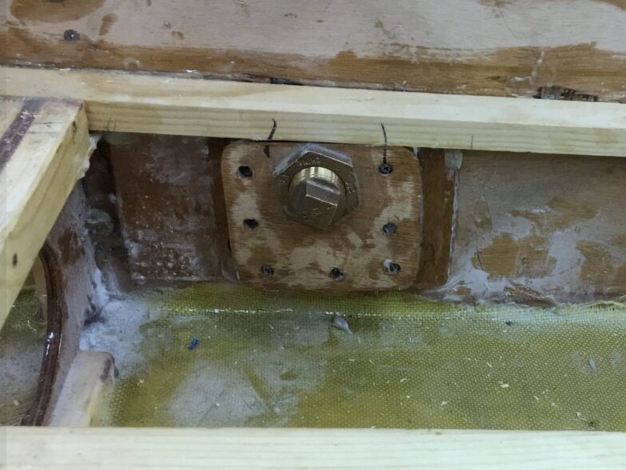
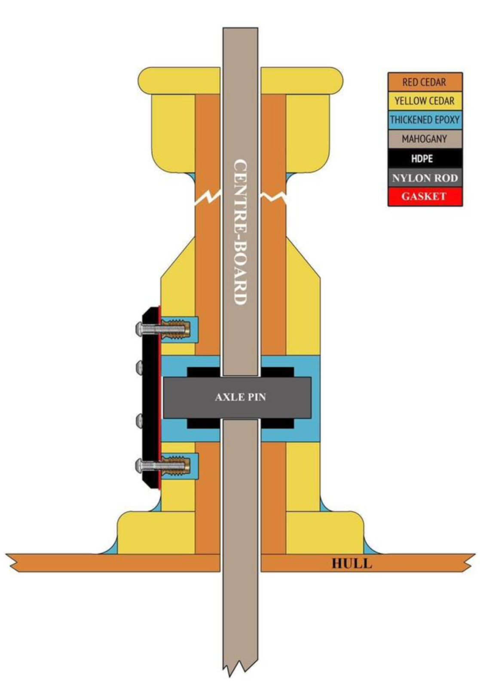
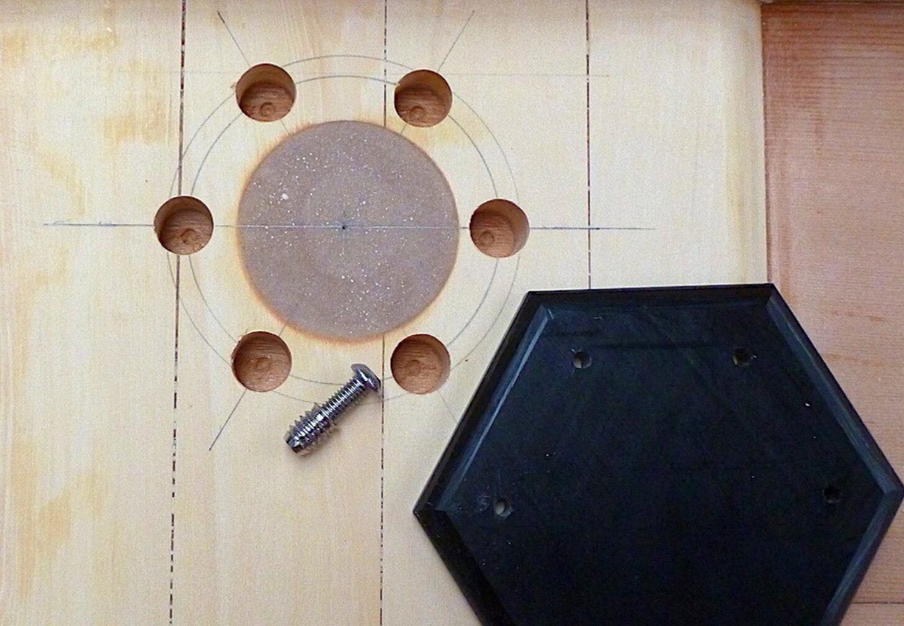

# Center board

[← Research index](README.md)

  - **NOTE: Also look at the [rudder section](((699dd56e-dcc4-462e-aaed-0dbc127efe40))) for relevant info**
    - Centerboard vs rudder:
      -
        > Rudders turn and require a profile that can handle larger angles of attack without stalling. NACA 0012 has the lowest drag and greatest angle of attack before stall. Dinghy rudders made from laminated planed 22mm timber need a cord length of 176mm to have 12% thickness/cord length ratio, which fits in with most smaller boats.
  - Why are centerboards shaped like airfoils? Two reasons:
    - Reduce drag, especially with a zero degree angle of attack
      - For both centerboard and rudder, Airfoil affects how much drag there is when I'm running, or going straight.
    - Maximize lift with a non-zero AOA.
      - Centerboard has non-zero AOA when going into the wind. Airfoil affects how much farther into the wind I can sail, in the ballpark of 1-3 degrees.
      - Rudder has non-zero AOA when the tiller is at an angle. Airfoil affects how quickly I can turn the boat at a given rudder angle.
    - NOTE: The Pollock shape is an interesting alternative.
  - How to build the center board
    - Design the foil shape. JW has a more linear shape (Pollock?), however, I wee many builders using proper foil shapes. I think I'll go with a proper foil shape
    - Have Thomas from Islandlaser CNC cut two halves (with pockets for lead)
    - Pour the lead in a plaster form
    - Install lead into two halves
    - Glue two halves together
    - Fiberglass and epoxy
      - Jeff from Sailing moga clamps it for fiberglassing:
        - 
  - The lead weight in the centerboard:
    - At least enough to overcome lift of board so that it stays down (and doesn't float up)
    - The more I add, the stronger the righting moment of the boat will be. But also, the harder it will be to raise it.
    - Recommendation is to make it so that it will drop by itself, but isn't too hard to lift with standard line tackle when needed (both in and out of the water).
    - Pouring the lead:
      - In situ
        - Sailing Moga cut notches into the inner plywood layers that the lead would flow into and lock itself in place
        - He doesn't even cover up the lead. It stays exposed on both sides.
      - Separately
        - Avoid burning the wood
        - Need to match cavity to poured lead
      - Sourcing lead
        - Canadian Tire sells fishing weights
          - 15lbs for $60
          - {:height 421, :width 347}
        - Can I buy used diving weights?
          - {:height 201, :width 333}
  - Good resources
    - [Design and Construction Of Centerboards and Rudders](http://boat-links.com/foils.html) - Article written by an EE. Very understandable and good concepts
      -
        > For running the section would be as thin as possible while for beating and probably reaching, around 8 per cent is a good thickness from a drag point of view. Taken overall the practical range of t/c values is 8 per cent to 12 per cent with the thicker sections probably tending to be better for slower boats.
      -
        > Strojnick[17] suggests this technique that is sometimes used for making airplane wings. Lay up a skin of fiberglass on a piece of Plexiglas. When it has partially set, but not yet hard, peel it off the plastic and form it around a male mold for the final cure. This gives a very smooth finish without the difficulty of having to make your mold very smooth.
      - NACA formula:
        -
          ```
          y = (t / 0.20) * ( 0.29690 * SQR(x) - 0.12600 * x - 0.35160 * x2 + 0.28430 * x3 - 0.10150 * x4 )
          where   x is the position along the chord from 0 to 1
            y is the thickness at a given value of x
            t is the maximum thickness as a fraction of the chord
          and   SQR is the square root function
          The leading edge has a radius given by:
          r = 1.1019 * t2
          ```
    - [High-Performance Foils | Small Boats](https://smallboatsmonthly.com/article/high-performance-foils/)
      - Has some good tips, shows a great video for CNC cutting a foil
    - [Helpful Calculations | Optimize Marine Designs Today — Competition Composites Inc.](https://www.cci.one/helpful-calculations)
      - Foil calculators for core dimensions, reynolds number, righting moment, lift
    - [Dinghy Foil Profiles | Sailing Anarchy Forums](https://forums.sailinganarchy.com/threads/dinghy-foil-profiles.166079/)
      - I'm seeing these recommendations a lot:
        -
          > The NACA 0010 (10% thickness) or 0012 (12% thickness) are good.
        -
          > 10 for the center board and 12 for the rudder are decent choices
    - [CNC shaped foils — Chase Small Craft](https://www.chase-small-craft.com/foils)
      - Chase Small Craft CNC cuts foils and rudders for their own boats, but also for others. They website shows a Goat Island Skiff foil.
    - Forum comment that suggests for small recreational dinghies the Airfoil shape for the centerboard is irrelevant. Parameters like length and aspect ratio seem to matter more. They say a thin flat plate would be just as efficient, and the speed difference would be a few seconds per mile sailed: https://forum.woodenboat.com/forum/designs-plans/11881-centerboard-shape?p=455435#post455435
    - This video shows a guy shaping his foil using a router jig: [Rudder Build - Offset Rail Method - Sharpie Build - V64 Rudder Pt1 - YouTube](https://www.youtube.com/watch?v=LxGoCouIVRE)
      - He gets outgassing, highlights the importance of doing a first epoxy coat to seal the wood before glassing it.
    - [Wave Dancer Yacht Design - wholesale plan sales](https://www.wavedancer-yachtdesign.com/html/Rudders_and_Centerboards.html)
      - Good writeup:
        -
          > Rudders turn and require a profile that can handle larger angles of attack without stalling. NACA 0012 has the lowest drag and greatest angle of attack before stall. Dinghy rudders made from laminated planed 22mm timber need a cord length of 176mm to have 12% thickness/cord length ratio, which fits in with most smaller boats.
        -
          > Centerboards and dagger boards on the other hand operate at much smaller angles of attack and could use a NACA 0010 profile. This works fine if the board is no wider than 210mm. Any larger chord lengths will require a thicker foil to stay around the 10% ratio.
        -
          > The other approach is to stay with 22mm planed timber for the boards too, but use a profile developed/advocated by Neil Pollock. Basically this consists of a leading edge portion similar to the 10-12% NACA profile, followed by a parallel section ending in the trailing edge portion. The leading and trailing edge sections are always the same thickness / length ratio and the wider the board, the wider the parallel section gets.
        -
          > The benefits of this profile seem to be that for the low thickness ratios that we are interested in, which tend to be 6% and less for daggerboards and centerboards, they can handle slightly higher angles of attack without stalling. For low angles of attack, lift is apparently about the same for most foils, but the sharper leading edges of say a NACA 0006 stall sooner. Furthermore, trailing edges being long and thin are more prone to damage.
        -
          > A practical benefit of the parallel section is that they are stronger as there is more material in the right place for strength. Good for the sailor standing on them to right the dinghy after a capsize.
    - [makefoil.pdw - NACA0010-12 Foil.pdf](https://www.duckworksmagazine.com/07/howto/naca/NACA0010-12%20Foil.pdf) Design for a NACA0010 foil from duckworks
    - This video shows how to design a foil in Onshape
      - [How to use Onshape Scripts - Airfoil Example - YouTube](https://www.youtube.com/watch?v=nrbH_505-kg)
      - https://github.com/dcowden/featurescript
    - Pollock Profile
      - [Cheap Hack for 10 percent more upwind Sailboat Performance - Storer Boat Plans in Wood and Plywood](https://www.storerboatplans.com/foils/cheap-hack-improve-sailboat-upwind-performance-by-10/)
        - Formula for Pollock profile:
          - Pollock Leading Edge
            -
              ```
              y=Tmax*(8*SQRT(x)/(3*SQRT(XLE)) – 2*x/XLE + x^2/(3*XLE^2)) where:
              y is the thickness at a given value of x
              Tmax is the maximum thickness as a fraction of the chord
              x is the position along the chord from 0 to 1
              XLE is the length of the tapered leading edge
                (the LE is upper case because a small L could look like a 1 or I.
              ```
          - Pollock Trailing Edge
            -
              ```
              y=Tmax*(1 – (3*x^2)/(2*Xte^2) + x^3/(2*Xte^3)) where:
              y is the thickness at a given value of x
              Tmax is the maximum thickness as a fraction of the chord
              x is the position along the chord, not from 0 to 1! (see below)
              x is 0 at the beginning of the taper and
              x increases to Xte at the trailing edge of the foil
              Xte is the length of the tapered trailing edge
              ```
      - A guy built a Jupyter Notebook to compute the profile for a pollock foil template, ready for CNC
        - [Canoe Sailing | I've posted a first draft of a web-based utility that makes 3D-printable templates for shaping rudders, daggerboards and other foils | Facebook](https://www.facebook.com/groups/152444938788/posts/10163065558518789/)
        - [seastate/CQFoil: A utility for creating 3D-printable templates for shaping rudders, daggerboards and other sailboat foils](https://github.com/seastate/CQFoil)
  - Centerboard pin
    - Jeff D has good photos [on his build blog](https://forum.woodenboat.com/forum/building-repair/9018924-building-a-welsford-long-steps/page8):
      - 
    - Phil McCowin uses this approach, not exactly sure how it works, [commended by Howard Rice](https://www.facebook.com/photo/?fbid=10226845670784937&set=a.10226845731506455)
      - 
    - [Interesting discussion in the FB group](https://www.facebook.com/share/p/1CZUAF3Hap/).
      - Consensus seems to be to overdrill the holes, use a SS 1" pin, maybe HDPE bushings. SS end place (or HDPE) to prevent pin from axial movement. Try to absorb later CB force not as torque on pin, but as forces on axle washers and bottom edge of case opening
      - From https://www.facebook.com/media/set/?set=a.2263337930393674&type=3
      - {:height 615, :width 429}
      - {:height 304, :width 440}
  - Centerboard casing inside coating: Use West System's graphite powder
  - Seems like a good foil shape is very important for performance
  - Bushing
    - JW recommends this: You can bore the holes well oversize, fill them with thickened epoxy and redrill them at the proper size for the bolt.
  - I asked Claude about axle and bushings:
    - Centerboard pivots take significant loads, so material choice and proper installation matter. Here's what works well:
    - ## Axle Materials
      **Stainless steel (316 grade)** is the most common choice—strong, corrosion-resistant, and readily available as rod stock. Use 316 rather than 304 for better saltwater resistance.
      **Bronze** is a traditional option that's extremely durable in marine environments and won't cause galvanic issues with stainless fasteners.
      **Fiberglass rod** is an increasingly popular alternative. It won't corrode at all, is lighter, and can be bonded directly with epoxy. It's plenty strong for most dinghies.
    - ## Bushing Materials
      **Delrin (acetal)** is arguably the best choice—low friction, doesn't absorb water, machines easily, and is very durable. It's widely used in production boats.
      **UHMW polyethylene** has similar properties: slippery, doesn't swell, and is inexpensive.
      **Bronze bushings** (particularly oil-impregnated sintered bronze) are traditional and long-lasting, though heavier.
      Avoid nylon, which absorbs water and swells over time.
    - ## Attachment to Your Boat
      For a plywood/epoxy/glass boat, you have several good options:
    - **Reinforced trunk sides**: Laminate extra plywood or hardwood pads on the inside of the trunk at the pivot location to provide solid material for the bushing.
    - **Flanged bushings**: Use bushings with a flange and epoxy them into holes drilled through the trunk. Glass over the flanges for security.
    - **Through-bolted tube**: Install a fiberglass or stainless tube through both trunk walls with the bushing inside it, secured with thickened epoxy and optionally backing plates on the outside.
    - **Direct epoxy bond**: If using a fiberglass axle with Delrin bushings, you can epoxy the bushings directly into the trunk walls—the epoxy bonds well to abraded Delrin.
  - Here are my requirements:
    - No electrochemical interactions between incompatible metals. Bronze and 316 SS seem to work.
    - Bolt and centerboard need to be removable.
    - Bushings on all parts?
    - Some gap between board and case to prevent it from jamming if sand and rocks get in there
    - Abrasion resistant (fiberglass and graphite thickened epoxy)
