# Cuddy

[← Research index](README.md)

  - [JR Boatworks](https://jrcraftyard.ee/our-works/scamp-sailboat) has beautiful finishing
    - Port holes for the window
      - 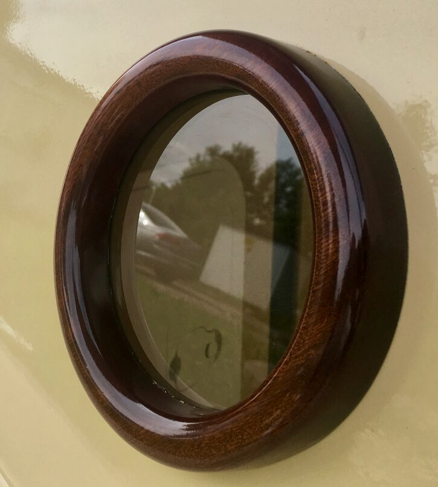
    - Cuddy roof toe rail on the side and raised aft edge (with stainless protectors where lines run)
      - The toe rail could be a teak grab rail rotated outwards. I've never seen this, however, it would give the benefit of a grab rail and a nice accent to the edge. So instead of installing the grab rail onto the roof, I would install it at the top edge of the sidewall. It's a bit non-traditional... Alternatively I could install the grab rail to the outside edge of the roof and get a similar accent, and even a better edge to the roof.
      - 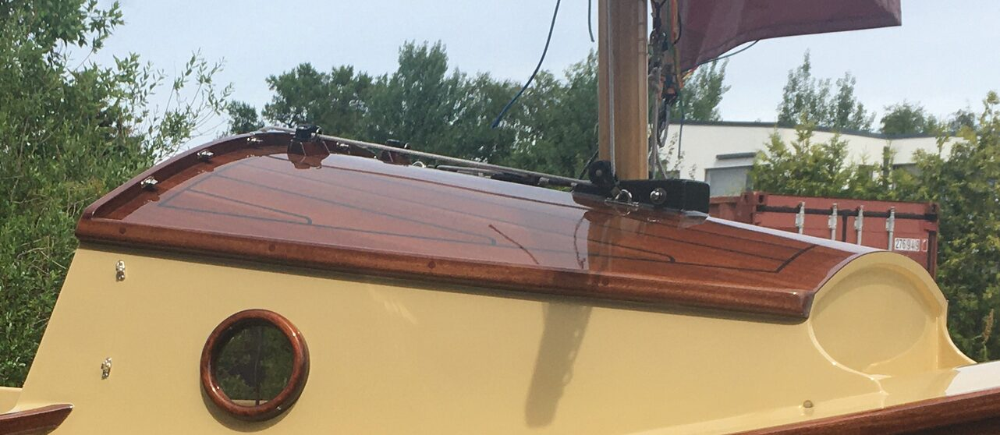
      - 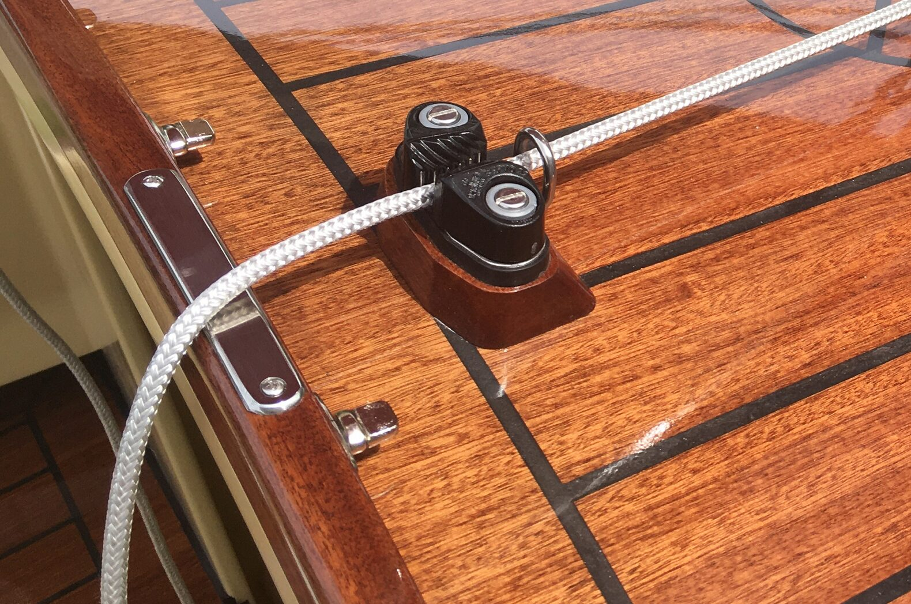
  - Add a second set of portholes in the cabin (into the forward enclosed compartment). Advantage could be to have more light in there. Michael Vaughn did it to Peppy
  - Todd Harris on FB added grip handles to his cuddy (on a walkabout)
    - 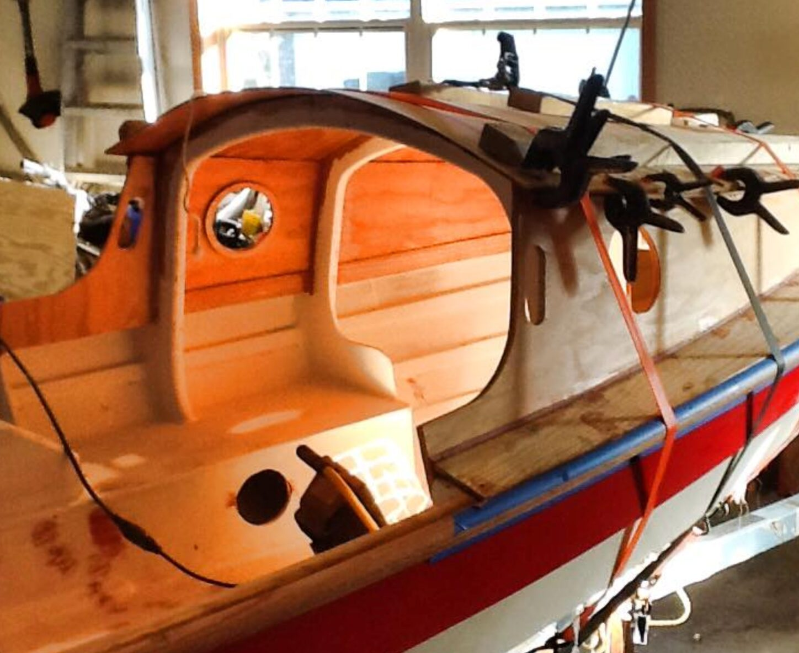
  - For good looks taper the sides forward and aft like Vivier's Meaban. The original LS plans look pretty good.
    - 
    - 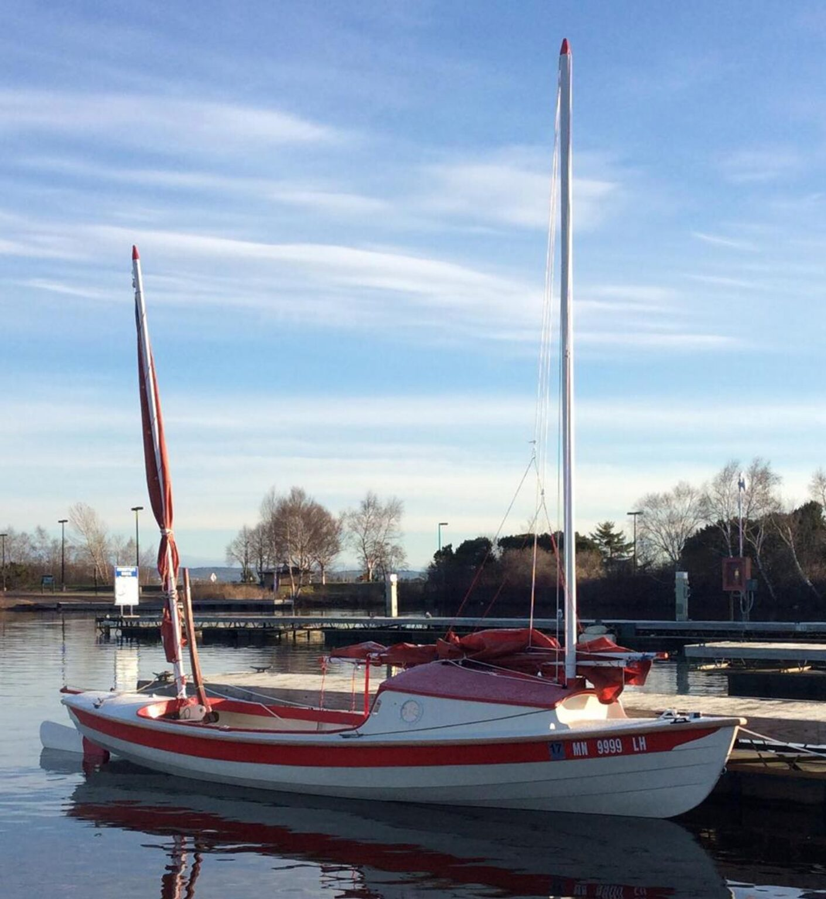{:height 791, :width 720}
    - 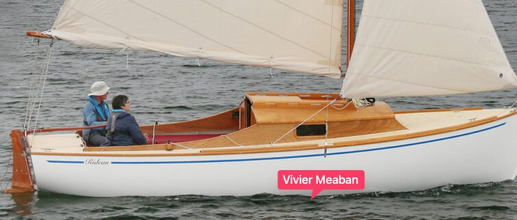
    - 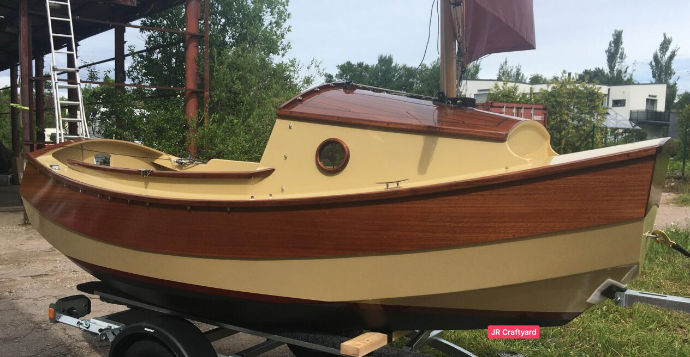
    - 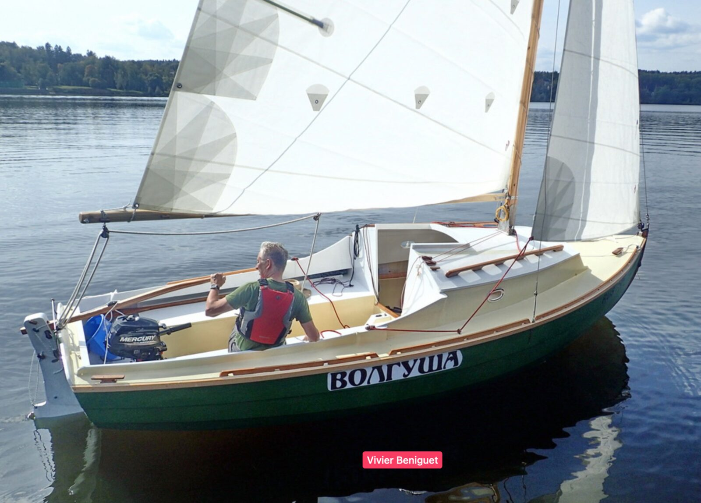
  - Don't make the roof look like that of a house, i.e. no big overhangs. However, we want good edge definition. Maybe just on the back above cockpit? Or none at all? Swallow yachts have no overhang at all.
    - Another reason to avoid overhangs is that lines get caught on them. There should be really nothing that will snag the lines. I like the collapsible cleats for that reason.
  - Add grab rails on either side of the cuddy roof
    - 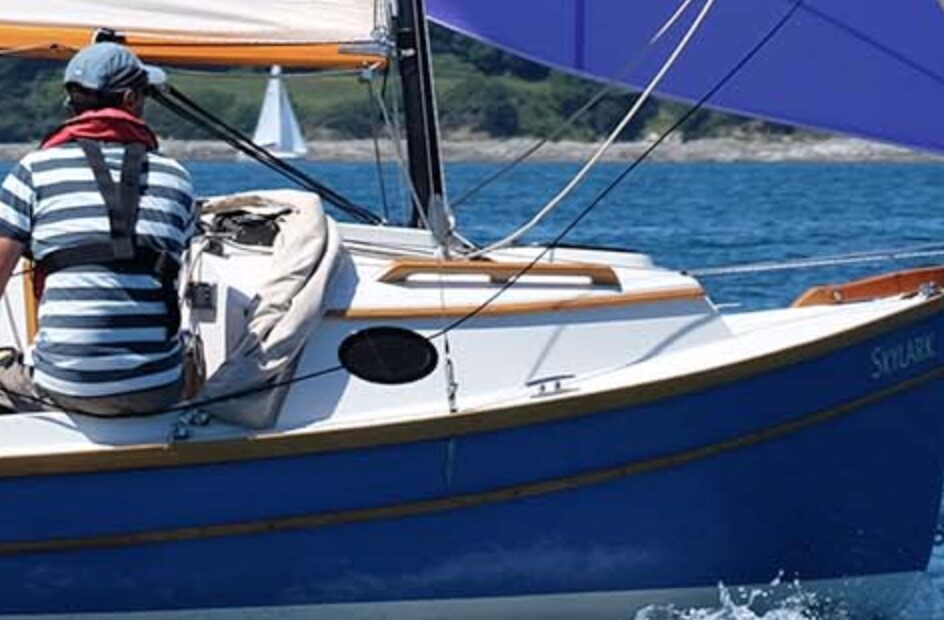
    - 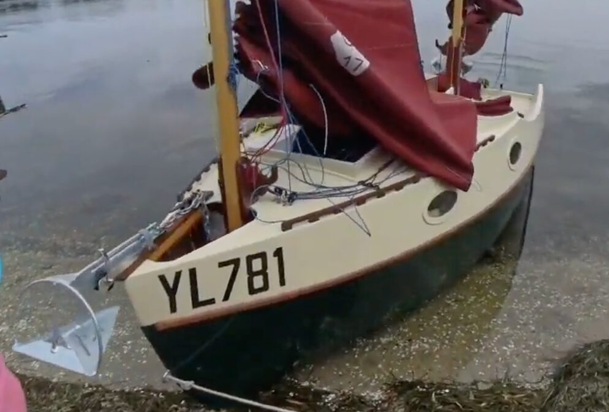
    - 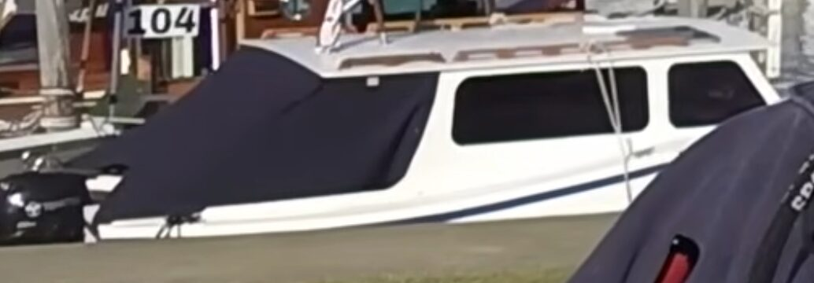
    - 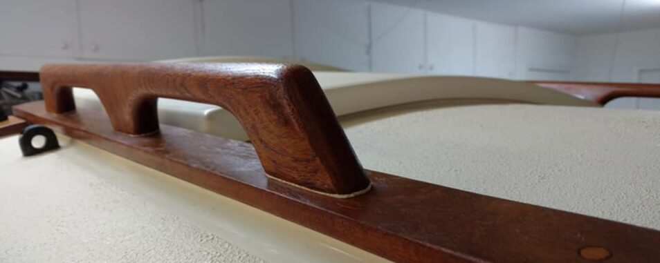
    - 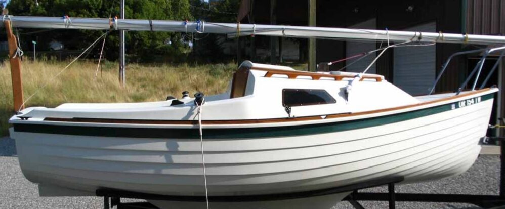
    -
    - Hammock Chair
      - Install a cross bar at the top of the B#3 after face, close to the roof. And cross bar anchor points on the seat fronts. Then mount a hammock chair between them.
      - 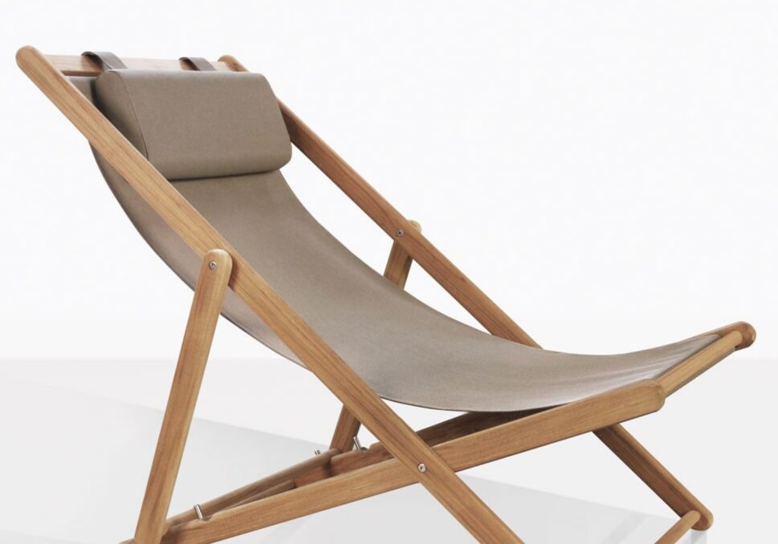
