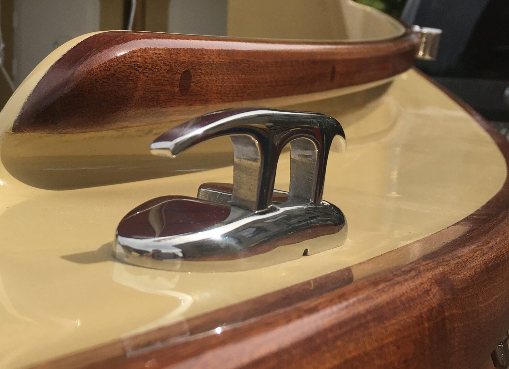
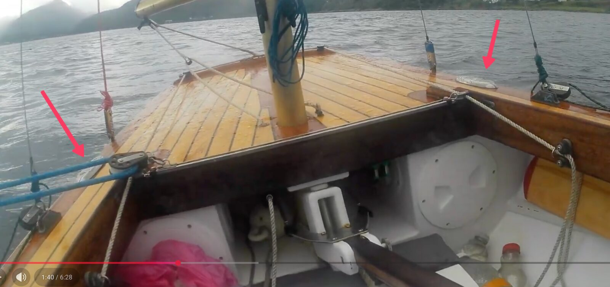
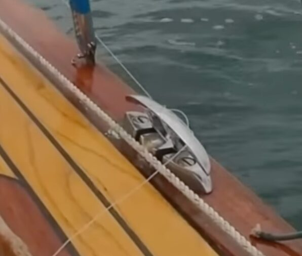
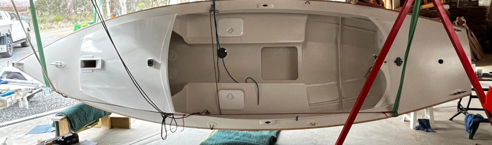
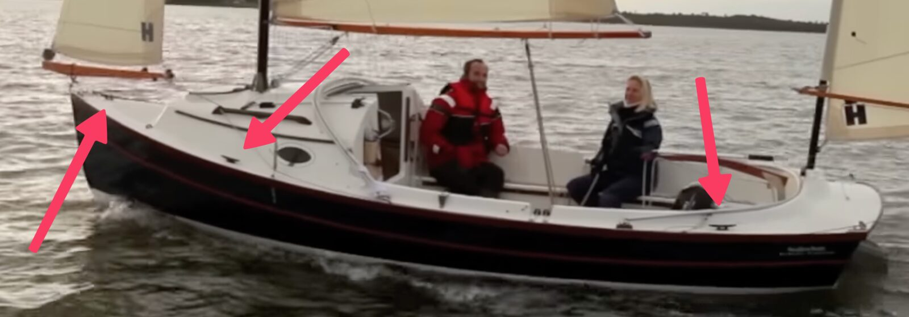

# Decks and hardware

[← Research index](README.md)

  - Q: Should I add more vertical holes into the side decks, similar to oar locks for mounting points, e.g., other rowing positions, fishing rod holder, camera mount, depth finder, fender tie ups, etc.?
    - Avoid issues w/ water ingress from outside the coaming into cockpit onto side benches.
    - A better alternative may be grab rails on the aft deck, one on either side. This would allow me to attach things like solar panels or tie down oars.
    - Also on the front deck? (may be a good location for solar panels)
    - And I am already planning on installing grab rails on the cuddy roof
  - Deck cleats
    - Josh with Navigator Trim uses folding cleats that fold up when moored and fold down under sail so that no ropes get caught in them. You can see them in [this video](https://youtu.be/GYacMfq9bro?si=VstTaa_NVK_Fu32E&t=291)
      - [Amazon.ca : folding boat cleats](https://www.amazon.ca/s?k=folding+boat+cleats&crid=3COOBPT3PJ65Y&sprefix=folding+boat+cleats%2Caps%2C154&ref=nb_sb_noss_1)
    - [JR Boatworks](https://jrcraftyard.ee/our-works/scamp-sailboat) also used folding cleats:
      - 
    - Northbound ([A Cruising Dinghy for Crossing the North Sea? - YouTube](https://www.youtube.com/watch?v=3tTcf_7OTA8)) also uses folding cleats on Fandango:
      - 
      - 
  - Michael Vaughn has a nice picture that shows all the deck hardware on his
    - 
  - Swallow Yachts BayRaider Expedition has 5 horn cleats on the decks:
    - 
