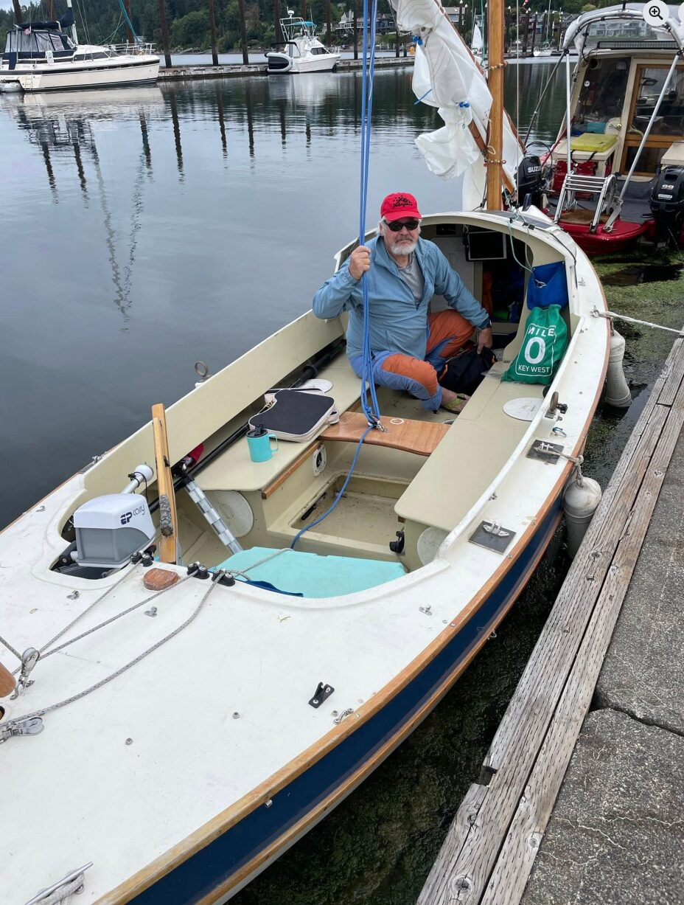
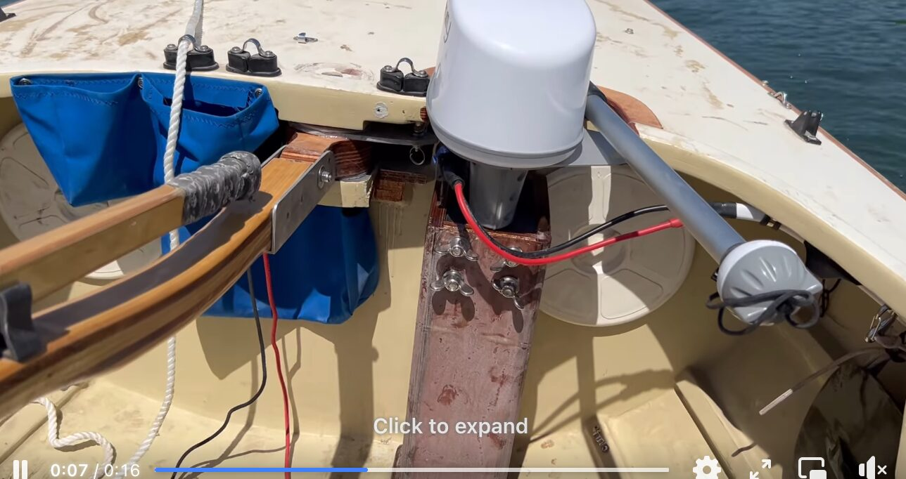
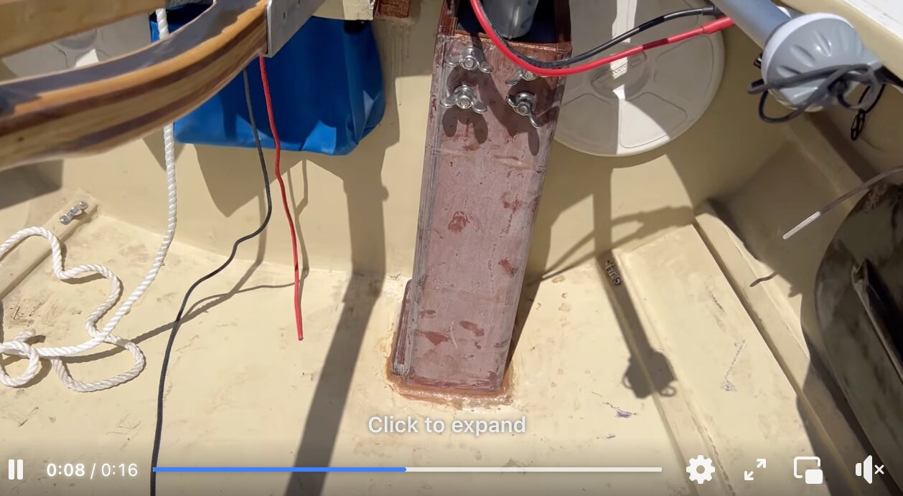
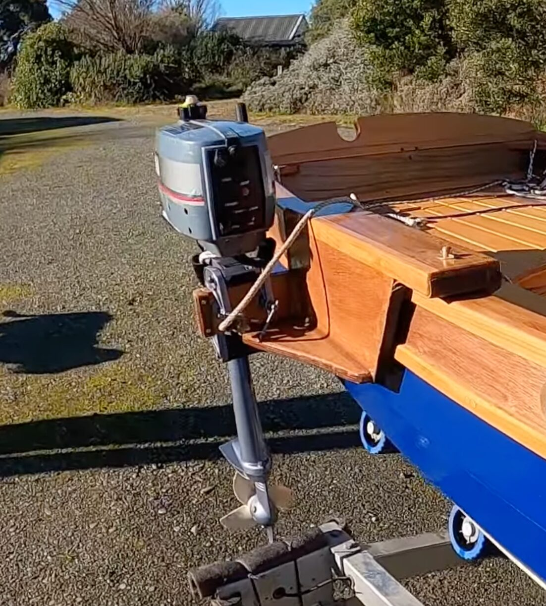
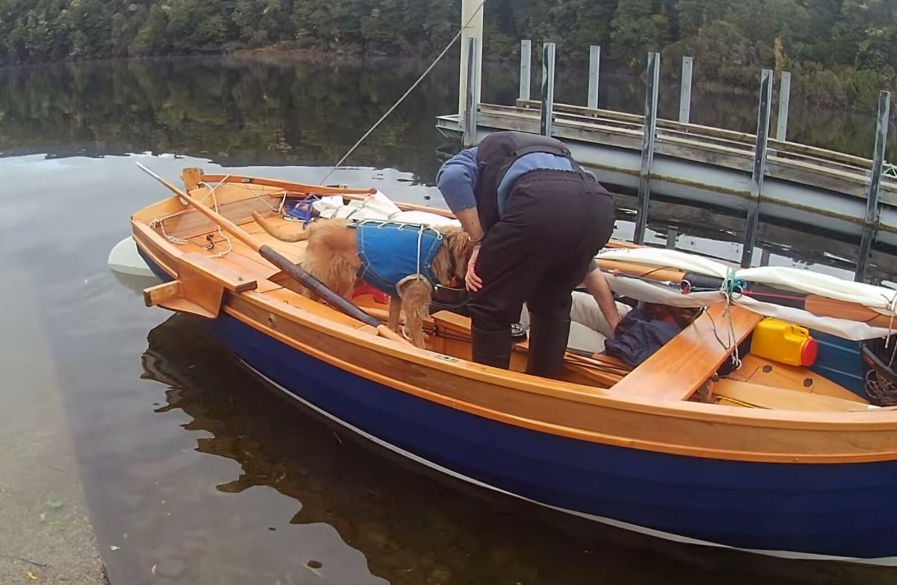
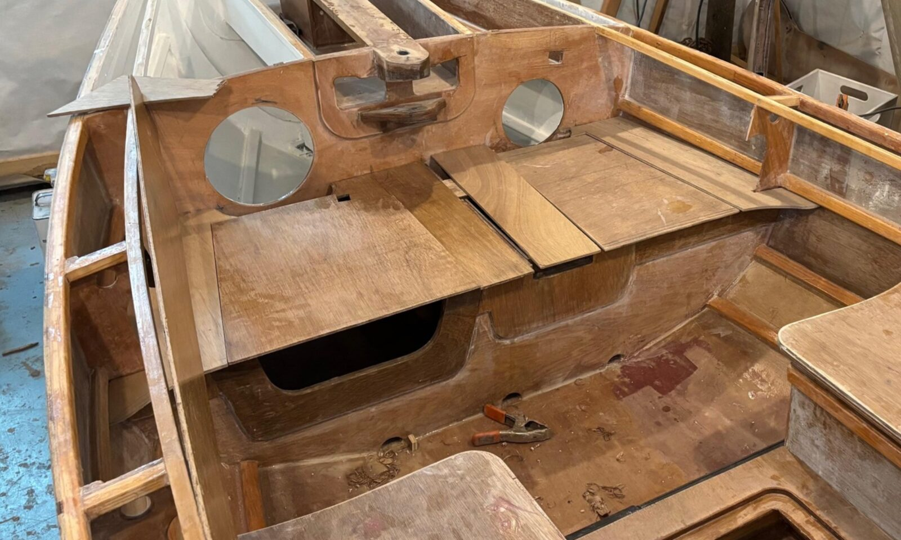
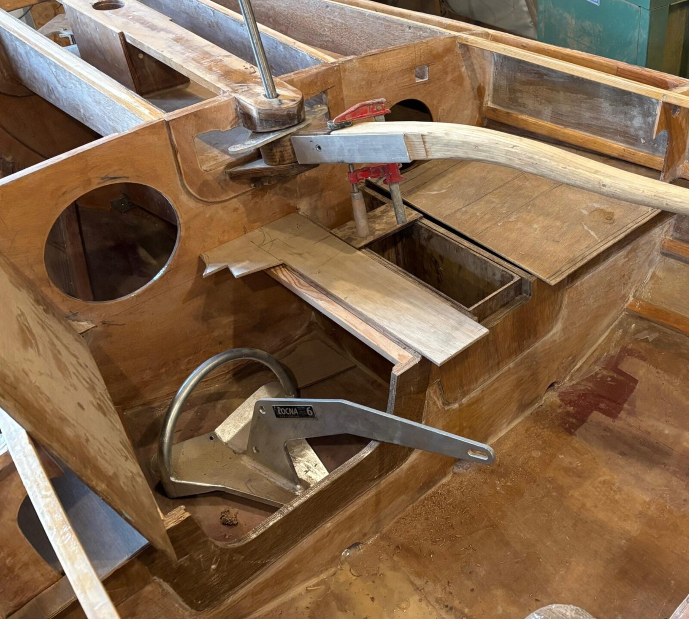
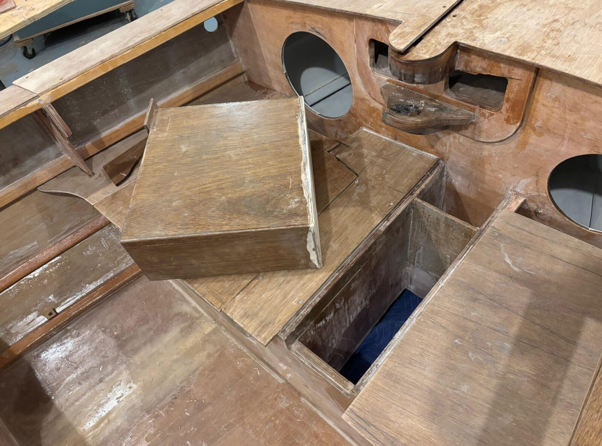
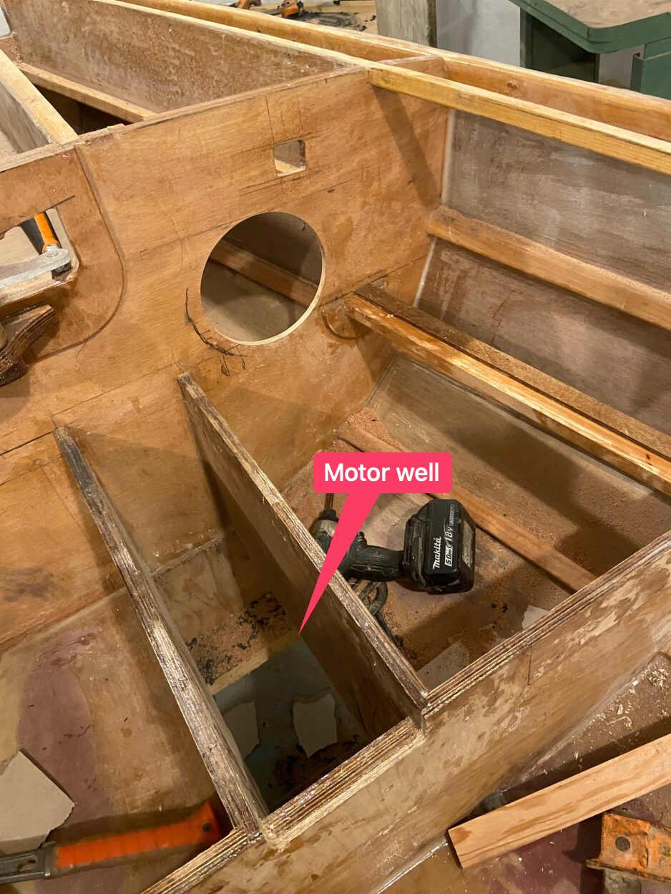
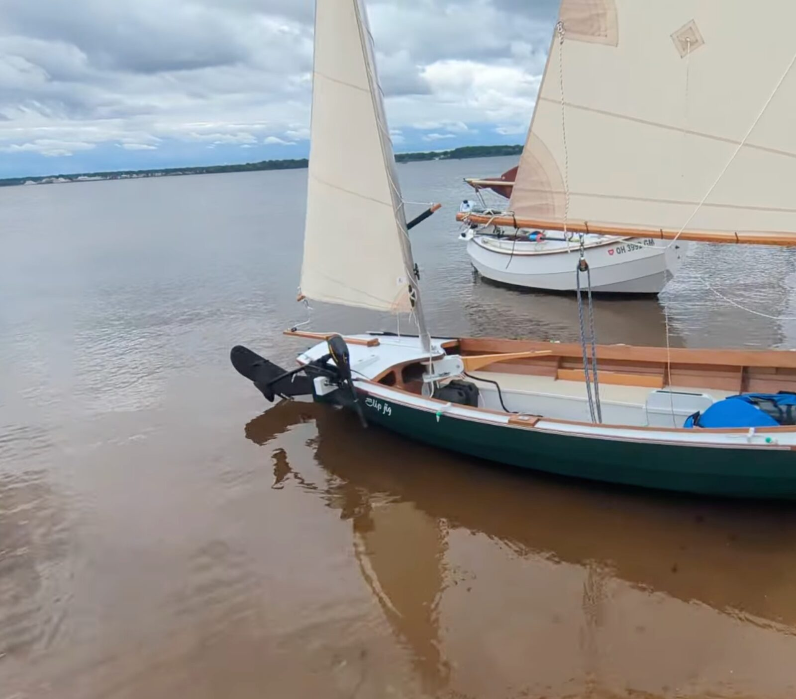

# Electric motor

[← Research index](README.md)

  - I may want to add an electric motor at some point. Would be good to plan how to mount the engine: Reinforced transom for a removable engine mount? Where would the engine go to not interfere with rudder and mizzen boomkin
  - Motor options
    - Pod motors
      - These could be mounted in a small motor well in the cockpit, similar to Ian Deveney's system (see below)
      - https://rimdrivetechnology.nl/product/electric-propulsion-pod-2-5/
      - https://www.kraeutler.at/wp-content/uploads/2018/10/Submersible-flange-motor.pdf
      - https://www.epropulsion.com/products/pod-drives/pod-drive-evo
      - https://ca.bixpy.com/products/bixpy-k-1-motor
      - I'd create a well before B#9 close to the center. I prepare two boxes that get dropped into the well:
        - one empty box with flat bottom when motor is not used. Creates smooth hull surface. Also creates space for prop when motor is not used and motor box sits on top.
        - one box that contains the pod motor. Goes to the bottom when motor is being used.
        - Depending on which mode I want I stack them in the correct order.
        - Will this require a collapsible prop so that the motor can be inserted through the narrow channel, and the motor box can be stored on top of the empty box? If so, I likely won't be able to use the prop for generation.
    - ePropulsion eLite
      - Mat Conboy recommends the ePropulsion eLite
        - https://youtu.be/9_5MtKZCHDk?si=ome7ZazQPG-DVaIw&t=826
        - [Ep. 49 - ePROPULSION eLITE LONG SHAFT TEST: push a 1 tonne Com-Pac Eclipse? - YouTube](https://www.youtube.com/watch?v=rzgfXqVe-L8&t=639s)
        - Weighs 8kg including built in battery
        - USB-C charging output for devices
        - He recommends adjustable long shaft version for more options
        - Doesn't have great range, so would have to be combined with solar charging system, or re-gen?
      - DRich about using eLite on SCAMP in Salish 100: [Salish 100 | Back home in Sebastopol, with so many learnings from my first real cruise on the Salish 100 | Facebook](https://www.facebook.com/groups/285180382147515/posts/1696346214364251/)
      - There is a dealer for ePropulsion in Victoria: https://oceansev.com/product/elite/
        - They charge around $1,800 CAD for the elite
        - And $260 CAD for a solar charge controller
        - The elite can be charged while operating. So I could get solar panels and significantly extend the range.
    - EP Carry
      - [EP Carry - Electric outboard motor for your dinghy](https://www.electricpaddle.com/ep-carry-dinghy-electric-outboard-motor.phtml)
    - Torqueedo Travel XS S
      - [Travel XS S - Torqeedo](https://www.torqeedo.com/us/en-us/products/outboards/travel/travel-xs-s/1169-00.html)
    - Other ePropulsion motors
      - This video has some good ideas:
        - ePropulsion motor
        - Battery disconnected from motor in the cockpit with extension cord
        - Locked engine direction in straight position
        - ePropulsion remote control for throttle control
        - https://www.youtube.com/watch?v=3d2jzglB4fM
      - Mat Conboy tests the ePropulsion Spirit 2, much bigger motor, may be overkill...
        - [Ep. 57 - REVIEW & TEST: The NEW ePropulsion SPIRIT 2 (on a Norfolk Urchin) - YouTube](https://www.youtube.com/watch?v=_JVKQkyoNzk)
  - And these videos talk about a solar charging system on a Welsford Navigator
    - [Ep. 32 - INSTALLING ePROPULSION SOLAR BATTERY SYSTEM ON SAILING DINGHY WELSFORD NAVIGATOR - YouTube](https://www.youtube.com/watch?v=PGVP8XWCEfQ)
      - Bungee buttons on the foredeck to strap in a flexible 50W solar panel by Renogy
    - https://www.youtube.com/watch?v=XnH7M6jrub8
  - Robert Ditterich has an interesting e motor mount in his Navigator: https://www.flickr.com/photos/waller540yacht/5152610511/in/album-72157623689676082/
    - I could do something like this at the end of the Long Steps cockpit
    - (Amazing build log of a Navigator by the way, lots to learn. He's an instrument maker)
    - Problem with this approach is that you can't easily raise the engine if you get into the shallows. Could that be solved with an engine well that goes above the water line? Then I could pull the motor up and the well would fill with water. This shows how deep the motor sits in the water: https://www.flickr.com/photos/waller540yacht/5522386740/in/album-72157623689676082/
  - Phil McCowin installed a motor well for an electric motor into his LongSteps:
    - This is probably the one JW is referring to here:
      -
        > One has been built with a "well" for an electric outboard motor just ahead of the tiller bulkhead, its a very small well, looks about 200mm fore and aft, and about 120mm wide. Those electric outboards are much smaller than the gas ones.
    - 
    - 
    - 
  - wetdog29 mounts the motor on the starboard side of his Tilly Ilur
    - [How I fit my short shaft outboard to my Ilur dinghy. - YouTube](https://www.youtube.com/watch?v=cm7enAkZUuA)
    - 
    - See it in action in this video: [Tilly. Ilur cruising dinghy. When things don't go entirely to plan..... - YouTube](https://www.youtube.com/watch?v=sZaYKhPjekI)
    - 
  - JW has prepared for side-mounting a 2.3 HP combustion on his LS:
    -
      > My own LS has a pair of mini frames under the side deck where a bracket clips in on the port side so my 2.3 hp Honda motor can be rigged on that side, but as yet I've not felt the need to use it.
  - This video shows a variant where the transom lip protrudes higher than the aft deck, and they clamp the engine on there: [Outboard Motor Bracket - No Holes Drilled Into Boat Transom - YouTube](https://www.youtube.com/watch?v=YJeTF553Q3E)
  - I could leave the starboard side of the upper transom edge exposed by cutting a recess into the aft deck. That would give me a pocket with the aft edge being strong enough to clamp a motor to. It's up to 6" wide, plenty for an electric motor.
    - I'm not sure if it would  interfere with the rudder though...
  - Ian Devenny has a clever solution for a motor well in his longsteps: https://www.facebook.com/share/p/19TiwRwWog : He built a plug that goes all the way down to create a smooth hull surface when the motor is not used. I could add a glass bottom to the plug to have a glass bottom boat! This could work both for an inboard or for a pod motor:
    - [(1) John Welsford Small Craft Design | Bit of progress… | Facebook](https://www.facebook.com/groups/JWDesigns/posts/2363094647202738/)
    - 
    - 
    - 
    - 
  - Thad Hallberg has a side mount on his walkabout:
    - 
  - Jean-Francoise Hardy has a cool rudder integrated motor with a collapsible prop on his Scamp
    - https://www.facebook.com/share/p/17dBxpnGkU/
    - He says that larger diameter props yield much more range (double he claims). They don't accelerate as quickly, however, they are significantly more efficient
