# Masts and spars

[← Research index](README.md)

  - Matt Conboy hit his head with the boom [Ep. 48 - EMERGENCY ON REMOTE ISLAND SAILING EXPEDITION - YouTube](https://www.youtube.com/watch?v=sawFwTNFAYE&t=6s)
    - Learnings: No sharp or hard parts on the boom! Keep it smooth and round to reduce risk of injury.
  - Mast building
    - I have to decide whether I use aluminum or wood. Aluminum is less work, however, I'm having a hard time getting dimension information and sourcing it. I have all the info for a wooden mast, it's just more work, however, it will look nicer, esp. with a taper.
    - Birds mount
      - Dimensions
        - Main Mast
          - Base
            - OD: 95mm
            - Wall thickness: 20mm
            - Solid up to 1200mm
            - Hollow up to 2000mm
          - Taper
            - Hollow from 2000 to ~4700mm
            - Solid from 4700 - 5000mm
            - Taper from 2000 to 5000mm
              - From 95 -> 70mm OD
              - From 20 -> 16mm wall thickness
            - [How to Layout an Elliptical Taper for Spars - YouTube](https://www.youtube.com/watch?v=rMH-BPJJfHs)
          - Top of mast
            - From 5000 to 5400mm
            - Looks like this is a separate piece attached to the main tube via blocking
            - Make very lightweight!
            - From 70mm -> 50mm OD
          - Considerations
            - I'd like to use 1x material for the staves. It's 18mm thick
            - That's a bit less than what JW asks for: 20mm wall thickness
            - He also has 90 and 95mm mast diameters. So I'll go with the larger diameter and the thinner wall thickness
            - Standard staves (symmetric v-groove)
              - The Duckworks calculator 4 gives me the following at the base of the taper:
                - Inputs:
                  - N: 8
                  - OD: 95mm
                  - H: 18mm
                - Outputs:
                  - L: 37mm
                  - ID: 63mm
                  - A: 0.67222
                  - K: 0.48431
                  - M: 2.55606
              - And at the top of the taper:
                - Inputs:
                  - N: 8
                  - OD: 70mm
                  - H: 18mm
                - Outputs:
                  - L: 27mm
                  - ID: 37mm
                  - A: 0.52573
                  - K: 0.67136
                  - M: 2.61085
              - Modified staves (outside shape is a regular octagon, not using it!)
                - Using calculator 7 at [Duckworks - Bird's Mouth Spar Size Calculators](https://www.duckworksmagazine.com/10/howto/birdsmouth/)
                  - Base of the taper
                    - Inputs:
                      - N: 8
                      - OD: 90mm
                      - ID: 58mm
                    - Outputs:
                      - L: 37mm
                      - ID: 18mm
                - Doesn't seem to make this any better, so I'll go with the symmetric v-groove
        - Mizzen Mast
          - Base
            - Square bottom to prevent rotation
            - From 0 to 1200mm
            - OD: 60mm
            - Solid from 0 to 650mm, hollow above
          - Taper
            - From 1200 to 4350mm (top of mast)
            - Hollow from 1200 to 4000mm
            - Solid from 4000 to 4350mm
            - OD: 60 to 40mm
            - Wall thickness: 16 to 8mm
      - Types of wood in order of preference
        - Douglas Fir
          - Cheaper than Spruce, but more dense
          - Density: 530 kg/m^3 (17% more than Spruce)
          - Given that I'm going on the light side with my dimensions, I'll go with Doug Fir for the extra strength
          - Mast weight
            - Length: 16'
            - Diameter: 95mm
            - Staves width: 18mm
            - Solid sections, taper: Add 15%
            - Wood volume:
              - Area:
                - Outer: Pi * (47.5mm^2) = 7088mm^2
                - Inner: Pi * (30mm^2) = 2827mm^2
                - Total: 4261mm^2
                - 0.004261m^2
              - Height: 5.4m
              - Volume: .023m^3
            - Estimated weight: 0.023 * 530 kg = 12.2 kg (26.9 lbs)
            - I'll have to add to that the epoxy
        - Spruce
          - Less dense than Doug Fir, still strong enough
          - Density: 450 kg/m^3
        - Yellow Cedar (I haven't seen this mentioned)
        - Red Cedar (Not recommended)
          - [Suzy's Blog: Prototyping a modified birdsmouth mast with an integrated sail track](https://www.suzyj.net/2014/10/prototyping-modified-birdsmouth-mast.html):
            -
              > There's no way I'm going to build it out of Pine or Western Red Cedar, because both are much too soft.
          - [17 ft. Unstayed mast questions | Sailing Anarchy Forums](https://forums.sailinganarchy.com/threads/17-ft-unstayed-mast-questions.207306/)
            -
              > Unless you weigh 90 lbs., I fear that western red cedar won’t be strong enough. Clear spruce or Douglas fir would be better choices.
          - [Western red cedar mast - The WoodenBoat Forum](https://forum.woodenboat.com/forum/misc-boat-related/98384-western-red-cedar-mast)
            -
              > Western Red Cedar is brash/brittle. It's also soft, doesn't hold fasteners well, and isn't very strong. It's also rather soft.
      - Solid sections in the mast
        - Avoid abrupt changes in strength. Cut a vee:
          - 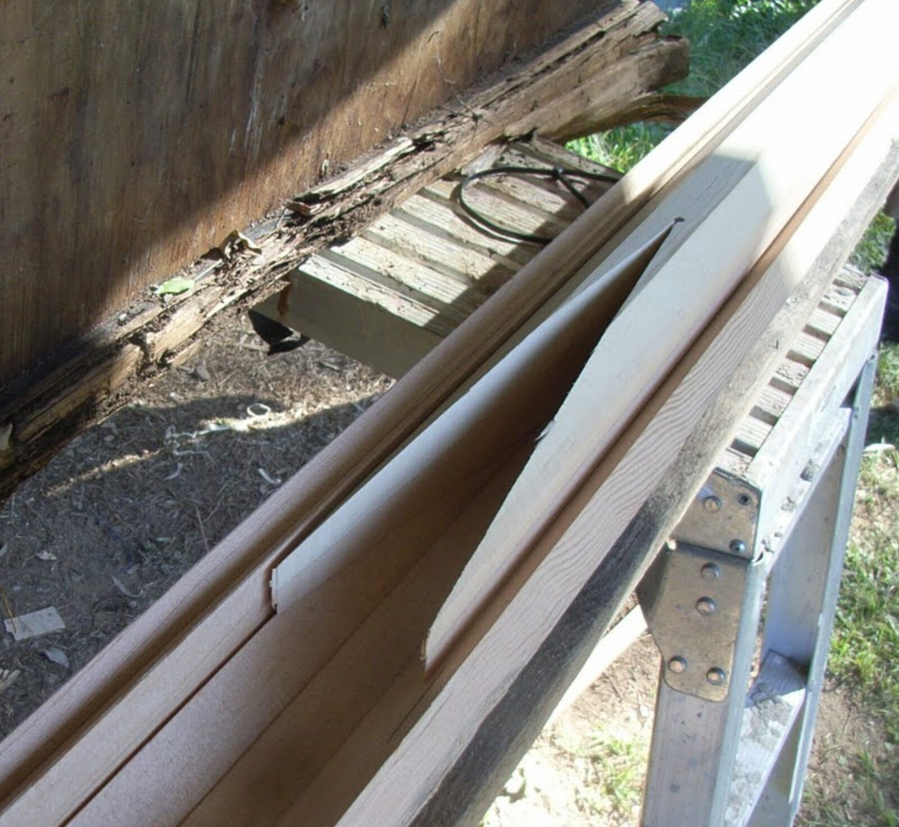
      - Rounding the mast
        - Plane to go from 8 -> 16 -> 32 -> round
        - Mark from Nomad Boatbuilding: 7-10-7 rule
        - Sanding jig from PVC pipe with handle
          - 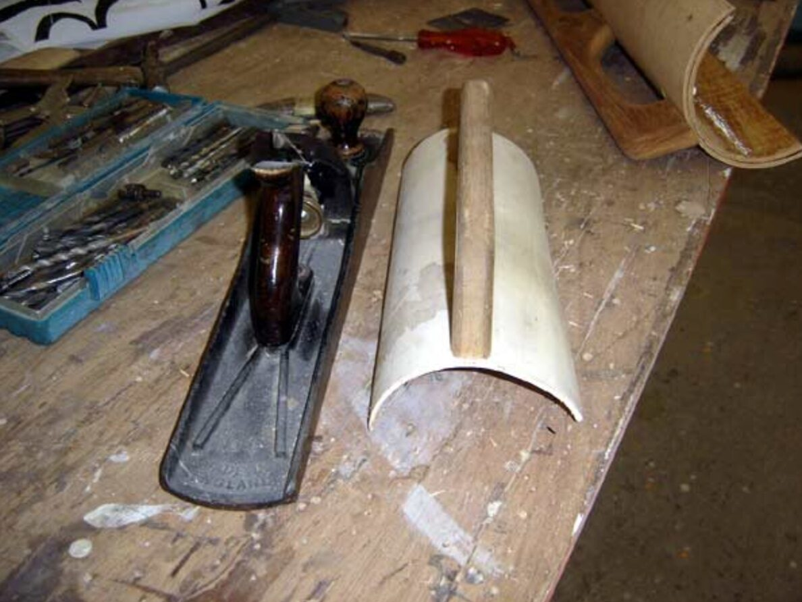
      - This person suggests to lay the staves flat when cutting the vee groove:
        - 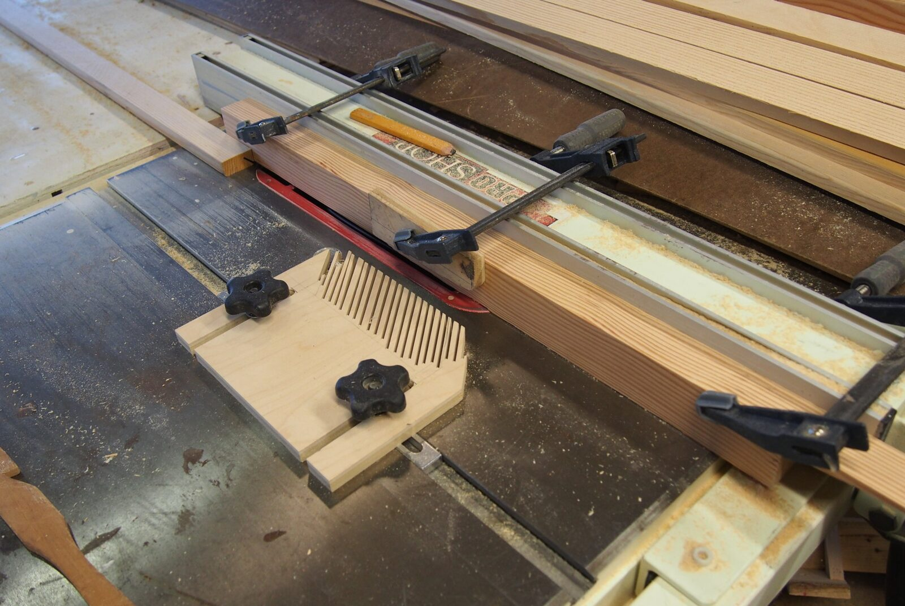
      - Birds mouth Resources
        - This FB group post has good info about birdsmouth mast: https://www.facebook.com/share/p/161PDZN6ki/
        - Here is a birdsmouth mast post on FB: https://www.facebook.com/groups/JWDesigns/posts/2473405849504950/
        - Another good birdsmouth mast post: https://www.facebook.com/share/p/16m6zq6MVz/
        - [Making a Bird's Mouth Mast for the Skerry](https://www.christinedemerchant.com/mast.html)
        - Duckworks has multiple articles
          - Original article: [Bird’s Mouth Spars](https://www.duckworksmagazine.com/03/r/articles/birdsmouth/mast.htm)
          - Follow up with lots more detail and calculators: [Bird's Mouth Spars revisited](https://www.duckworksmagazine.com/04/s/articles/birdsmouth/)
          - Just the calculators plus calculators for modified birdsmouth: [Duckworks - Bird's Mouth Spar Size Calculators](https://www.duckworksmagazine.com/10/howto/birdsmouth/)
          - Good howto for actually making it: [Duckworks Magazine](https://www.duckworksmagazine.com/06/howto/birdsmouth/index.htm)
        - JW on his approach to birdsmouth, just a plug, not an entire mast: [I get questions about making a hollow mast, so here's how I go about it. - JW Boat Designs](https://jwboatdesigns.co.nz/i-get-questions-about-making-a-hollow-mast-so-heres-how-i-go-about-it/)
        - [Ross Lillistone Wooden Boats: Assembling a "Bird's Mouth" Hollow Mast](https://rosslillistonewoodenboat.blogspot.com/2011/04/assembling-birds-mouth-hollow-mast.html)
        - Mark from Nomad Boatbuilding has a really good video on building a birdsmounth mast
          - [Bird’s Mouth Spar Construction | With WEST SYSTEM EPOXY - YouTube](https://www.youtube.com/watch?v=Kwfw0Fa7EcU)
          - Tips: Coat the inside surface with epoxy with two coats. Do this well ahead of assembly
          - Make any modifications while the mast is still prismatic, either square or octagon. Things will get a lot harder once it's round
          - He suggests an alternative build method that's a bit easier:
            - {{renderer(:drawio,1774237010882.svg)}}
      - Wood finishing
        - As of 2026-03-17 it's not clear to me what the best approach is.
        - [Wood Finishing for Marine Use](https://www.rosslaird.com/articles/blog/wood-finishing-marine-use/)
          - Compares different approaches.
        - Standard: Spar Varnish
        - Cetol Marine Natural
          - [Andrew Denman](https://www.denmanmarine.com.au/) (builds swallow yachts in Australia) uses Sikkens Cetol for all wood on his boats. Much easier to maintain than Varnish.
          - [Source](video https://youtu.be/O2m1Bm5FIqA?si=se9YR47P25ocfklU&t=1170)
          - Also recommended here: [Exterior Wood Finish Update at 2 Years - Practical Sailor](https://www.practical-sailor.com/boat-maintenance/diy-projects/exterior-wood-finish-update-at-2-years/)
        - Simple penetrating oil
          - Tung Oil seems to be the best quality
            - [Tung Oil: debunking the myths - Canadian Woodworking](https://canadianwoodworking.com/techniques_and_tips/tung-oil-debunking-the-myths/)
            - Requires at least 5 coats
            - Start with 70% thinned (Turpentine) on first coat. Last coat must go unthinned
            - Allow 1 week to cure between coats
            - Mildew resistent, waterproofing qualities, stays flexible when cured
          - Boiled Linseed Oil (BLO)
            - dries faster, can develop mildew
        - I asked Claude and it said this:
          - Here's how I'd rank the options for your specific situation:
          - At Tier 4 (strong) confidence: mixing graphite into the epoxy at the stave joints handles your UV-protection-for-epoxy objective well, regardless of what else you do. The field evidence for graphite/epoxy UV resistance runs strong, and the manufacturer acknowledges the protective effect even while recommending additional coatings. For narrow glue lines on a garage-stored boat, the graphite alone should suffice for years.
          - At Tier 3 (moderate) confidence: Cetol on the bare wood portions represents a sound choice now that the over-epoxy concern has shrunk to a negligible fraction of the surface area. Your original reasoning — easy recoating, no stripping — holds up well.
          - At Tier 3 confidence: leaving the spars bare with graphite epoxy only at the joints will work structurally for a garage-stored, dry-sailed dinghy, but the wood will gray and develop surface checking within a couple of seasons of PNW use. Whether that matters depends on your aesthetic tolerance and how concerned you feel about the checking-accelerates-moisture-ingress cycle.
          - A middle path worth considering: graphite epoxy at the joints, plus a simple penetrating oil treatment on the bare wood. No film to maintain, no build-up, just wipe on a fresh coat of thinned BLO when you feel like it. This provides enough water repellency to slow graying and checking while requiring essentially zero prep work for recoating — ever.
    - Aluminum
      - 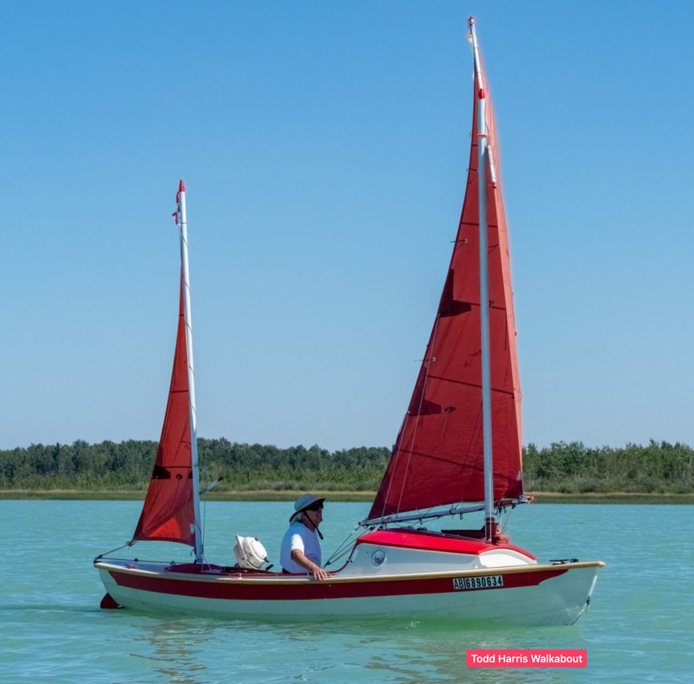
      - JW recommends .065" (1.65mm) 16 gauge wall thickness on a 2.75" diameter for Houdini and SCAMP and Walkabout (See my plans) masts:
        - I've shown alloy tube spars for simplicity, and have specified tube supplied by www.onlinemetals.com whom I understand will cut to length and ship to anywhere in the USA.
        - In this case the sections will fit one inside the other for shipment, the mast being fattest and longest protects the smaller and more vulnerable boom and yard sections.
        - Note that their on-line catalogue has a button to show all product in metric.
        - There will be other suppliers who can offer close equivalents, and as long as the product is no less stiff, and only slightly heavier if at all, that's fine.
          - Mast, 6061 T6 alloy. 69.85mm Outside Diameter, x 1.65mm wall thickness. Length per plan
          - Boom, 6061 T6 alloy. 34.93mm Outside diameter x 1.24mm wall thickness Length per plan
          - Yard, 6061 T6 alloy. 31.75mm Outside diameter x 0.89mm wall thickness. Length per plan
        - A note, each of these should have the ends plugged with wooden plugs, and while some builders will have access to a woodturning lathe to make special plugs with nicely rounded ends, it is quite acceptable to simply whittle a plug that has an approximate fit, sand the inside of the tube to give the glue a "key" then drive the plug in with a mallet until its really firm, the end of the tube will shave off the bits that are oversize. Later saw the remainder off when the glue has set. The screws that hold the fittings will provide additional security
        - The mast has a special base, and that can be made in the same way and is secured by some countersunk screws plus glue, again, don't fret about getting it specially turned, whittling will do the job as long as you can get a reasonable fit. One smart customer of mine showed me how he'd achieved a good fit by sawing a ¼ in ring off the end of his spar tube, then using that as a template to shape the plugs.
      - JW has a post about [birds mouth masts](https://jwboatdesigns.co.nz/i-get-questions-about-making-a-hollow-mast-so-heres-how-i-go-about-it/) where he talks about an aluminum mast he was donated for his Long Steps:
        -
          > I’ve been given a mast blank,  a 5m long x 75, od, 5mm wall thickness chunk of T6 temper aluminium tube.  It was bought to be the main mast for a Pathfinder, but life got in the way of the builder completing the project and he very generously donated it to my cause.  (Thanks so much Brian,  very much appreciated) It’s a little light for the unstayed rig on the longer, but slimmer, water ballasted Long Steps, so I’m reinforcing it.
        - So he says that 75mm OD and 5mm wall thickness is a little light for the Long Steps. That is already a lot thicker than everything I've considered so far. That means any aluminum mast would be quite heavy. Probably not saving a lot of weight compared to a wood mast.
      - Michael Storer recommends .065" wall thickness on a 2.5" diameter for the Oz Racer
        - https://www.storerboatplans.com/tuning/lug-rig-setup/test-for-google-docs/
        - Oz Goose recommendations: 2.5" diameter, .08" wall thickness
          - [Substituting aluminium spars on the Oz Goose sail boat - Oz Goose Sailboat - Cheap Simple Plywood Boat](https://www.opengoose.com/building-a-goose/materials/substituting-aluminium-spars-on-the-oz-goose-sail-boat/)
        - Michael Storer has an interesting recommendation:
          - For me I would be tempted to use the 0.065 and add a internal sleeve in the bottom 1.8m (including the diagonal cut at the top) of the same tubing.
          - 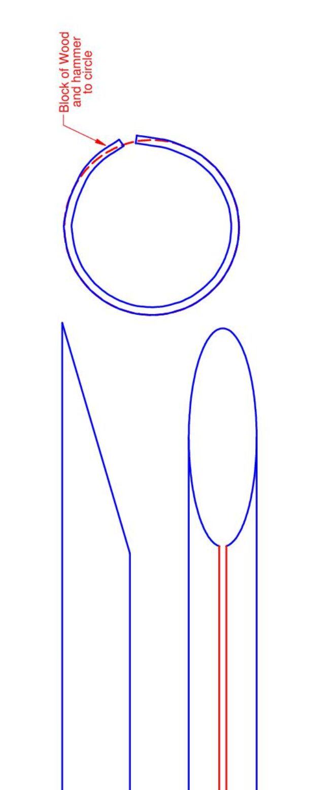{:height 992, :width 403}
      - Rick Thompson shows [photos of his mast here](https://forum.woodenboat.com/forum/building-repair/9145504-standing-lug-and-leeboard-for-a-welsford-walkabout?p=9186994#post9186994)
        - He inserted corks to provide buoyancy, and he used rivnuts to attach fittings
      - I think I'll go with 3" diameter.
        - I contacted MetalSupermarkets. They have 4" listed on their website ($180 for 15'), and I'll ask them if they can source 3" with 0.065 6061 T6
      - Alloys
        - Some people recommend the 6082 alloy. They say that is used by commercial aluminum boat builders. It has less copper content and is less prone to corrosion.
        - I also see 6060 T5
          - Someone selling their SCAMP mast https://www.facebook.com/commerce/listing/33671902622454741/?ref=share_attachment
          - From Walkabout plans
            - Standard sail plan
              - Main mast: 65mm x 1.6mm wall thickness 6060 T5
              - Mizzen mast: 50mm x 1.6mm wall thickness 6060 T5
            - Alternate sail plan
              - Main mast: Solid Spruce, 70mm diameter
              - Mizzen mast: 50mm diameter
      - I tried some computations, however, the results were inconclusive
        - From here: https://www.calcresource.com/statics-cantilever-beam.html
        - With these settings:
          - 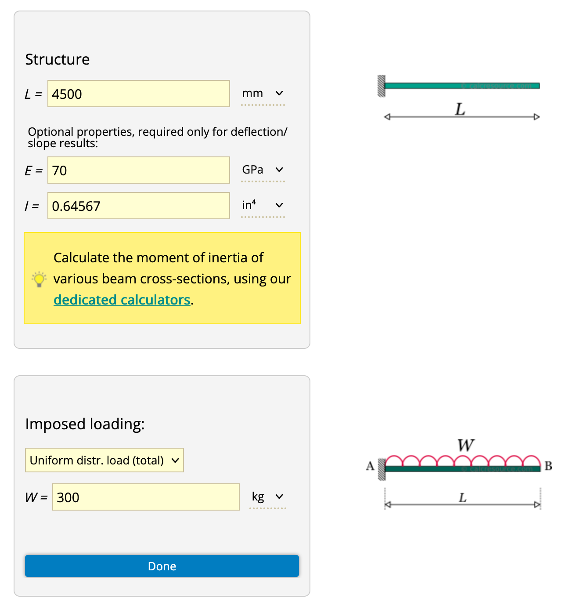
          -
      - I did some [calculations for mast weights](https://www.onlinemetals.com/en/weight-calculator)
        - 197" length
        - OD: 3"
          - Wall thickness:
            - 0.065" (1/16"): 11.6 lbs
            - 0.125" (1/8"): 21.8 lbs
        - OD: 2.75"
          - Wall thickness:
            - 0.065" (1/16"): 10.6 lbs
            - 0.125" (1/8"): 19.9 lbs
  - Mast step drainage
    - Make sure that both main and mizzen mast steps drain properly, and not into the sleeping platform. Either through a hole in the hull (main out the side, mizzen out the transom, or also out the side), or into the lowest area of the cockpit (through pipe from main mast through storage compartments into standing area).
    - PVC pipe has good UV resistance. I could run a pipe from both mast boxes into the lowest point of the cockpit, and have a bilge pump there (inside the bench at the back?)
    - Sailing moga has a good approach to mastbox inspection port and drainage:
      - Up forward I epoxied a doubler and some 5/8" fiberglass pipe through the hull that will take a drain line from the mast box. I think the plans call for running it aft through the bulkhead and into the cockpit area, but I figure this will be tidier.
      - I could use 1/2" PVC pipe with fittings and shutoff valves
      - And I could apply the same approach (going out the side) to the mizzen mast box drainage (rather than transom because it can get tight there)
      - 
  - Mast storage
    - Make the front tiller tunnel opening large enough so that we can run both the main and mizzen mast from the back into the cuddy. That will provide safe storage while on the trailer.
    - or just rest them on the aft deck.
    - In any case, they will protrude into the bow storage compartment.
    - Alternative could be two special jigs that go into the main and mizzen mast mounts to support masts and keep them above the hull for transport
  - Mast floatation
    - To prevent turtling I could add some mast floatation. Options:
      - Build a wooden mast
      - Put pool noodles inside the mast
      - Plug the ends of the mast
      - https://bandbyachtdesigns.com/building-supplies-and-tools/hardware-and-rigging/masts-track-and-more/mast-head-floats/
      - Inflatable mast floats
      - Fill the mast with foam
  - Mizzen boomkin
    - Use a PVC pipe
      - Jeff from Sailing Moga [used a PVC pipe as the boomkin tunnel](https://forum.woodenboat.com/forum/building-repair/9018924-building-a-welsford-long-steps?p=9308770#post9308770)
      - I kind of like it, but I'm not sure how well the pipe will hold up to UV degradation. What about a metal (aluminum) tube? Could that be epoxied to wood?
      - I did some research and it turns out that PVC pipe is quite UV resistent. Can also be painted with latex paint for additional protection
      - Jeff did this to make epoxy bond to PVC: sanding to 80 grit, alcohol wiping, and flame treating
      - 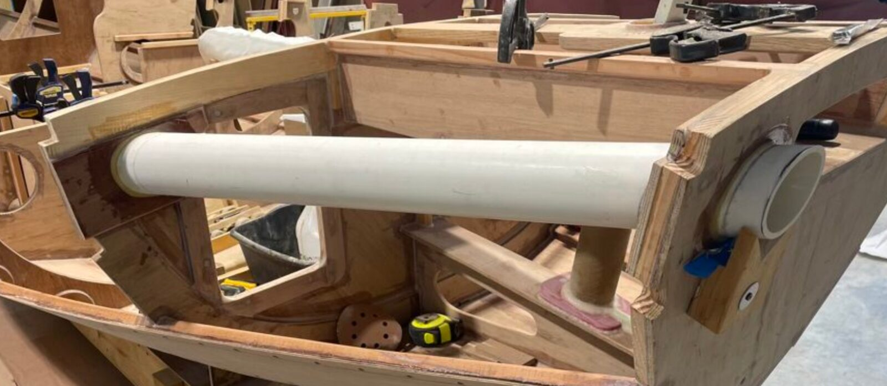
      - 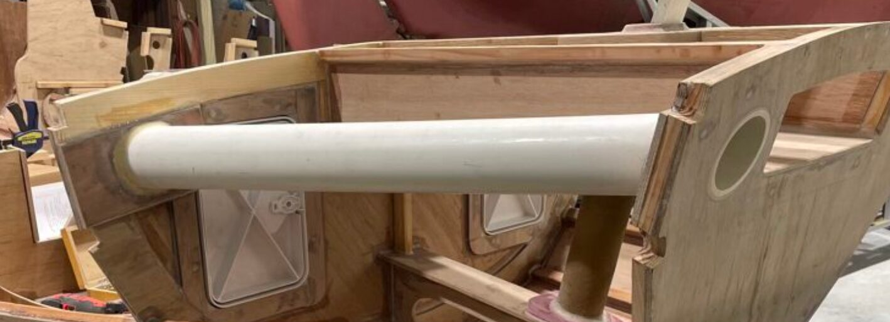
      - Lonnie Black did the same:
        - 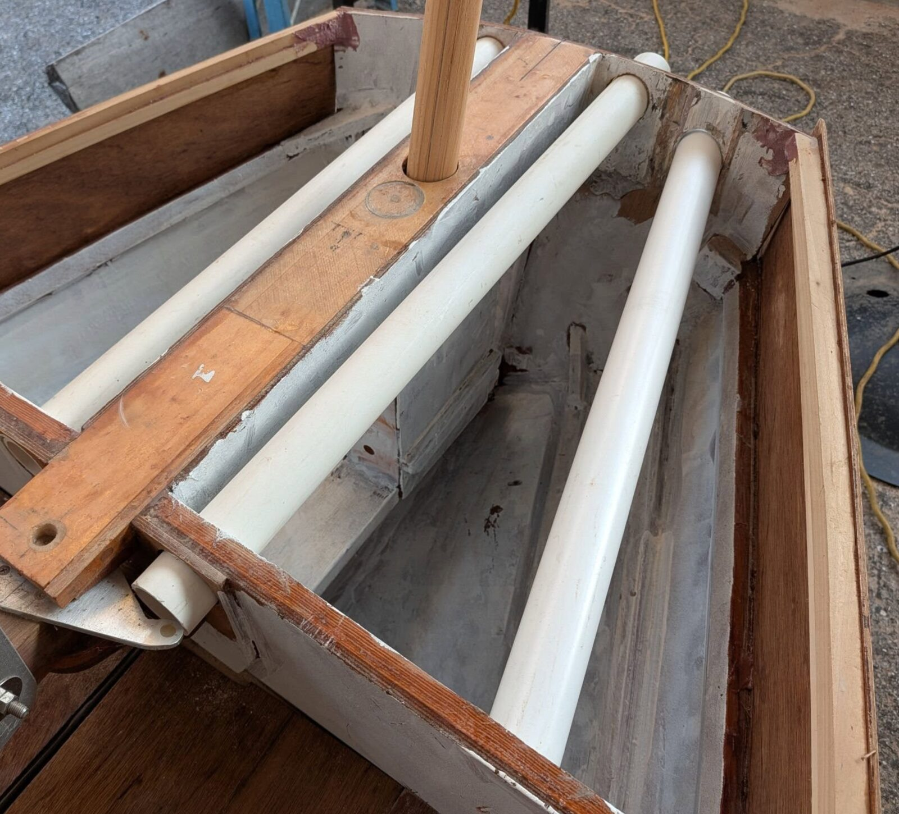
    - Run the mizzen sheet through the boomkin into the cockpit like this Caledonia Yawl from Nordic Craft
      - 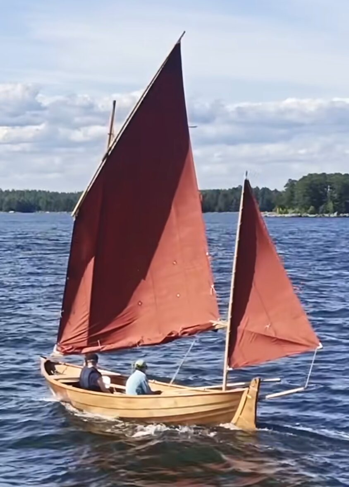
      - 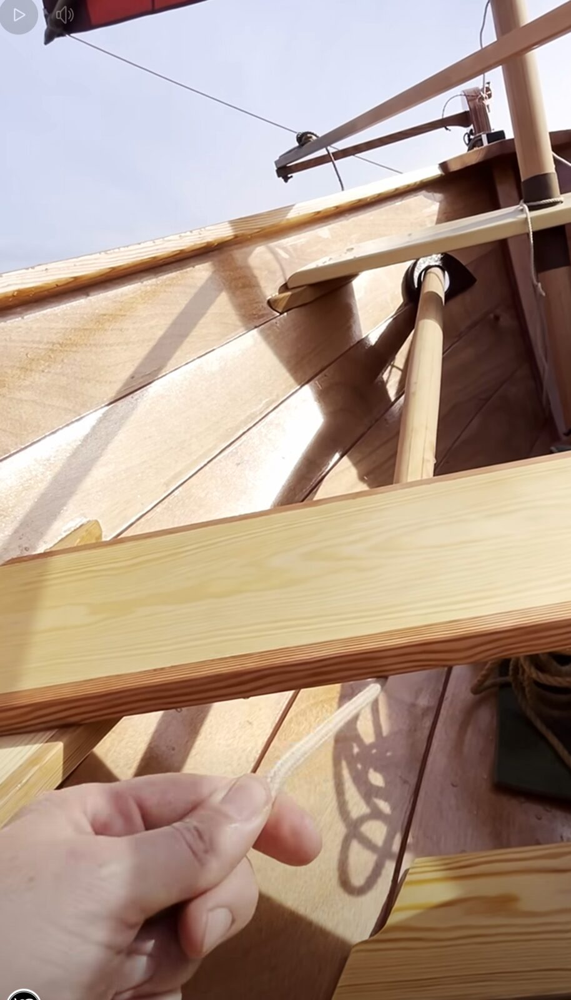
