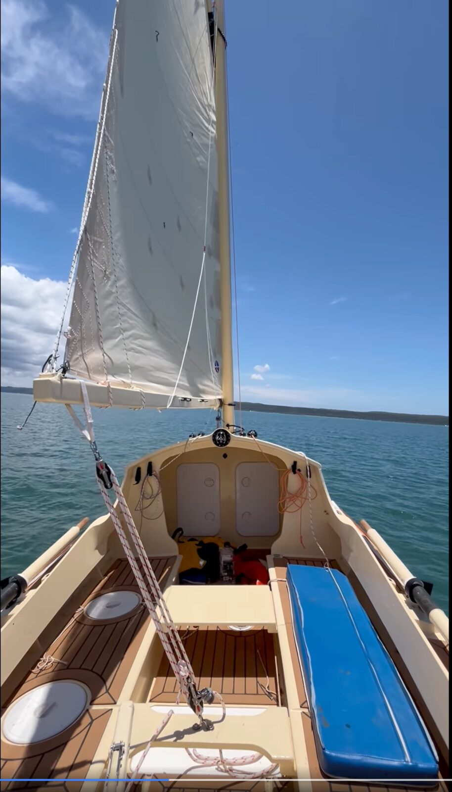
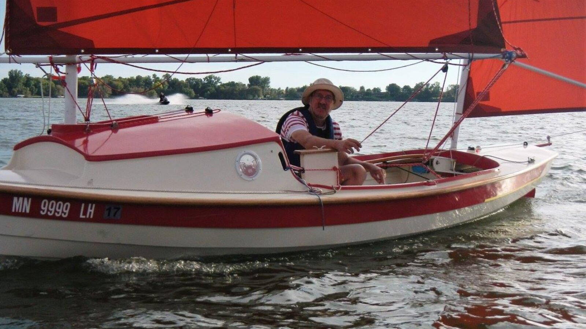
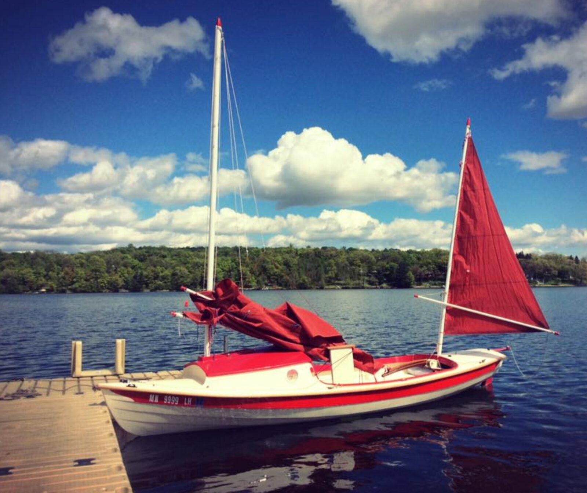
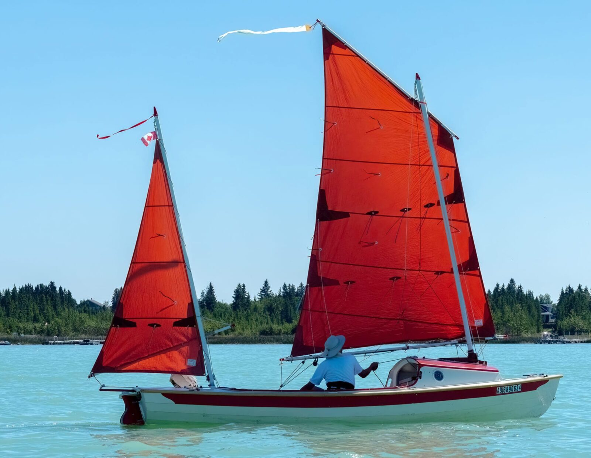

# Other Builders

[← Research index](README.md)

- ## Build logs
  - Alitair Easton
    - Selling his partially built Long Steps, good photos
    - https://www.facebook.com/share/p/1AMBQVuyzv/
  - Derek Desaunois
    - Nice longsteps build: [(1) Derek Desaunois | Facebook](https://www.facebook.com/groups/440526479459574/user/1664618510)
    - {:height 873, :width 489}
  - Etienne Muller (builds a Melonseed skiff, but amazing skills and lots to learn. Must view before build!)
    - https://www.facebook.com/media/set/?set=a.2263337930393674&type=3
  - Herman Peerdeman
    - Long Steps without cuddy: https://www.facebook.com/groups/JWDesigns/permalink/2790336744478524/
  - Ian Devenney
    - Lots of good questions and ideas: Seat bench across cockpit aft with anchor locker and motor well, asks about water ballast paint (Hempels Bilge paint or bilge coat), aluminum mast
    - [(1) Ian Devenney | Facebook](https://www.facebook.com/groups/440526479459574/user/503789572)
  - Jean-Francoise Hardy of https://mountainboats.ca is building Scamps and has very cool ideas.
    - Check out his Facebook profile at https://www.facebook.com/groups/440526479459574/user/1279792084/
    - Content:
      - Rudder integrated electric motor
      - DeWalt powered boat electronics
      - DIY back rest when sitting on the bench
      - Solar panels
  - Jeff Darden - Sailing Moga
    - https://www.facebook.com/groups/JWDesigns/posts/3151885848323610
    - Located at Chesapeake Bay
    - Nice build thread with frequent updates, must read if I build this boat: [Building a Welsford Long Steps - The WoodenBoat Forum](https://forum.woodenboat.com/forum/building-repair/9018924-building-a-welsford-long-steps)
    - [Long Steps Build | Sailing Moga](https://sailingmoga.com/2024/03/18/long-steps-build/)
  - Jeremy Radawiec
    - Lives in the Comox Valley, has a Pathfinder
    - 778-266-0705
    - mostly free weekday mornings and then weekends
  - John Welsford's own
    - He has lots of posts starting in May 2016 on his blog. Follow the "Newer Posts" link from here: [Long Steps, a preview - jwboatdesigns](https://jwboatdesigns.blogspot.com/search?updated-max=2016-05-24T01:08:00-07:00&max-results=7&start=35&by-date=false)
    - His own boat at a boat show: https://youtu.be/Rty4FwY2-Hg?si=gnhdHl7kBjWYCH-l&t=632
    - He commented on trying different hatches for the water ballast and settling on Armstrong hatches from Duckworks: https://forum.woodenboat.com/forum/tools-materials-techniques-products/8908168-watertight-inspection-hatches?p=9058201#post9058201 and https://forum.woodenboat.com/forum/building-repair/9018924-building-a-welsford-long-steps?p=9073638#post9073638
  - Len Anderson
    - Has a few photos on the Facebook group. Is on Vancouver Island
  - Lonnie Black in Florida
    - [Lonnie Black | Facebook](https://www.facebook.com/groups/440526479459574/user/100004880507963)
    - [Lonnie Black | Facebook](https://www.facebook.com/groups/160617757328741/user/100004880507963/)
  - Mark Baker in Victoria
    - Lives in Colwood, is building a Long Steps: [baker.jmark@gmail.com](mailto:baker.jmark@gmail.com)
    - [John Welsford Longsteps build: Gluing and screwing bulkheads part 1 - YouTube](https://www.youtube.com/watch?v=SxZAnhKLU0k)
    - [John Welsford Longsteps build: Gluing and screwing bulkheads part 2 - YouTube](https://www.youtube.com/watch?v=mxH5QodESME)
    - [His posts in the facebook group](https://www.facebook.com/groups/440526479459574/user/100068682074760/), must review before build!
  - Michael Vaughan, (AKA Audrey Laser) Peppy
    - [His posts in the facebook group](https://www.facebook.com/groups/440526479459574/user/100002459741082/), lots of good build photos, must review before I build!
    - https://www.facebook.com/audrey.laser/photos/after-a-hiatus-and-break-in-transmission-work-has-recommenced-on-the-tasmanian-l/7046499145442007/
    - [John Welsford Small Craft Design | Tasmanian Long Steps build update | Facebook](https://www.facebook.com/groups/JWDesigns/posts/2271466676365536/?_rdr)
    - Video of sailing Long Steps: https://youtu.be/JKh76qsWNa8?si=i0uyO69comERDf-3&t=1046
    - [Ep. 13 - WELSFORD LONG STEPS: The launching of 'Peppy' - YouTube](https://www.youtube.com/watch?v=RjVELw4jFBk)
    - [The ‘unofficial’ launch of Peppy, a Welsford Long Steps - YouTube](https://www.youtube.com/watch?v=4uZG6YRcbLQ)
    - [Peppy - 2025 Australian Wooden Boat Festival](https://awbf2025.org.au/boats/peppy/)
  - Phil McCowin's Long Steps build: 248 photos
    - https://www.facebook.com/media/set/?vanity=phil.mccowin&set=a.10226845731506455
    - Must review before build
    - Shows photos of portable crane
  - Todd Harris (stretched Walkabout with cuddy)
    - [John Welsford Small Craft Design | Not a "Long Steps" | Facebook](https://www.facebook.com/groups/JWDesigns/posts/1833381760174032/)
    - [Dinghy Cruising NZ | Todd Harris and his John Welsford Walkabout "Deep Calling", forerunner to her larger sister Long Steps. | Facebook](https://www.facebook.com/groups/dinghycruisingNZ/posts/1855780051437001/)
    - [todd Harris | Flickr](https://www.flickr.com/photos/129075926@N06/)
    - [18' Stretched Welsford Walkabout Yawl (2015) - DEEP CALLING - Worldwide Classic Boat Show](https://classicboatshow.com/listing/deep-calling-18-stretched-welsford-walkabout-lug-yawl-2015/)
    - 
    - 
    - 
    - 
    - 
    - 
