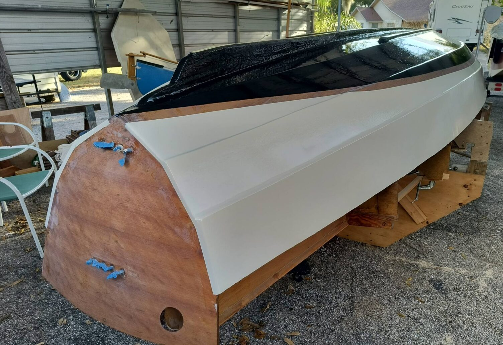

# Paint

[← Research index](README.md)

  - Hull
    - Lonnie Black coated the bottom with at least two coats of graphite thickened epoxy
      - 
  - Cockpit
    - Recommendation is to paint the cockpit and the decks white [The WORST Listings I’ve Ever Seen (15 MASSIVE Sailboat Red Flags) - YouTube](https://www.youtube.com/watch?v=3GifyUiXYuM)
  - No-slip paint
    - Home Depot sells Behr textured low-lustre enamel Porch & Patio Anti-Slip Floor Paint
      - 100% Acrylic with custom color matching
      - I checked a sample at the store and think it could work quite well.
      - They sell a gallon for $76. I'd get the ivory tint for any non-slip surfaces in the cockpit and the decks.
      - And maybe even paint the roof with it, and then a coat of regular green on top for the color accent. I wouldn't want to buy another gallon of green just for the roof
      - Areas to paint in non-slip:
        - front deck
        - aft deck
        - side decks
        - cockpit floors
        - bench tops?
    - JW uses very aggressive non-slip on the side and foredecks
      - Post with more info: https://www.facebook.com/groups/JWDesigns/permalink/1652060691639474/
      - JW shows in the facebook group how he created the no-slip paint areas on his Long Steps: He first painted the whole thing, then he masked around the areas he wants no-slip. He applied a thick coat of paint, and while it was still wet he sprinkled sharp sand on it. He spread it evenly and let the paint dry. Then he removed all loose sand and repeated the process (paint, sprinkle, let dry) a few times until he had solid coverage. Then he painted over the sand a few more times until it was all well sealed.
    - JW uses more rubbery non-slip inside the boat for regular use. It's called
      - Post with more info https://www.facebook.com/groups/JWDesigns/permalink/1678695008976042/
      - https://www.amazon.ca/anti-slip-paint/s?k=anti+slip+paint
    - Options from [The WORST Listings I’ve Ever Seen (15 MASSIVE Sailboat Red Flags) - YouTube](https://www.youtube.com/watch?v=3GifyUiXYuM)
      - Treadmaster
      - KiwiGrip
      - Sharkskin
      - Advises against sand because it's impossible to get off
      - He also talks about kork as a non-slip option
  - Using Acrylic Latex House Paint
    - I'm considering using latex paint because it's cheap, durable, easy to apply, and easy to patch. I expect the boat to get dinged and scratched, and I want it to be easy to patch: Cheap paint, easy to apply, not much prep, easy to clean up. This is going to be a working boat. I shouldn't be afraid to beach it, drag it, etc. And I can get any color I want. From what I can tell it's good for inside and outside of the boat.
    - Some comparisons to marine paint:
      - Cost: Latex paint is significantly cheaper than marine paint.
      - Ease of application: Latex paint is easier to apply, going on more smoothly and with less brush drag.
      - Cleanup: Latex paint can be cleaned up with water.
      - Recoating: Latex paint can be recoated in as little as one hour.
      - Durability: Latex paint is more durable and tougher than oil-based paint. (?)
      - Chalking and fading: Latex paint resists chalking and fading, retaining its colour well when exposed to bright sun.
      - Mildew: Latex paint has less tendency to grow mildew.
      - Odour and fire hazard: Latex paint has almost no odour and no fire hazard.
      - Longevity: Latex paint may need to be recoated annually or every few years.
    - Some useful tips:
      - Use semi-gloss sheen (almost as durable as gloss, less likely to show blemishes)
      - Use a primer (mostly for even gloss and appearance, detecting defects, rather than adhesion)
      - Use Floetrol for smoother application
      - Stick with primer/paint from a single manufacturer to guarantee compatibility (However, HomeDepot recommends the Killz primer under Behr paint, partly because it's cheaper)
      - The glossier the paint the more scratch resistant it is.
      - Higher end paint adheres to more materials and is more fade resistant and is mildew resistant
      - I don’t need to opt in to Behr single coat cover
      - Put first coat primer on: it’s cheaper
      - Non slip is thick and has lower coverage
      - Prep:
        - Expoxy all surfaces to prevent water ingress
        - Wash every inch of the boat with a nylon scrubbing pad and soap and water to remove amine blush
        - Fill any dents with filler
        - Sand thoroughly with 60 grit
        - John Welsford applies primer very early over sanded epoxy to spot all the blemishes. Then he fixes them with filler and more sanding.
        - Maybe another coat of primer over all areas that received filler.
      - Apply
        - Apply a few coats, no sanding between coats required
        - Give it a week to fully dry hard
    - Social proof
      - Dave Carnell wrote a lengthy article on the topic: [Latex Paint for Boats](https://simplicityboats.com/latexcarnel.html)
        - Through the years latex paints have developed to the point where 100% acrylic latex paints are better than oil paints on all counts.  They are more durable and tougher.  They resist chalking and fading, retaining their color especially well when exposed to bright sun.  They are easier to apply, going on more smoothly and with less brush drag.  They have less tendency to grow mildew.  They have almost no odor and no fire hazard.  Cleanup is with water.  They can be recoated in as little as one hour.
        - The 100% acrylic latex is the key to the outstanding latex primers and paints now available
        - Reprint: [Latex Paint for Boats - Small Craft Advisor](https://smallcraftadvisor.substack.com/p/latex-paint-for-boats)
        - [Latex Paint for Boats - The WoodenBoat Forum](https://forum.woodenboat.com/forum/building-repair/3785-latex-paint-for-boats?3737-Latex-Paint-for-Boats=)
      - [Can You Paint a Boat with House Paint? - YouTube](https://www.youtube.com/watch?v=ER2zTUCODAo)
      - [Acrylic latex paint for your boat - The Hull Truth - Boating and Fishing Forum](https://www.thehulltruth.com/boating-forum/528504-acrylic-latex-paint-your-boat.html)
      - [Duckworks | OK you paint Maestros | Facebook](https://www.facebook.com/groups/duckworks/posts/2762126794009692/)
      -
