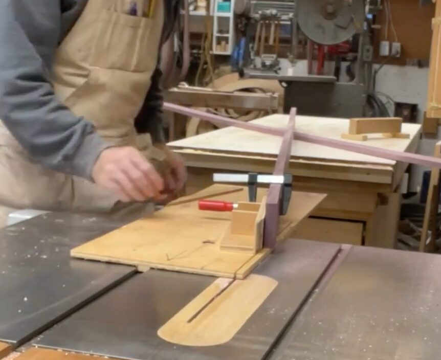
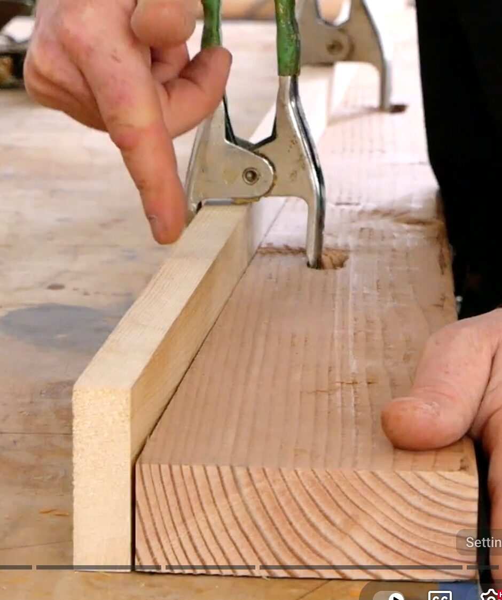
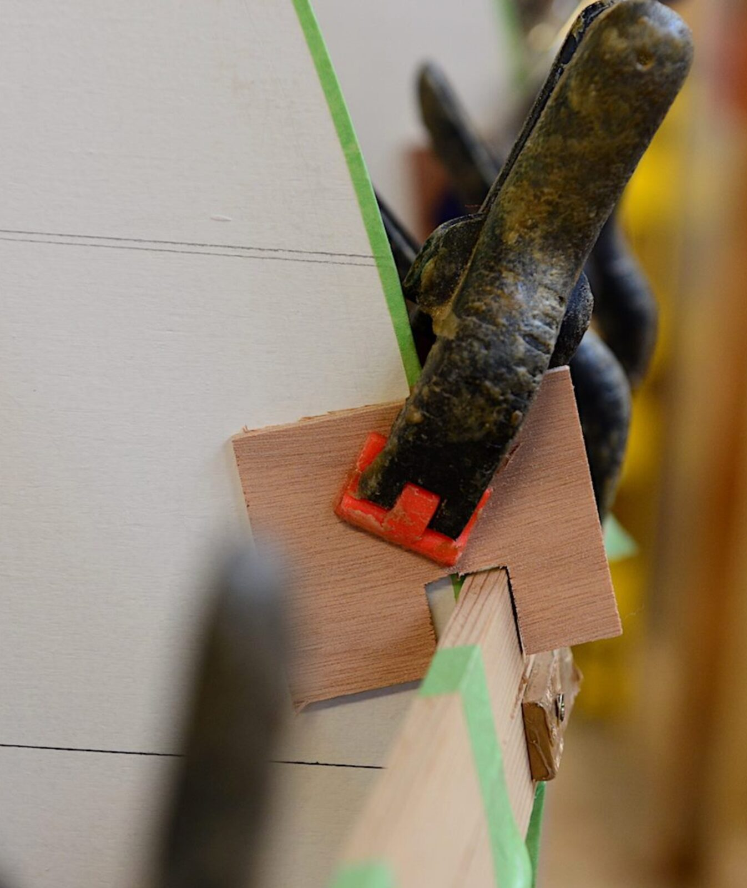
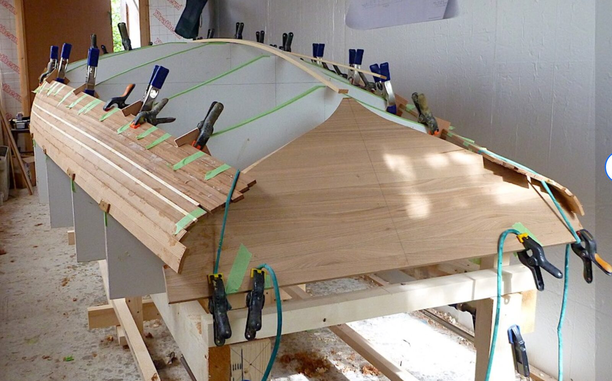
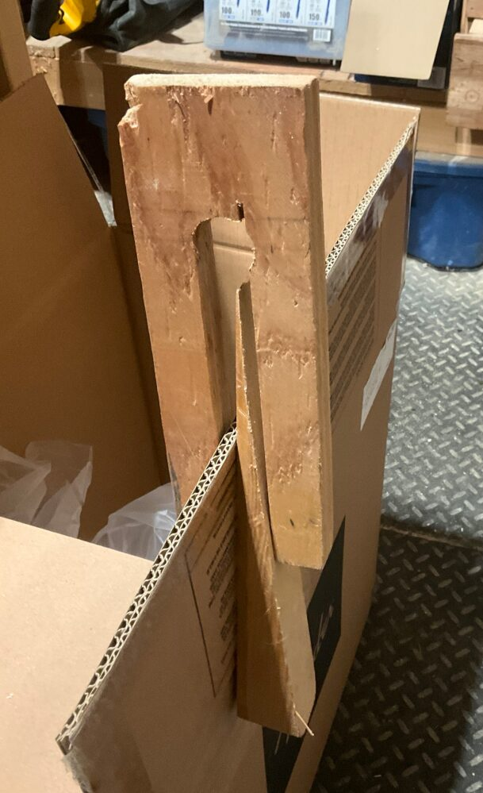
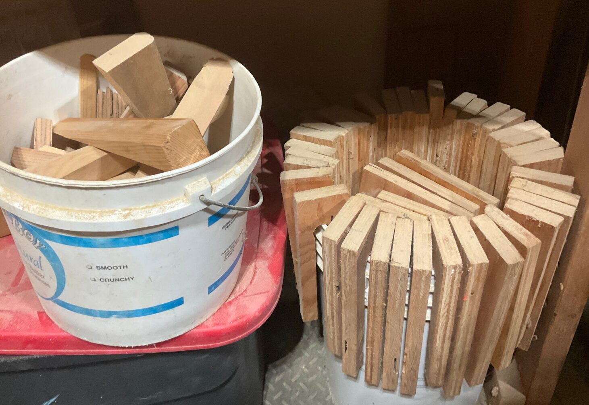
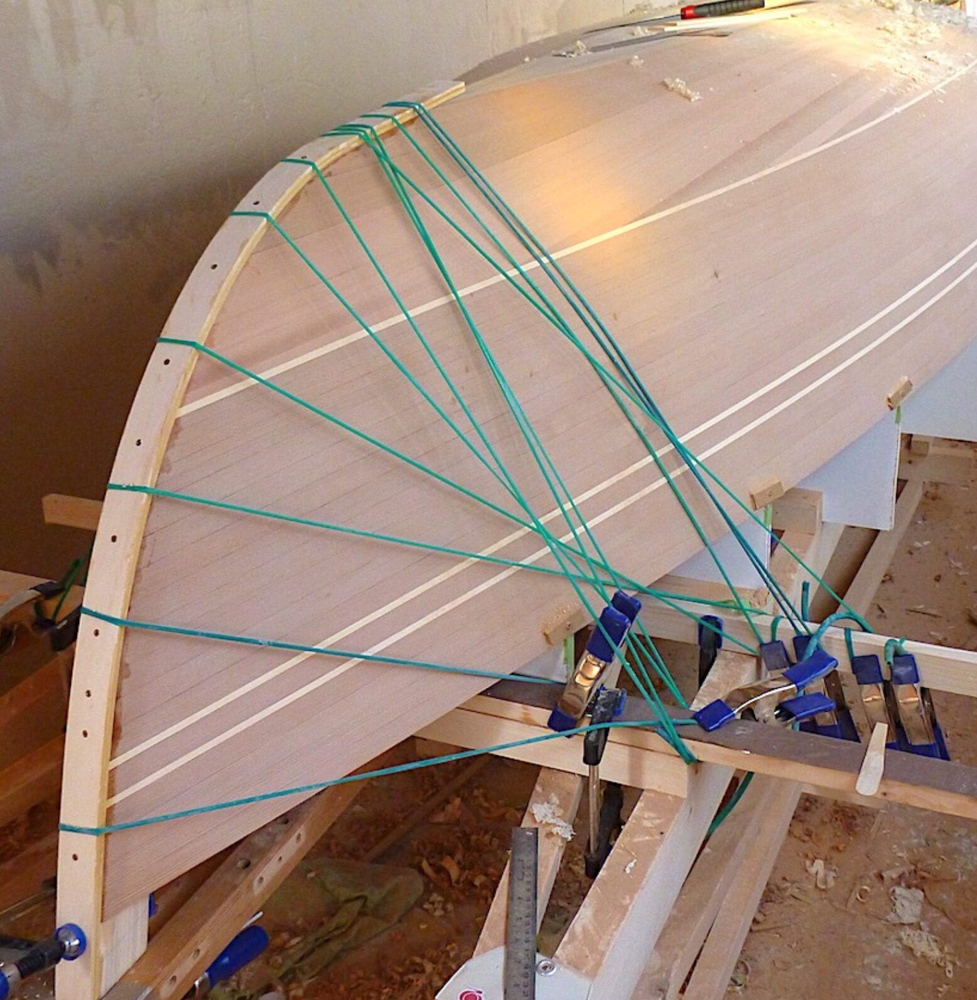
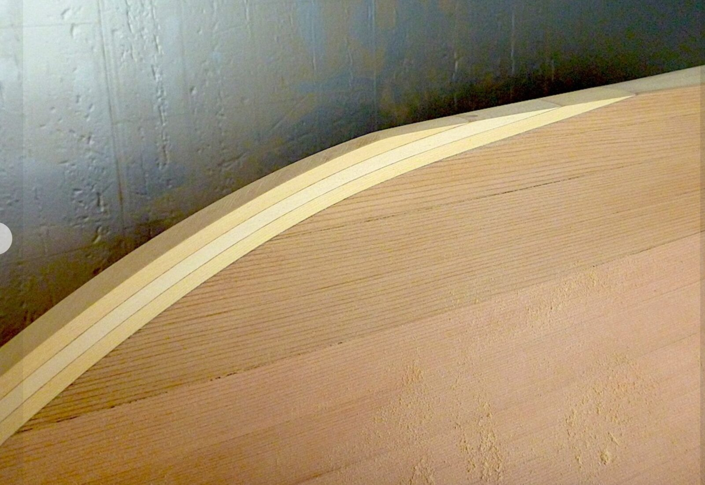
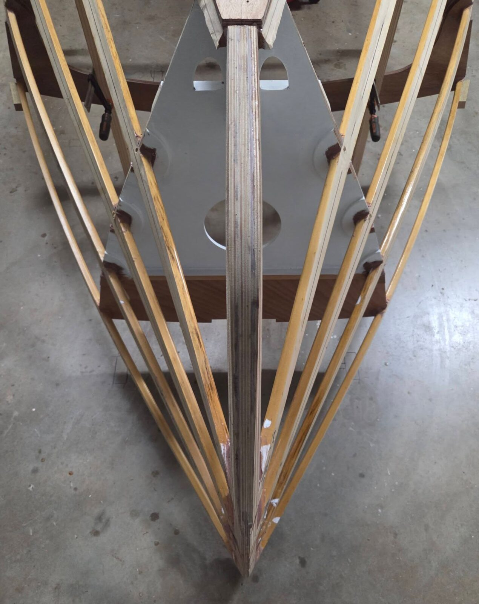
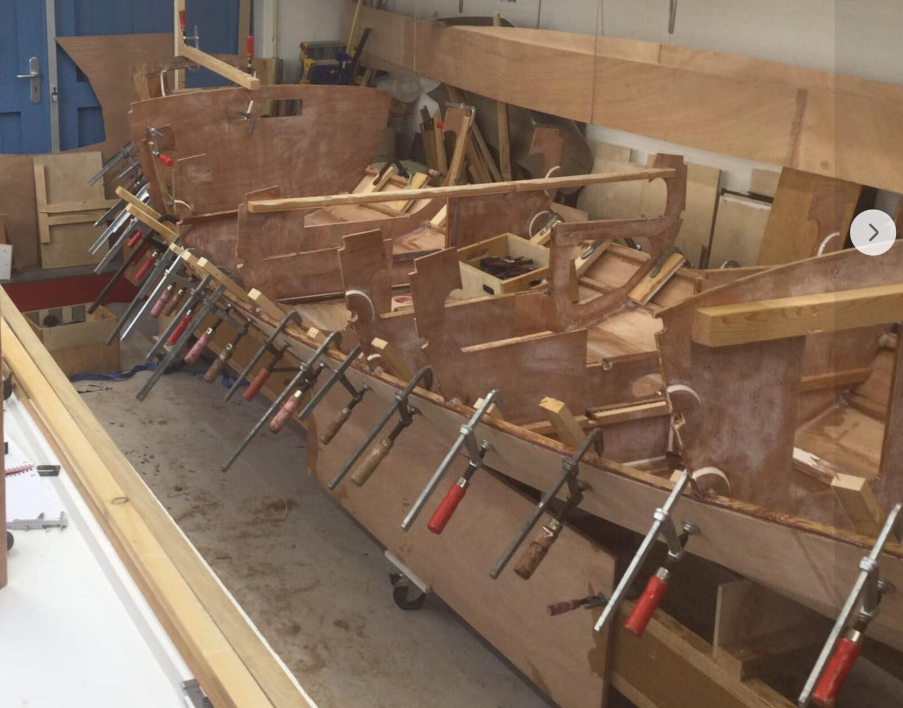

# Planks and stringers

[← Research index](README.md)

  - Stringers:
    - Cedar or Fir. Cedar is a lot lighter, and probably easier to bend, too. May need special treatment before epoxying though...
    - I am looking at 1x3" Douglas Fir from Windsor plywood, ripping it down the middle for two stringers from each piece I buy. That worked out quite well.
    - Mark from Nomad boatbuilding has a nice scarf jig for the table saw. I copied his approach and it worked quite well.
      - 
      - Brian Schulz from Cape Falcon Kayaks has a slightly different approach
        - 
  - Holding stringers in place while gluing
    - This is a clever clamping system: plywood U-profiles and surgical tubing (or old bike inner tubes) as bungee cords
      - {:height 512, :width 425}
      - {:height 294, :width 427}
    - Planking clamps: Cut from plywood with softwood wedges, stored in buckets
      - {:height 487, :width 328}
      - {:height 254, :width 349}
  - Make sure the stringers are a bit proud of the bulkheads to ensure fair curves, not interrupted by protruding bulkhead edges.
  - How to finish the stem:
    - {:height 467, :width 431}
    - 
  - Attaching stringers to bow, and shaping bow from wide to narrow. Photo is from a navigator
    - {:height 619, :width 471}
  - My own stringer installation:
    - Stringer #1, port side 2026/01/31
      - Prep, several days before the installation:
        - Scarf join the stringers for correct length. Let the epoxy cure for 3+ days for full strength.
        - Rip the stringers down after scarf joining for correct width (so they fit into the bulkhead notches) and for smoother edges.
        - Round over the two inside edges on each stringer.
        - Dry fit both stringers (port and stbd), adjust bulkhead notches, esp. those with doublers, as needed.
          - Make sure that the grain is very straight in areas of high stress, e.g., at the bow where I bend and twist each stringer. I had a stringer break on me at the bow because the grain ran at an angle and was only about 4 inches long from side to side.
        - Mark the intersections of stringers and bulkhead notches on the stringers so that I know where to apply unthickened epoxy.
        - I left both #1 stringers clamped in place for a few days to have them adjust to the bending.
      - The day of installing port side #1 stringer
        - These steps took me 2 hours
        - Temperature in the garage was 11 degrees Celsius. Fairly low to give me more time.
        - Mark where the stringer meets the bow. Notch the bow doubler 9mm deep and width of stringer.
        - Cut the bow end of the stringer just a bit proud of the bow.
        - Taper the bow end of the stringer to 9mm at the tip (from the inside so that the outside stays a nice fair curve). This is so that the planks land flat on the bow stem. We don't want the stringer to be proud of the bow stem thickness once installed.
        - Unclamp the port side stringer and lay it on the floor with the two inside edges facing up.
        - Roughen the bulkhead notches with 60 grit sandpaper for good adhesion
        - Mix 2 pumps of epoxy, leave unthickened.
        - Apply a healthy coat of unthickened epoxy to all the mating surfaces: In the bulkhead notches and on the stringers where I had marked them for intersection on three sides.
        - Thicken the remaining epoxy with 404 thickener to non-dripping peanut butter consistency. Rather too thick than too thin.
        - Apply thickened epoxy generously to the three bulkhead notches starting from the stern.
        - Insert the stringer into the notch on the transom, clamp it.
        - Insert the stringer into bulkheads 9 and 8, clamp.
        - Now work your way forward one bulkhead at a time:
          - Generously apply thickened epoxy, don't worry about squeeze-out yet.
          - Clamp the bulkhead lightly into place. Don't worry about perfect fit at this point.
            - Note: Not all bulkheads need a clamp. I left 2 or 3 unclamped. The tension on the bent stringer pressed them sufficiently into the notch.
        - At the bow:
          - Apply a large clamp perpendicularly to the stringer and use it as a lever to twist the stringer so that it is parallel to the bow stem.
          - Generously apply thickened epoxy to the notch.
          - Clamp the stringer to the bow stem. Adjust both clamps (for twist and pressure) for a perfect fit at the bow stem.
        - Now work your way back for a perfect fit at all bulkheads
          - The two things to look out for are the stringer's twist and its depth into the notch:
          - First twist the stringer so that the outer face of the stringer is parallel to bulkhead edge extending downwards from the notch. This is important so that the plank that will be installed downwards from the stringer mates nicely with the stringer and the bulkhead edge.
            - You can adjust the twist by clamping a piece of wood perpendicularly to the stringer and have the end of the wood rest on the existing boat structure, e.g., the bottom panel or a lower stringer. You can then adjust the twist by slowly tightening the clamp.
          - Then adjust the depth of the stringer into the notch so that the lower outside edge of the stringer is either aligned or just proud of the lower bulkhead edge. You don't want the bulkhead edge to protrude beyond the stringer as that would result in a visible kink in the plank. You want the fair curve of the stringer to determine where the plank ends up.
            - You can adjust the depth of the stringer into the bulkhead notch using a clamp.
        - Next you work your way forward and roughly clean up the epoxy mess. Removing any excessive squeeze-out and filling gaps in the epoxy.
        - And last you work your way backward again to do the detailed cleanup with your finger. Make sure to also clean up any epoxy that may have landed on your clamps. You're looking for a small fillet at all joins for strong adhesion
      - Post processing
        - I turned on the heat in the garage to speed up the curing process.
        - Let the epoxy cure for 48 hours for sufficient strength
        - Install wooden dowels at the bow and transom ends of the stringer. This will provide extra strength resisting a pullout. Limit it to the two ends as they are the only places where the stringer wants to pull away from the boat, and where a dowel adds more strength in a meaningful load scenario. Avoid drilling holes in the middle of the stringer where the hole would weaken the bending strength of the stringer.
          - Make sure to have the dowels recessed by 1/8" into their hole and filling the depression with thickened epoxy. This is to prevent the dowel fibers from being exposed at the surface and from wicking moisture into the wood.
        - Remove the clamps.
  - Planking
    - Herman Peerdeman has a good approach to planking using wooden blocks and clamps. I could improve on this by adding wooden blocks to the outside, too to distribute the pressure:
      - 
    - Fiberglassing lapstrake planks
      - [Fibreglassing a Lapstrake Boat](https://www.youtube.com/watch?v=6s6QnlSBEv8&t=10s)
        - Use glass strips/tape
        - run glass over edges, trim off when gelled, fillet the strakes
