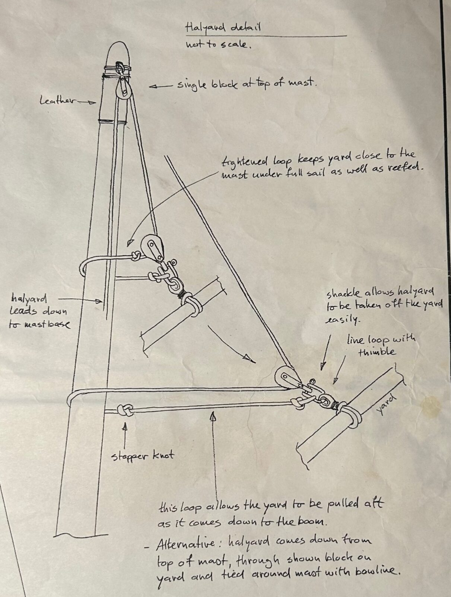
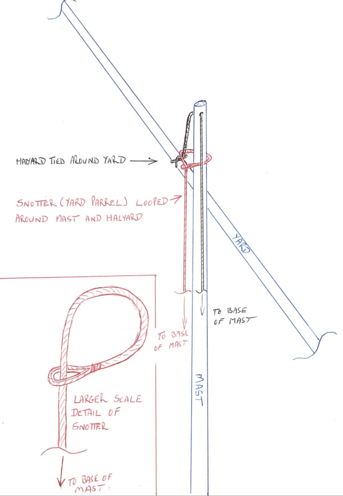
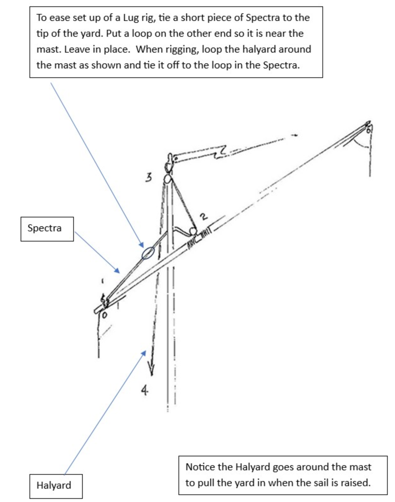
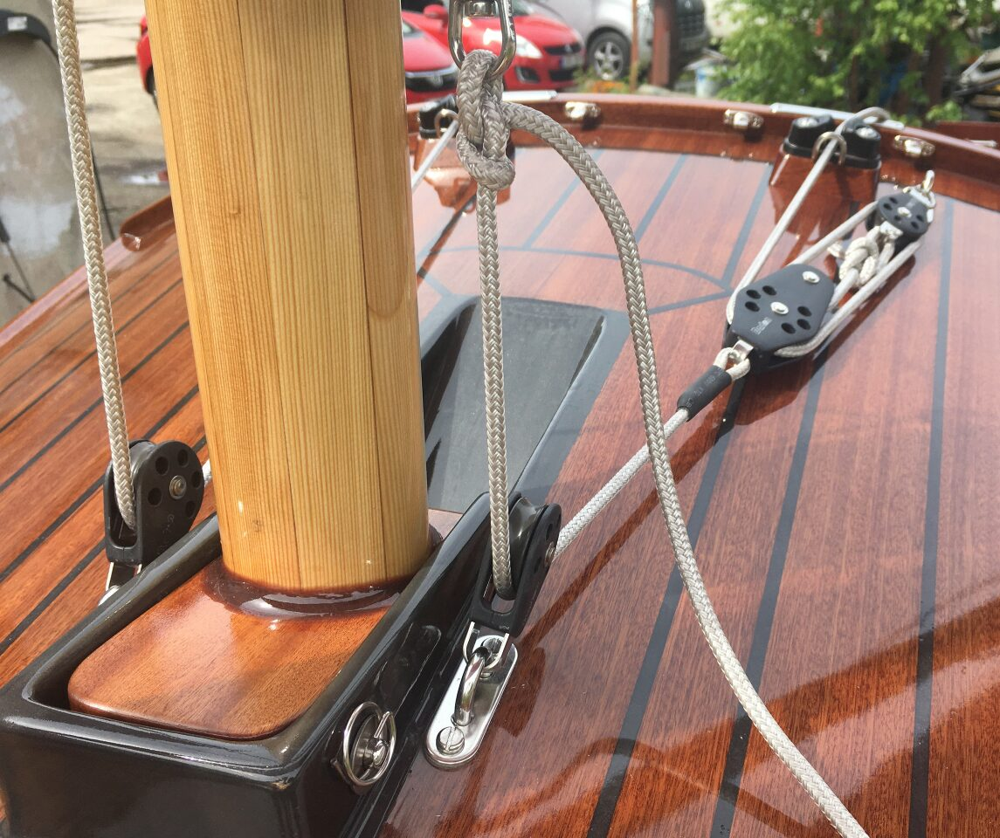
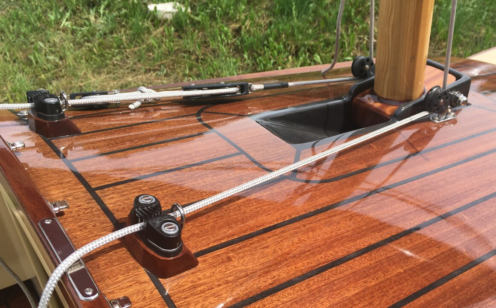
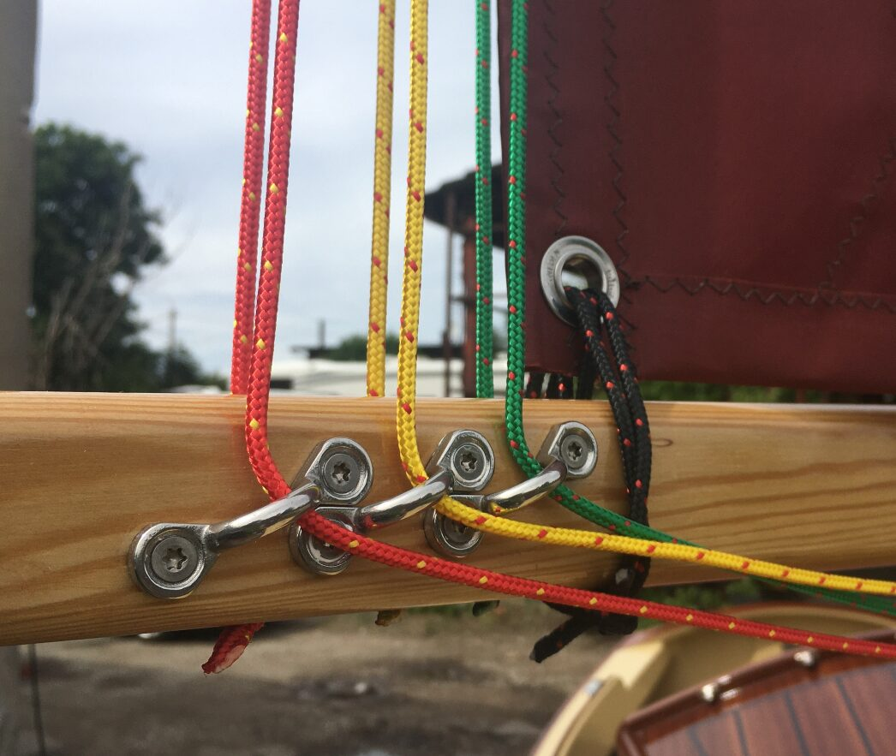

# Rigging

[← Research index](README.md)

  - Racelite has good hardware, and that is what's recommended in the plans
  - Michael Vaughn puts the main sheet cleat at the boom (rather than down in the cockpit): https://youtu.be/6xkEtMHPGm8?si=3fpcCvytrChzMgKj&t=1853
    - This? https://ca.binnacle.com/p6258/Lewmar-Synchro-50mm-Single-with-Fiddle-&-Cleat-29925037BK/product_info.html#description
  - Main halyard rigging: Objective is to keep the yard high and close to the mast, and to make it easy to lower/reef the main sail. There are various approaches to do so:
    - This FB post shows some options for Scamp, LongSteps (with balanced lug) should be similar: [John Hippe on halyard connection](https://www.facebook.com/groups/JWDesigns/permalink/2964403517071845/?rdid=KnmUmxp8iKdlu4Pi)
      - SCAMP plans
        - 
      - [Ross Lillistone Wooden Boats: Up-date - Lugsail Yard Parrels](https://rosslillistonewoodenboat.blogspot.com/2016/11/up-date-lugsail-yard-parrels.html) aka snotter
        - 
      - Michael Storer has a whole page dedicated to [Balanced lug rigging. Here is a link to the halyard section](https://www.storerboatplans.com/tuning/lug-rig-setup/goat-island-skiff-rig-and-rigging-details-for-efficient-lug-sails/#h-the-mainsail-halyard)
        - And this one also has good info: [Controlling Sail Twist on Balance and other lug rigs. - Storer Boat Plans in Wood and Plywood](https://www.storerboatplans.com/tuning/lug-rig-setup/making-balance-lugs-faster-2013-setting-up-sails-spars-and-rigging/)
      - Paul Stovner recommends a variation on Michael Storer's system in the FB thread
        - 
  - Resources for rigging:
    - [Lug Rig Setup Archives - Storer Boat Plans in Wood and Plywood](https://www.storerboatplans.com/category/tuning/lug-rig-setup/)
      and https://www.storerboatplans.com/tuning/lug-rig-setup/test-for-google-docs/
    - Michael Storer's videos
      - [Part 1 Detailed step by step rigging for a lug sail on the OzGoose or other boat - YouTube](https://www.youtube.com/watch?v=93FjgWWKC1Y)
      - [Part 2 Lug Sail The first sailing day, Rig and set up the sail boat to launch. Oz Goose Method - YouTube](https://www.youtube.com/watch?v=TWNmGhaS7mo)
    - [Ross Lillistone Wooden Boats: Lugsail Yard Parrels](https://rosslillistonewoodenboat.blogspot.com/2016/11/lugsail-yard-parrels_72.html) aka a "Yard snotter"
    - [Ep. 26 - MORE DINGHY TIPS & TRICKS - NAVIGATOR vs PATHFINDER vs CORE SOUND vs HARTLEY - YouTube](https://www.youtube.com/watch?v=7hJ8vAXJcGk) Matt shows his Navigator rig around 18 minutes, e.g., lazy jacks
    - This FB post shows how a Walkabout owner has rigged their boat with some useful comments: https://www.facebook.com/groups/JWDesigns/posts/3027882077390655/
    - [GHBoats Scamp Rigging Tutorial - YouTube](https://www.youtube.com/watch?v=BLTYt5Tt6Go) very good video that talks through the entire boat setup. Lots can be transferred from SCAMP to LS
  - Use Dyneema
    - [How to make a simple Dyneema loop - YouTube](https://www.youtube.com/watch?v=uzK0gApBrCg)
      - The PremiumRopes website has info on what kinds of dyneema to use, and what tools to use for splicing: [The Essential Guide to Dyneema® Loops for Sailing - blog](https://www.premiumropes.com/blog/the-essential-guide-to-dyneema-loops-for-sailing)
  - From Michael Storer
    - https://www.storerboatplans.com/tuning/lug-rig-setup/test-for-google-docs/
      - Downhaul is the single most important sail control (because of twist). On bigger boats he recommends a 5:1 or 6:1 purchase.
        -
          > In very light winds – too light for the boat to move reliably the downhaul can be slack to allow the sail to twist.  As soon as the boat starts moving reliably the downhaul must be firm.  When starting to lean out it needs to be tight.  As the boat becomes overpowered it should have BRUTAL tension.
      - Mast shouldn't bend too much. He says 2.5" diameter with 0.065" wall thickness should be ok
  - JR Boatworks has beautiful rigging
    - 
    - 
    - 
    -
