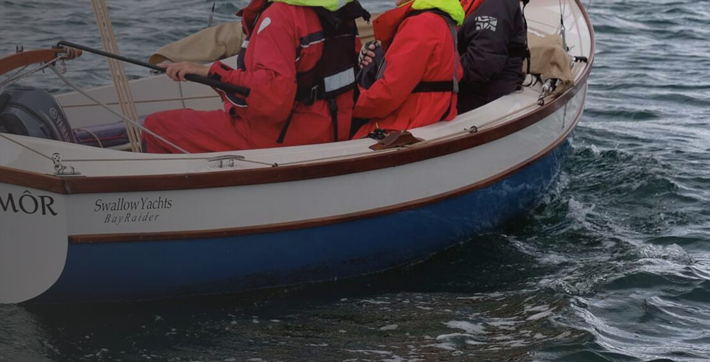
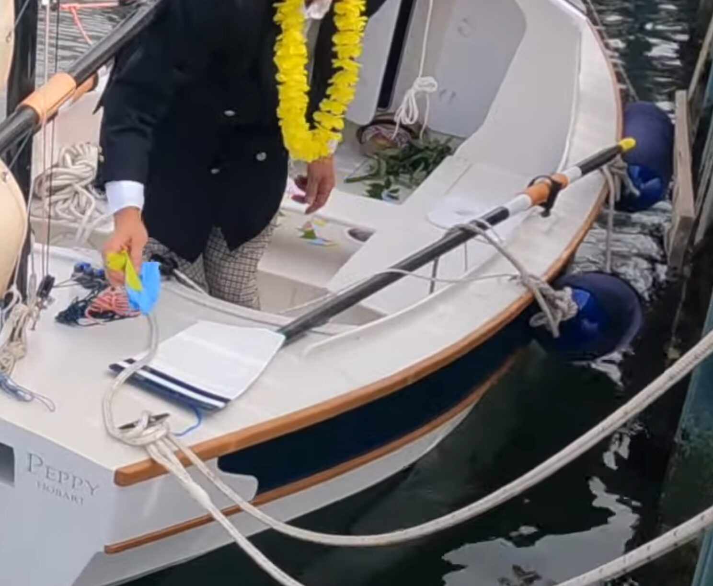
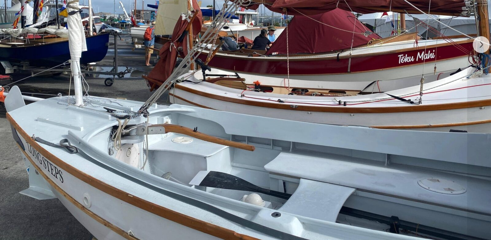

# Rowing

[← Research index](README.md)

  - I would like to be able to switch between fixed and sliding seat rowing
  - I'll set up 2, if not 3, oar lock positions so that I can adjust trim for rowing solo or with crew.
  - Fixed: Just use JW's recommended approach
  - Sliding:
    - This book was recommended "The Nuts & Bolts Guide to Rigging" by Mike Davenport
    - I have a separate entry for rowing geometry: Long Steps rowing geometry
    - I'll need a way to have a removable and stowable sliding seat rig.
      - One option is to have two tracks separately and they can be mounted to the same boards I'd use for the 2-person sleeping platform. Would need a special board for the foot brace.
  - Oar Locks
    - Swallow Yachts Bayraider:
      - 
  - Oar storage
    - Oars are 9'6" long (to confirm!)
    - Oars stay in the oar locks and I just pivot the blades forward or backward so that they rest on the side of the cuddy or on the aft deck where I lash them down.
      - 
    - Store the oars near cockpit floor on seat fronts
      - Starboard side:
        - May get in the way of the centerboard tackle
        - I'd have to open the hatch on the back bench starboard side to make enough length for both oars on that side.
      - Port side:
        - Cut one or two holes into the port side wet locker if I want to keep one (or both) oars on the port side. JW does this:
          - 
    - Behind back rests
      - Cut an opening into the aft most bulkhead (before transom) so that I can store my oars under the side decks on one side (or an opening on both sides for symmetric storage). Make the opening either for the blade, or the handles, depending on how the other end fits under the side decks.
      - Alternatively, cut an opening into the cuddy bulkhead and extend the oars forward from the cockpit.
      - I may have to widen the side decks, and move the back rests closer towards the center of the boat to create enough space to tuck a straight oar behind the curved back rests.
