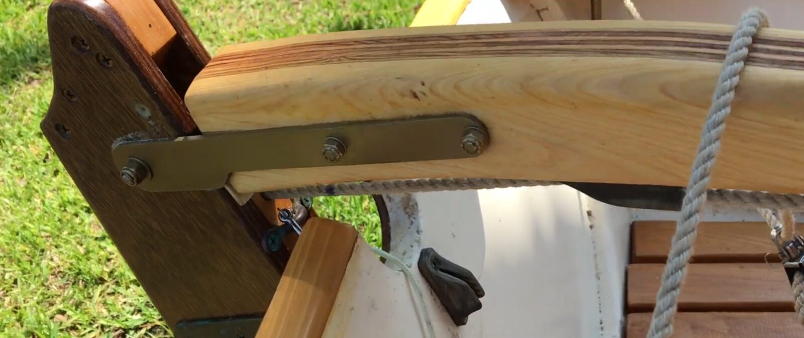
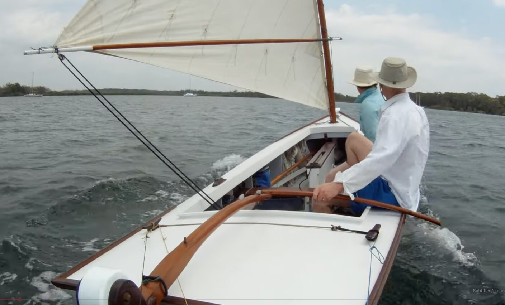
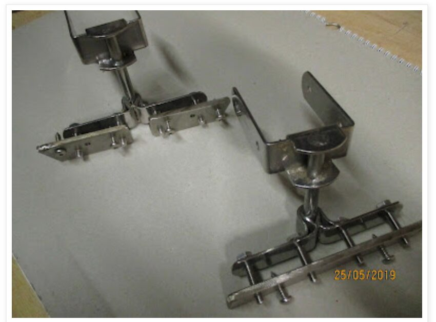
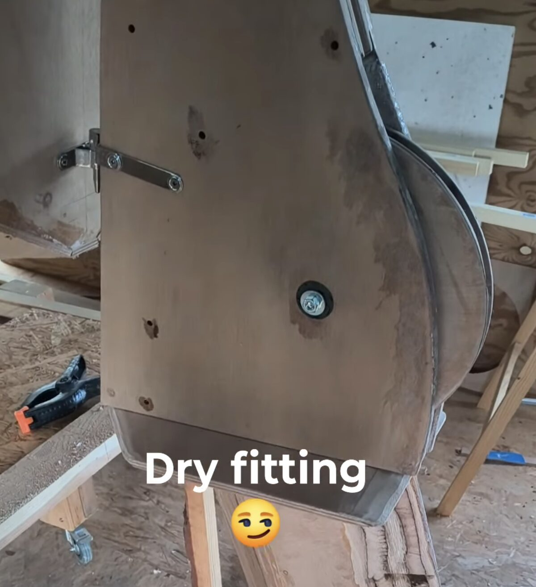
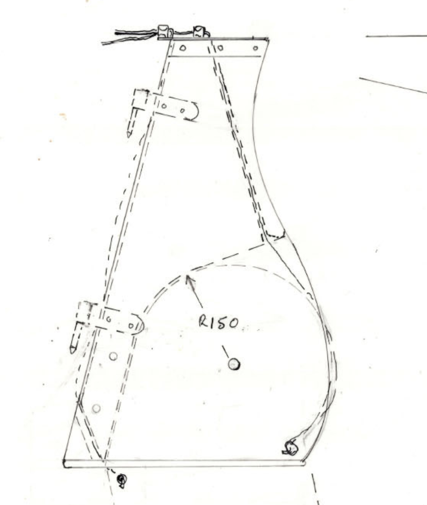

# Rudder & Tiller

[← Research index](README.md)

  - Tiller:
    - I see a lot of tillers with nicely curved horizontal laminations. That's a bit tricky to build. It's much easier to cut the curves into plywood and vertically laminate curved strips.
      - 
    - [This boat](https://www.youtube.com/watch?v=uBT9jObqmp4) has a nicely shaped tiller and tiller extension. Notice the simple wooden peg tiller extension lock when extension is not in use. It just folds over the tiller and visually disappears
      - 
    - Some people swear on telescopic tiller extensions, e.g., [Telescopic - Alloy Tiller Extensions - Rudder & Tiller Hardware - Products | Ronstan Sailboat Hardware USA](https://www.ronstan.com/us/products/rudder-tiller-hardware/alloy-tiller-extensions/telescopic.html)
  - Rudder mount
    - JW uses pretty hefty stainless steel on the inside of the rudder mount:
      - 
  - Bell Crank System
    - [Facebook](https://www.facebook.com/groups/JWDesigns/permalink/3249235621921965/)
      - Post by Ron Parker about sourcing rudder connects
  - Rudder cheeks
    - Built according to plans, the rudder blade rounded top extends past the cheeks and it looks a bit silly. See this [video by Newyd built rudder](https://www.facebook.com/reel/4538987553085990):
      - {:height 523, :width 446}
      - It's a little less pronounced in the plans:
        - {:height 410, :width 335}
      - I'd like to extend the cheeks so that the rounded blade is completely enclosed when the rudder is in the lower position.
        - What could be possible reasons for building according to plans? Access to the uphaul line?
        - This would allow me to make the channel for the uphaul line tangential to the outline of the rudder blade, reducing chafe where the line bends in the plans.
        - Also make the channel for the downhaul tangential to the radius of downhaul attachment point to reduce chafe as much as possible. It would still chafe at the exit point. But I may be able to reduce it by making the channel as close to parallel to the rudder stock's front edge (shifting the exit point upwards towards the lower rudder mount.) Alternatively I could move the downhaul attachment to the end of the R150 radius (higher up) and bury it inside the rudder cheeks with an exit just below the upper rudder mount. Not sure...
