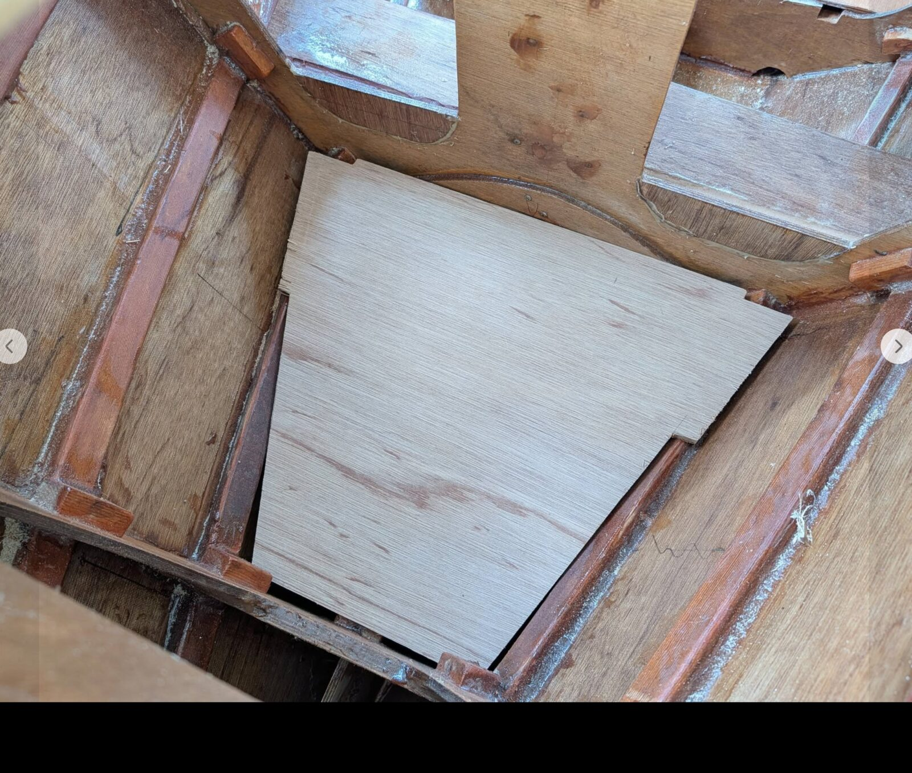
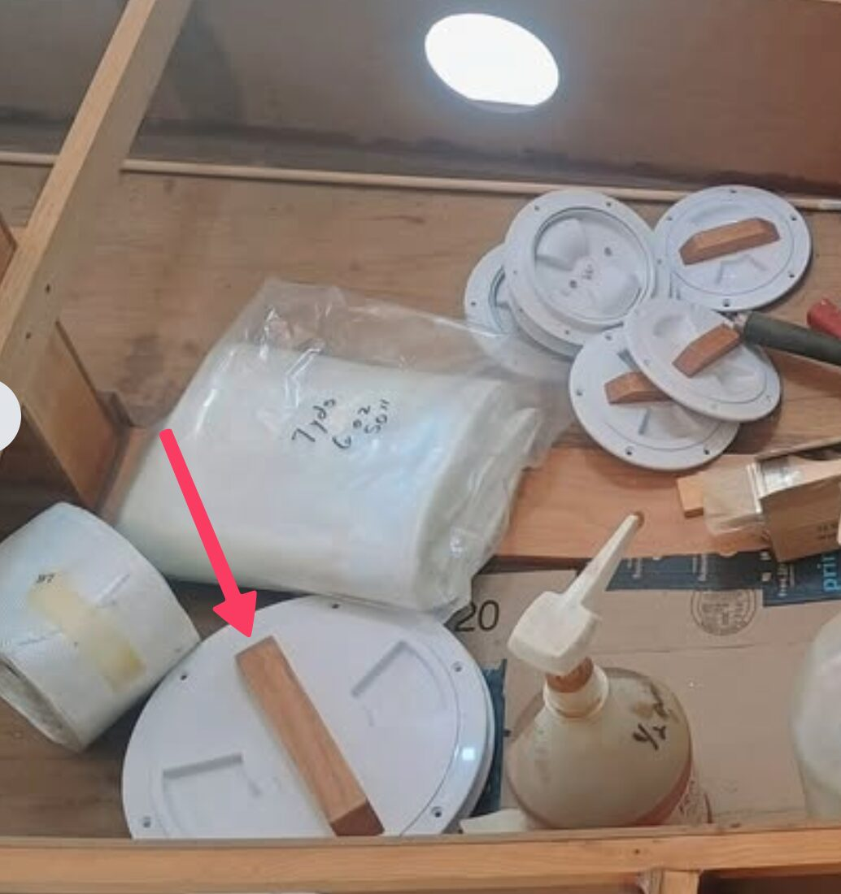

# Storage

[← Research index](README.md)

  - Lockable compartment
    - So that I can leave the boat unattended with valuables on board
    - Inside forward storage compartment?
  - Cooler
    - To keep food fresh
  - Forward storage compartment
    - Places to hang things below cuddy roof
    - Floor system to keep items out of the bilge
      - Lonnie Black did this between B#1 and 2:
      - 
    - Trays above B#2 openings (support mast box and provide convenient storage space)
    - Objective is to not reduce ability to store large items! Find places that are not usable by large items anyways
    - Also should be easily reachable
    - Provides dry storage
    - A tray on the spine between mastbox and B#3
  - Cuddy
    - Places to hang things below cuddy roof
      - Hooks, bars, grid
      - To keep things off the floor and easily reachable
    - Utility storage inside cuddy
      - Plans have storage compartments on both cuddy sides
  - Line stowage
    - Little bags to put lines into
  - Extra handles on access ports for easier opening
    - 
