# Tent

[← Research index](README.md)

  - My idea
    - NOTE to consider: The tent is pretty low when sitting on the benches. Should I raise it up from the cuddy by a foot? That would allow me to sit comfortably on the benches in the tent. I'll have to test this when I can sit on the benches, compare to cuddy roof and see how much room there is
      - 
    - 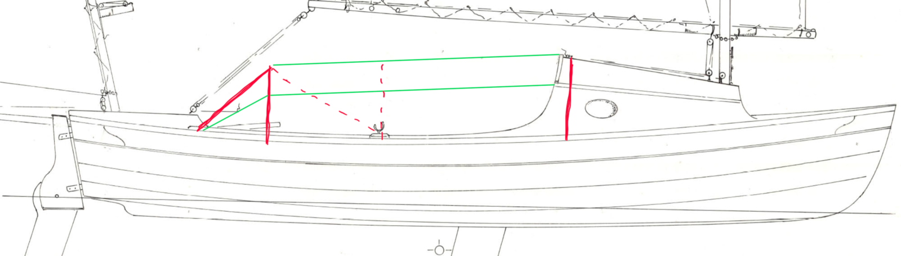
    - Support structure (red)
      - Fwd
        - Cuddy top and sides at B#4
      - Middle
        - An optional support frame in the oar locks
      - Aft
        - Frame with same shape as B#4, just a bit scaled down
        - Located around B#8 to keep aft bench open for cooking
        - Support braces from center top to each side of aft deck, or to the oar locks
        - Stowed under side bench when not in use, or can I fold it back onto the aft deck and keep it there when not in use?
    - Ridge lines (green)
      - 1x along top ridge
      - 2x along each top corner edge
      - 2x from aft top corners to base of support brace on aft deck
    - Panels
      - 1x roof panel extending between two top edges
      - 2x side panels from top edges to cockpit coaming
      - 1x rear panel from aft support structure to aft deck
    - Notes
      - Should be tall enough that I can sit in the tent without touching the roof. I need 90cm (just under 3') clearance when sitting. Currently there is 95cm clearance from the cockpit floor to the top of the cuddy roof. Sitting on the side benches will not be tall enough (it's only 2'4", 8" too low)
      - No interference with rigging: I could sail with the tent up, fully enclosed, just open at the aft end and sitting on aft bench.
      - Mosquito proofing? Maybe rear end has zippable door and netting?
      - No interference with rowing: I could row with the tent up, just leaving out the side panels. Hmm, maybe not. Would be hard to look forward.
      - Open at aft end for cooking or sitting outside on aft bench. Or to manage anchor.
      - Open up further by peeling back tent roof to B#7 so that I can stand up in the space between B#7 and B#8.
      - Tent roof could also double as cuddy door: Attach on Cuddy roof and just drop down. Would provide shelter in cuddy without having to set up the entire tent.
      - Can be partially set up to accommodate various scenarios (see below at Rick's photos)
      - Taper it a bit towards the aft end (lower and narrower) for better looks and water drainage?
      - Try to use existing mounting points on the boat, e.g., cleats, oar locks, other mounting points.
      - Sailrite has lots of good tips and resources:
        - [Learn: How-To Content](https://www.sailrite.com/learn)
        - Build dodgers and biminis, learn how to sew, etc.
      - Some kind of fastener all the way around
        - There are a number of fasteners available. Sailrite as good resource for selction:
          - [Fastener Selection Guide (PDF) - Sailrite](https://www.sailrite.com/Fastener-Selection-Guide-PDF)
          - [Fastener Selection: Choosing the Right Fastener Type - Sailrite](https://www.sailrite.com/Fastener-Selection-Choosing-the-Right-Fastener-Type)
        - Need to make sure that studs mounted to hull don't provide path for water ingress: Overdrill, fill w/ epoxy!
        - [Snap Fasteners Kit, 15 mm Stainless Marine Grade Boat Canvas Snaps with screw, Pack of 120](https://www.amazon.ca/Fasteners-Stainless-Marine-Clothing-Leather/dp/B09Z24N2ZC?crid=2YNWEXNJFBQHR&dib=eyJ2IjoiMSJ9.HAEpVYRed1tp8TmgYtdYBghZzbJCB1F09D4_Af2tntc3lkMDbriitMllzO2lMGI7aFwL6hNpTfvA3auBm1fQWEdonjPl4hAH8aOtsSVJQej7hrtus_VmzljQtCbbXEJoX-lSoHr0I3oNkuPKNfBD6eDWXavUFCcnopr48fffhLzPX0IyKCnIQDC88_bEpA__KxIqf2cEC69Y9KydLbsuZaxeU9LWkB3EhauNe9QYmFzDfH00xqnesUtOfQKWQszmJOzINFi6ClVLlSfEVqJj-Eye6ECWfCablzFlrSVbRkw.Yxuu7mPuXyBSrA89JrCb-VLxQcaKMr29W6hnqd9U5Ks&dib_tag=se&keywords=marine%2Bcanvas%2Bfasteners&qid=1771871729&sprefix=marine%2Bcanvas%2Bfasteners%2Caps%2C192&sr=8-33&th=1)
          - They are cheaper and don't protrude as far
          - They may be harder on the fabric when disconnecting them. Maybe a tool helps to reduce stress on fabric?
            - Yes: [Snap Tool for Boat Canvas Snaps](https://www.amazon.ca/Practical-Release-Non-Slip-Silicone-Perfect/dp/B0DMVNQXZN?crid=1AM66CQ4CDFVX&dib=eyJ2IjoiMSJ9.1QgfCeQxXOZBGsYO_dyDDPqraOforw9EA1OqGPkP3_yuhSyUWMHRVk_eSIsEpzq5Jo1MsJuJGNQouT3LPeBZaSCHLoEoHJPFjzgmBRuLKIHmY493z3o44NFsOjmBPRwJJr94j_jO2RkL7x2EtkufmPdpAxz1AA_2pSstB7UrWBA4l0yhAf659vyAl7nnCRsMluthqBeAmfIE-mW94tZ7hsA5N-7YER_pkmOMNbsS7pFToOUryl-bVw1ZEk1q5ilMtpNC496ESnIqWwws8-NRKe6SaaRv1QgQDsowPZg4004.nMqgL0WuG5BZEKQDzcf74KhqH-DwQ_520knZWFHiJbQ&dib_tag=se&keywords=canvas%2Bsnap%2Bremoval%2Btool&qid=1771893086&sprefix=canvas%2Bsnap%2Bremoval%2Btool%2Caps%2C165&sr=8-6&th=1)
          - I can use double snaps (female/male aka Gypsy stud) to double layers, e.g., end panel and roof panel stacked on same stud
            - [Fastener Selection: What Is a Gypsy Stud? - Sailrite](https://www.sailrite.com/Fastener-Selection-What-Is-a-Gypsy-Stud)
            - [Female/Male Dual-Sided Fabric Snap Halves | McMaster-Carr](https://www.mcmaster.com/95690A299/)
            - [Gypsy Snaps - Double Snaps - Piggyback Snaps](https://store.canvas-boat-cover-and-repair-advisor.com/gypsy-snaps/)
          - YKK® SNAD® Fasteners are adhesive and don't require drilling a hole
            - [What's the Difference Between Screw Studs & YKK® SNAD® Fasteners? - Sailrite](https://www.sailrite.com/Difference-Between-Screw-Studs-and-SNAD-Fasteners)
        - [EZ-Xtend Marine Grade Twist Lock Fasteners - Nickel Plated Brass (Long Base - 10 PK)](https://www.amazon.ca/EZ-Xtend-Marine-Grade-Twist-Fasteners/dp/B0B7QZHJ4D?crid=JD5A7GRVGTHQ&dib=eyJ2IjoiMSJ9.Ck16z5j7s-Wru2SVpS9oVVkN-r-9DwKHMtxmQY09PebB-WdfWfXCDWn1skIMqQ1eiIiUyygc5qP5oZ9JtpgWmVWGnW01mZmN3DRLa7jOU4z9g_crnYqQBqynwzclMjsEkXKVFtLqGvElutOTqjQvfs8t_mAHTIzTzNrH_b6tPnCVCLVM5Mw0y-Pxvf_XsoIRNw4rINmgmFg1xwkLshReMyzELI0sJKJDxr-5b9GWoO1cVL5Hmr-jzKiOEStBmZV65TKiddKf-SNhFN0IJ_KAxloLI05nzQ0WE-bi2IVHKys.VN3YNTdrPdTQpN_oaI6KbPzbE7Cfro8zpGz1PXogFDY&dib_tag=se&keywords=marine%2Btwist%2Block&qid=1771872040&sprefix=marine%2Btwist%2Block%2Caps%2C165&sr=8-35&th=1)
          - AKA Murphy fasteners
          - They are quire a bit more expensive and protrude further
          - Easier on fabric when disconnecting
          - Can have double layers on single stud: https://www.mcmaster.com/products/metal-snaps/turn-button-fastener-bases-2~/
        - A zipper to attach the sides to the top. The sides would still have snaps on the bottom and at least the cuddy side. The aft side could also use a zipper.
      - Sewing thread
        -
          > SolarFix PTFE is a great thread to sew with if you will be doing your own work and if you plan for the canvas to hold up longer than about three years it's worth the price.  Other brands are Tenara by Gore, [Solar](https://www.cruisersforum.com/forums/tags/solar.html) Thread by Pennsylvania Thread Co., etc.
  - [Howard Rice has 2 SCAMP tents](https://www.facebook.com/groups/scampers/permalink/2311694146266267/)
    - One with and one without poles. He also has a road cover.
    - He uses snaps. Color coded for easy setup (black and silver)
    - He uses Weathermax fabric
    - He makes and sells SCAMP tents
    - 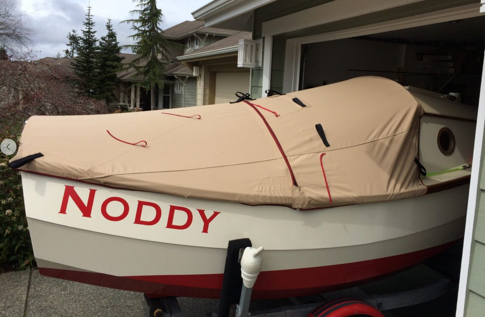
    - 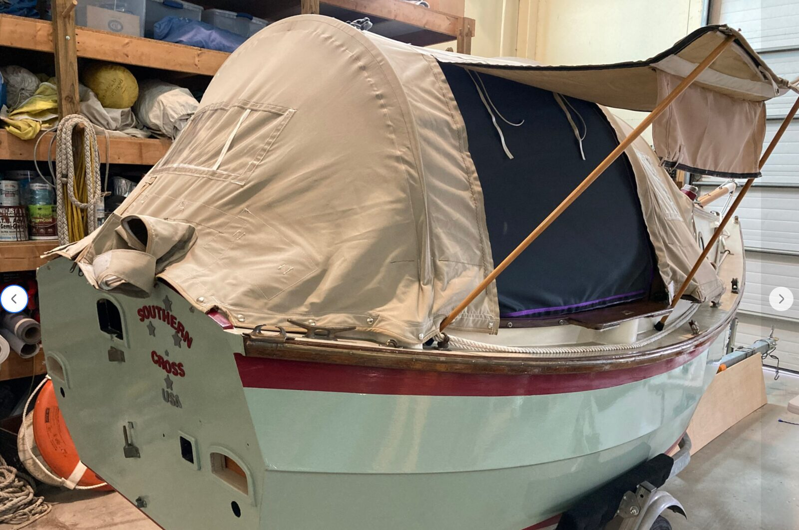
    -
  - [Brent Butikofer](https://www.facebook.com/groups/1494787034623653/user/100004295442439/) builds an interesting tent for his SCAMP
    - 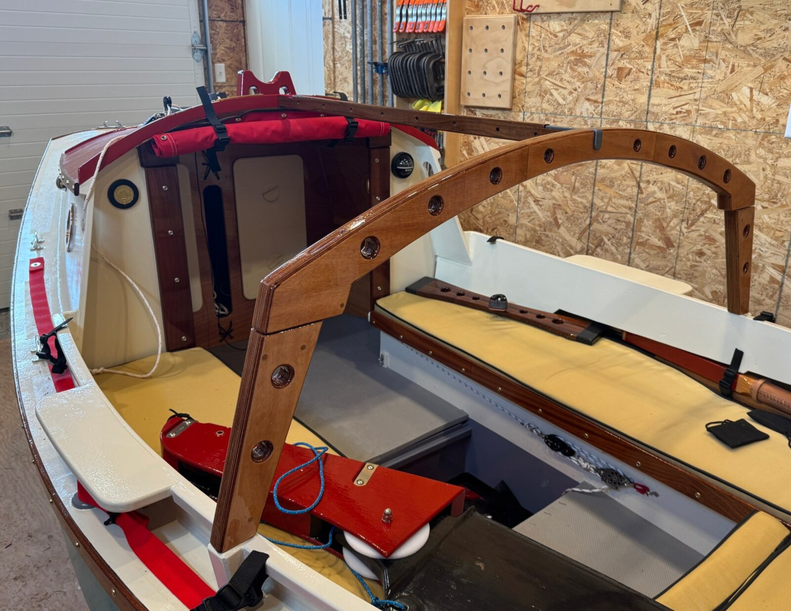
    - 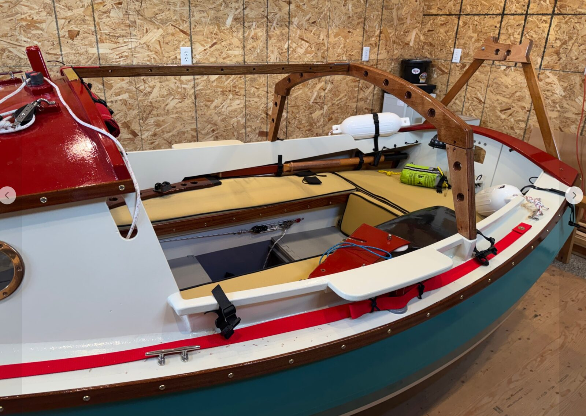
    -
  - [JR Craftyard](https://jrcraftyard.ee/our-works/scamp-sailboat) did this:
    - See their image gallery for a rear view. They use twist locks instead of snaps
    - 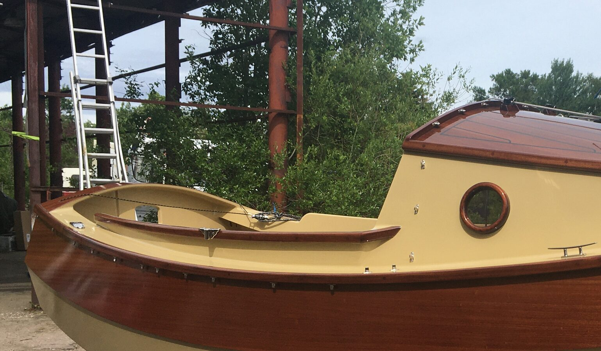
    - 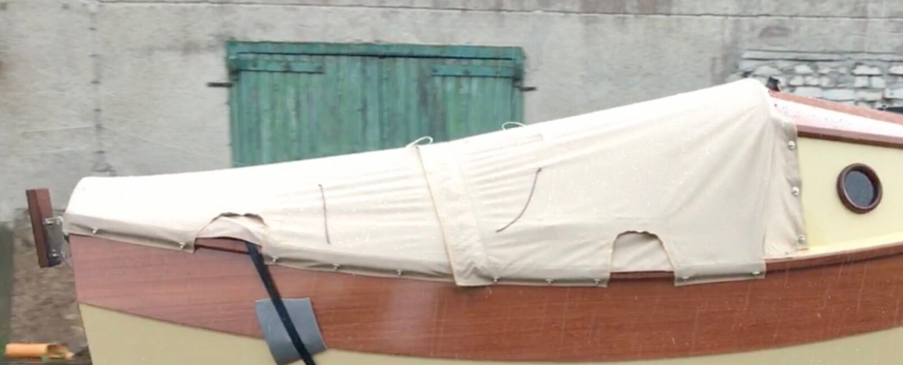
    - 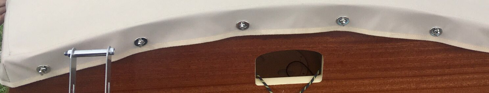
  - Rick Thompson uses separate components to provide a very flexible tent setup:
    - 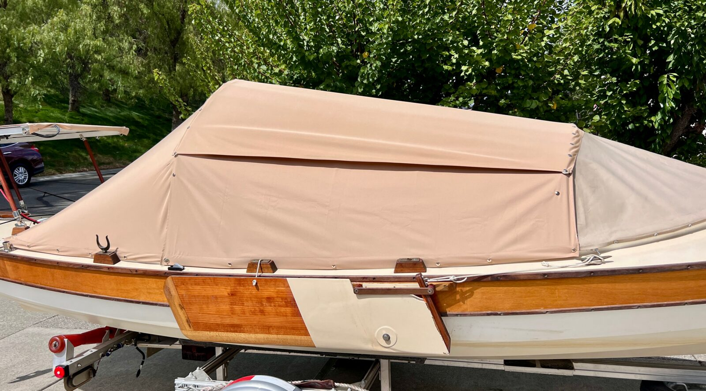
    - Two side panels and one top panel make up the full tent, all from WeatherMax fabric. There are no zippers and no plastic windows, attachment is all by snaps. It is configurable for the various conditions I usually encounter.
    - With the dodger and aft section up there is some wind and sun protection, good for a quick lunch stop: [https://flic.kr/p/2rsq2yz](https://flic.kr/p/2rsq2yz)
      - 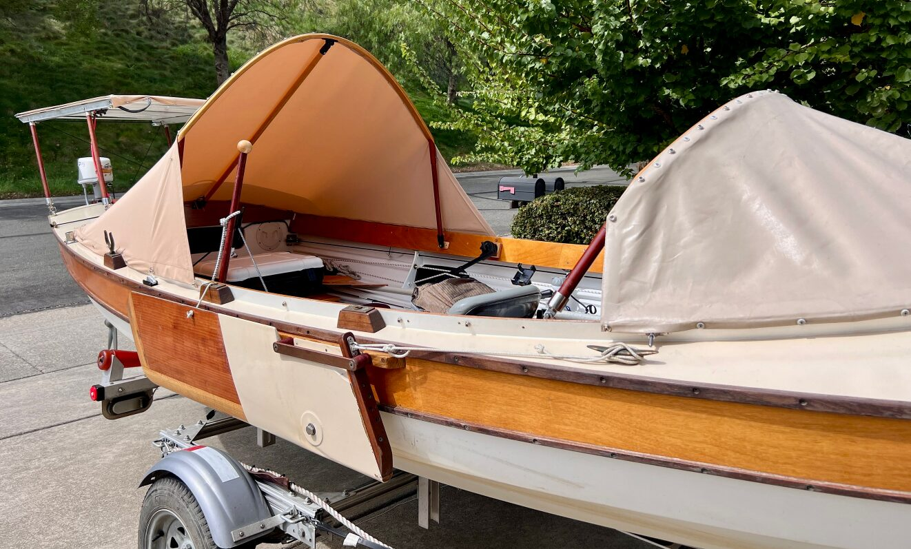
    - The side panels add more wind blocking but leave a view of the stars: [https://flic.kr/p/2rsrKDP](https://flic.kr/p/2rsrKDP)
      - 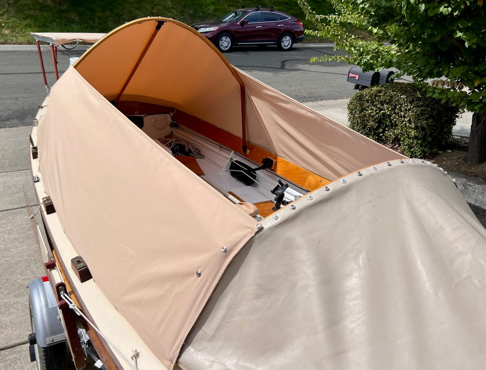
    - Just the top keeps dew off me for cool mornings: [https://flic.kr/p/2rskEbD](https://flic.kr/p/2rskEbD)
      - 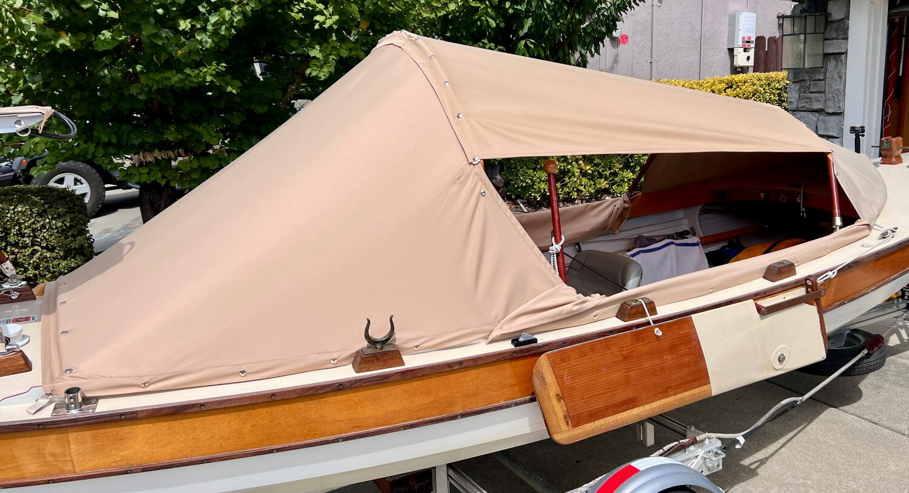
    - Top and sides with a vent opening for cold nights: [https://flic.kr/p/2rsq3Pa](https://flic.kr/p/2rsq3Pa)
      - 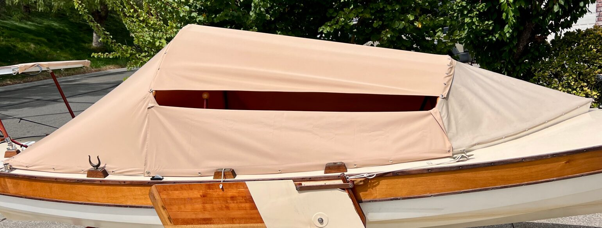
    - Full overlap of top on all sides for rain: [https://flic.kr/p/2rsrhqQ](https://flic.kr/p/2rsrhqQ)
      - 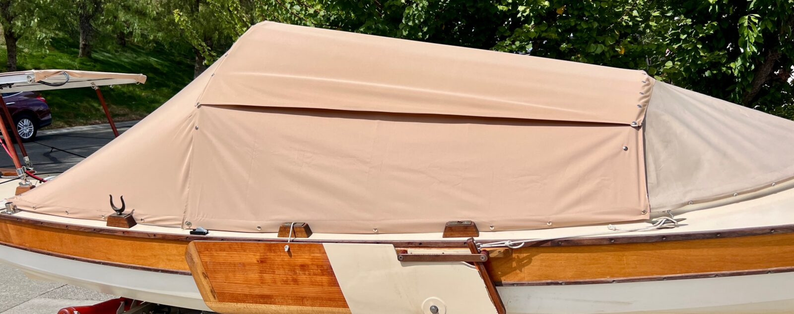
  - Gig Harbor Sells one for the SCAMP
    - [Scamp Convertible Camping Cover - Setup Demo - YouTube](https://www.youtube.com/watch?v=Fob7TNTA3PQ)
    - Can be set up as Bimini or fully enclosed tent
    - 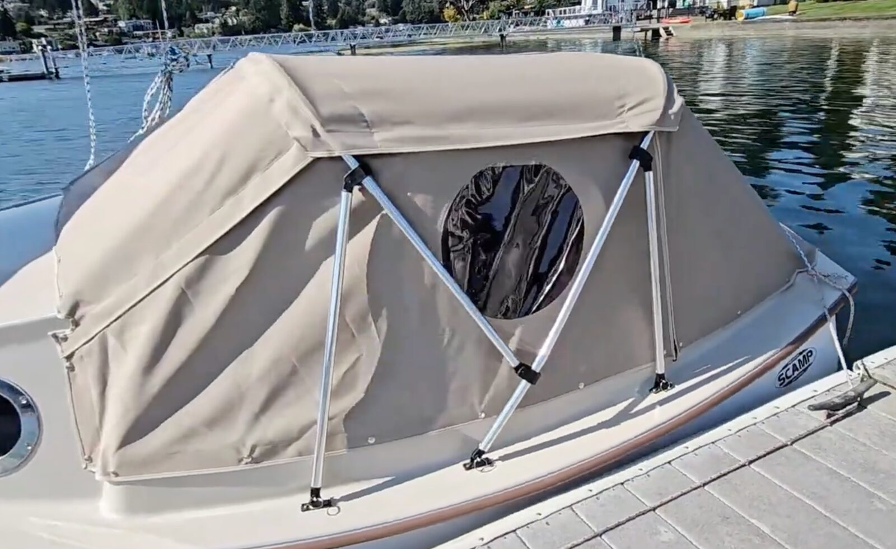
  - Swallow Yachts Bayraider expedition
    - [Ep. 55 - Dorothy’s NEW Swallow Yachts BayRaider Expedition - YouTube](https://www.youtube.com/watch?v=O2m1Bm5FIqA)
    - 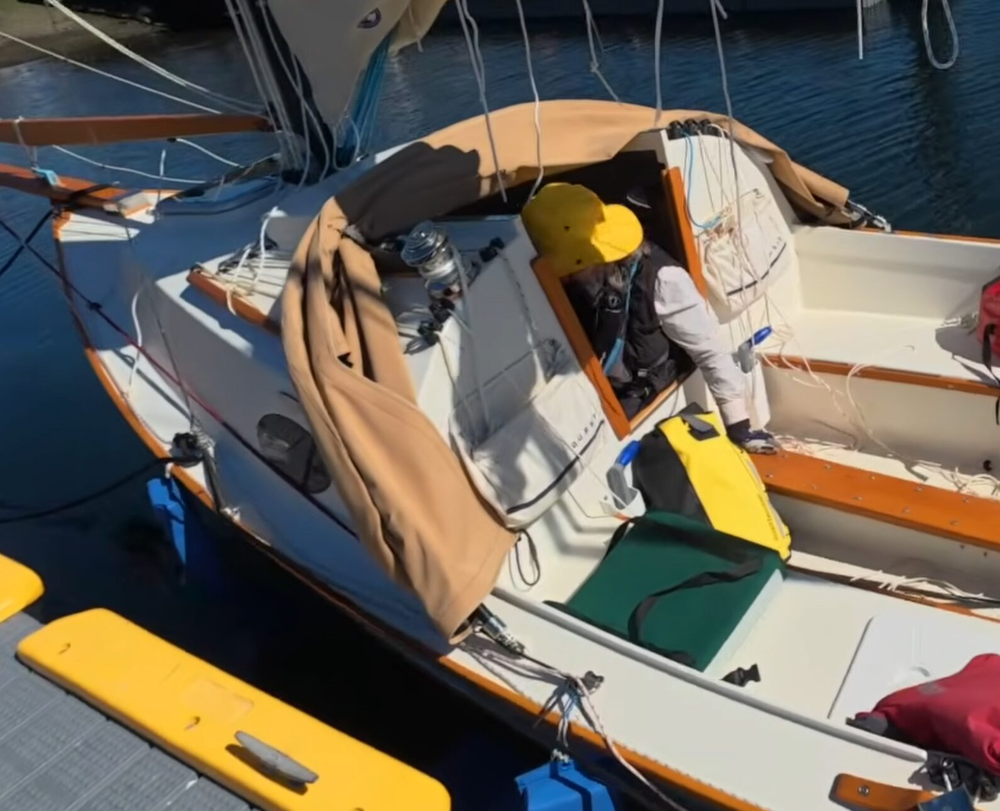
    - 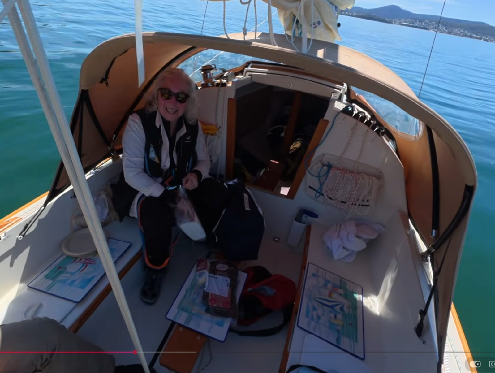
    - 
  - Exploring tent options
    - The forward end will likely be supported by the cuddy sides and roof
    - Going backwards, a ridge line could be
      - draping tent over the boom (would require an a-frame or connecting the halyard at the end of the boom to hold the boom up)
      - suspending tent underneath boom (requires lazy jacks, or connecting halyard to end of boom to hold it up)
        - loops over boom
        - a line running below and parallel to the boom
      - a line running from cuddy roof center to
        - end of boom
        - mizzen mast
        - a curved aft support frame
        - an a-frame
    - The aft end
      - taper down to the aft deck over length of tent (reduces height at the end)
      - end section, like Rick Thompson's boat
        - supported by bent pole. This would keep the aft end roomy
        - draped over line, a little less room, but fewer extra parts
  - Attachment
    - Snaps all around.
    - Hooks and loops
  - The Sea Pearl 21 tent looks interesting. Folds out very easily and stows away just as easily.
    - [VIDEO: Sea Pearl 21 for Gunkholing and other Small Boat Virtues](https://www.offcenterharbor.com/videos/virtues-small-boat-gunkholing-sea-pearl-21/)
  - Claude's thoughts on making a DIY tent
    - This is a great DIY project and absolutely doable with moderate sewing skills. Let me walk through it.
    - ## Can you make this yourself?

      Yes. A sailing dinghy tent is essentially flat or gently curved panels with hemmed edges, reinforced corners, and snap fasteners. There's no complex tailoring involved — no darts, no zippers (unless you want them), no lining. If you can sew a straight line and measure carefully, you can do this. The hardest part is patterning the panels accurately, not the sewing itself.
    - ## Fabric choice

      For a boat tent that needs to shed water, breathe enough to avoid condensation, resist UV, and last many seasons, the usual contenders are:

      **Sunbrella (solution-dyed acrylic)** is the gold standard for marine canvas work. It's what most factory bimini tops and boat covers are made from. It's breathable (reduces condensation under the tent), very UV-stable, water-repellent (not fully waterproof — water beads and sheds, but prolonged rain will eventually wet through a seam area), dyed through the fiber so it doesn't fade, and sews beautifully on a home machine. Weight is around 9 oz/yd². Downside: not cheap, roughly $25–35 USD per yard.

      **Polyester marine canvas (e.g. Top Gun, Odyssey III)** is a coated or tightly-woven polyester. More waterproof than Sunbrella out of the box, generally cheaper, and holds up well to UV though not quite as well as solution-dyed acrylic over 10+ years. Less breathable, so condensation can be worse in a sleeping-aboard scenario.

      **Coated nylon or polyester (like what backpacking tents use)** is fully waterproof and light, but it's a poor choice here — it degrades quickly in sun, and a tent that lives on a boat sees brutal UV exposure.

      For a dinghy tent in the Pacific Northwest climate, **Sunbrella is probably your best bet**, especially if you'll ever sleep under it — the breathability matters. If you expect it to see more hard rain than sun, consider Top Gun instead. Sailrite (sailrite.com) is the standard online source in North America and has excellent how-to videos.

      Thread matters as much as fabric: use **Tenara** (lifetime UV-stable PTFE thread) or at minimum **V-92 polyester bonded thread**. Cheap thread is the #1 cause of canvas work failing — the fabric outlasts the stitching by years.
    - ## Tools

      **Sewing machine:** A regular home machine can handle Sunbrella if you go slowly, use a size 18 or 20 needle, and don't try to stitch through more than 4 layers at hems. If you're doing more canvas work beyond this project, a Sailrite LSZ-1 or similar walking-foot machine is the investment piece, but you don't strictly need one.

      **For snaps:** Marine-grade snaps come in two common systems — standard snap fasteners (like Fasnap/DOT) and the self-locking "Loxx" or "Tenax" fasteners. For a tent you'll remove and re-seat repeatedly in various combinations, standard snaps are fine and cheaper. You'll need:
    - A snap setting tool or press. A hand-setting kit (punch + anvil) works for a project this size (~ $30). A bench-mount hand press (~$ 100) is much faster and more consistent if you're setting 40+ snaps.
    - A hole punch for the fabric side (usually included in kits).
    - A drill for the deck studs, plus a sealant like 4200 or butyl tape to bed the screws.

      **Other tools:** sharp fabric shears, a hot knife or soldering iron for cutting synthetic fabric (melts the edges, prevents fraying — huge quality upgrade), long straightedge, chalk or a soapstone marker, lots of pins or binder clips, a seam ripper for inevitable fixes, and a big flat floor or table for layout.
    - ## A few design thoughts for your panel system

      Since you want each panel removable independently while others stay in place, the snap layout matters more than the sewing. A few things worth planning before you cut:

      Where panels meet each other (roof-to-side, side-to-aft), you'll want **overlapping flaps with snaps joining panel-to-panel**, not just panel-to-boat. Otherwise you'll get gaps and leaks at the seams. The roof typically overlaps the sides (shingle-style, so water runs off), and the aft piece typically overlaps both sides at its edges.

      Give some thought to whether the aft panel should have a window, a zippered door, or rolls up and ties. If you're ever going to be inside the tent while it's deployed, you'll want at least some ventilation and a way in and out that doesn't involve unsnapping 15 snaps.

      For the rigid frame contact points, consider sewing in webbing loops or reinforced pockets so the frame takes load off the fabric — otherwise the snaps closest to the frame tips will slowly pull out over the years.

      Want me to go deeper on any of these — patterning approach, snap layout for the overlap system, or a parts/materials list with rough costs?
  - Other resources
    - [A Huge Upgrade To Magic Carpet! - YouTube](https://www.youtube.com/watch?v=xV7bk4Hnd9w)
      - This video shows how Simon from Gabriola makes a dodger for a sailboat with great tips for cleaning and protection around the 11 minute mark:
      - Canvas: Sunbrella
      - For waterproofing: aqua-tite (silicone based), clean before applying with oxy-clean and a brush
      - To UV protect poly-carbonate windows: klear-to-sea, don't use windex
      - Do both protections once per year
    - [Making A Boat Tent - YouTube](https://www.youtube.com/watch?v=ZsUBQ3TD5Oo&t=95s)
