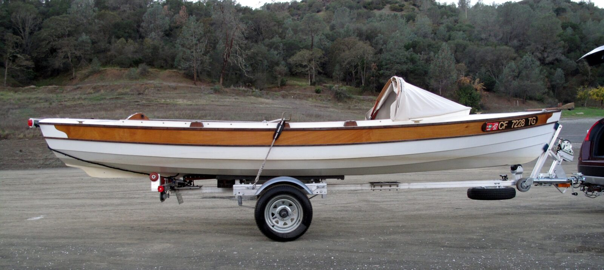

# Trailer

[← Research index](README.md)

  - People suggest that having Long Steps and Walkabout hangover the back is ok because they have a small transom and no heavy motor
    - Here is Rick Thompson's with a Walkabout
      - 
  - Here is JW's response to Ron Parker's trailer question:
    - https://www.facebook.com/share/p/1G59zmUa64/
    -
      > Minimum 3 metres from the axle to the winch post snubbing block where the bow goes, rollers down the middle rather than the usual wobbly roller things that work with vee bottom power boats, I've a 45 x 245 each side of those centreline rollers, they're good to walk on as well as stabilising the boat laterally. The trailer ends about a metre short of the transom, and has some spare room sideways
  - [John Welsford Small Craft Design | A question regarding trailers for welsford or any ply wood boat as I’m nearly ready for a trailer for my pilgrim](https://www.facebook.com/groups/JWDesigns/permalink/3225865694258958/)
    - Has good tips on trailers
